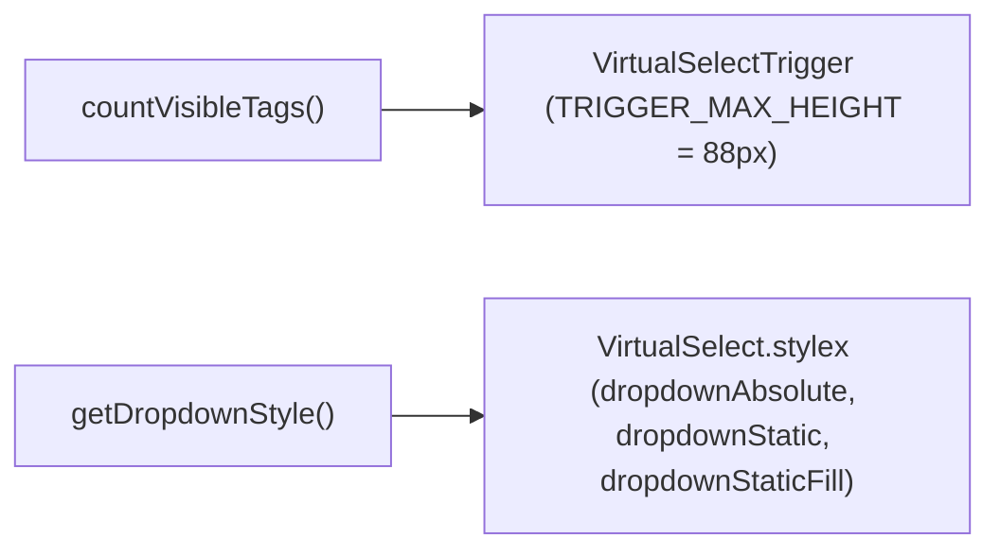
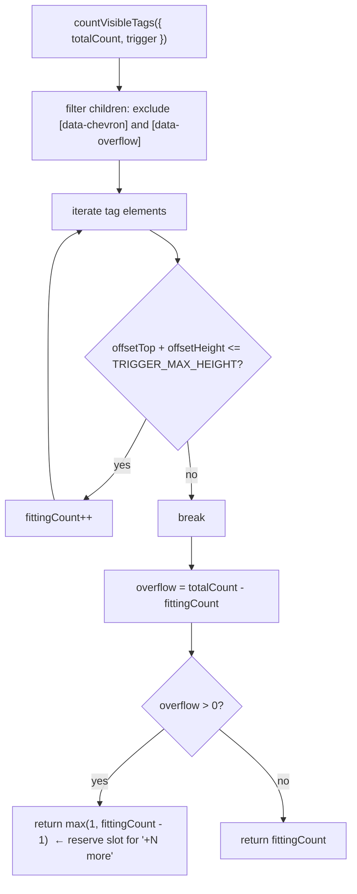
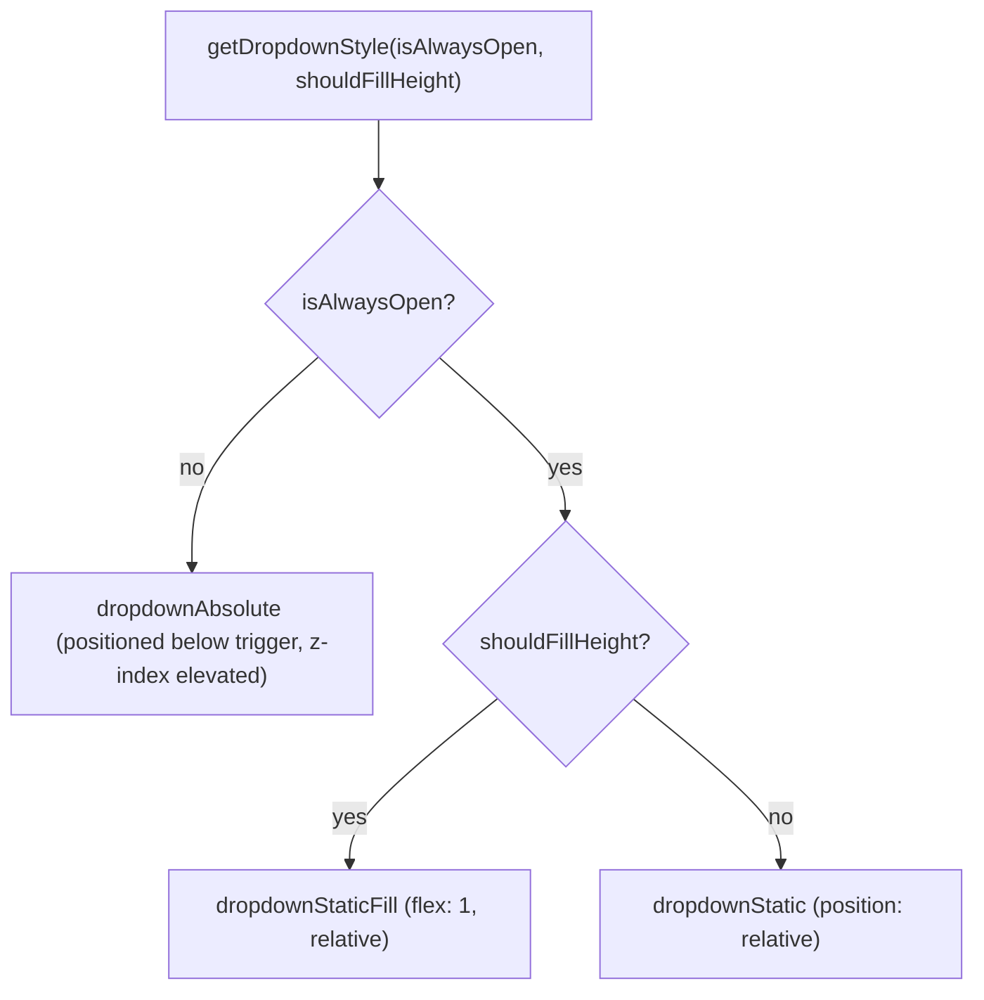

# utils/ Architecture

Pure utility functions for VirtualSelect: tag overflow measurement and dropdown positioning.

## File Structure

```
utils/
├── index.ts                       → Barrel export
├── countVisibleTags.util.ts       → DOM-measure how many tags fit in the trigger
└── getDropdownStyle.util.ts       → Select the correct dropdown position style
```

## Dependencies



## `countVisibleTags`

### Logic Flow



### Args

| Field        | Type             | Description                                      |
| ------------ | ---------------- | ------------------------------------------------ |
| `totalCount` | `number`         | Total selected items (full `selected.length`)    |
| `trigger`    | `HTMLDivElement` | The trigger DOM node (from `triggerRef.current`) |

### Overflow Slot Rule

When some tags overflow, one visible slot is reserved for the `"+N more"` badge — but at least **1** real tag is always shown.

## `getDropdownStyle`

### Logic



| Input                           | Output style         | Use case                           |
| ------------------------------- | -------------------- | ---------------------------------- |
| `isAlwaysOpen=false`            | `dropdownAbsolute`   | Normal dropdown (overlays content) |
| `isAlwaysOpen=true, fill=false` | `dropdownStatic`     | Inline / embedded list             |
| `isAlwaysOpen=true, fill=true`  | `dropdownStaticFill` | Fill-height panel (e.g. drawer)    |
