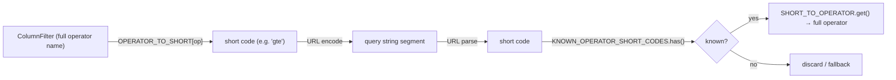

# constants/ Architecture

Application-wide constant values: API host configuration, filter operator definitions (display labels, URL serialization codes, and per-type allowed sets), and global settings option groups.

## Placement Rule

Use this folder for app-wide, cross-domain constants that are imported by multiple features or layers.

Keep constants colocated with their domain when they are implementation details of a specific utility/feature (for example utils/security or utils/theme internals).

Quick decision guide:

- Add to `src/constants` when the constant is shared across domains.
- Keep local when the constant is only meaningful inside one domain module.

## File Index

| File                              | Contents                                              |
| --------------------------------- | ----------------------------------------------------- |
| `api.constants.ts`                | `CONFIG` — API host URLs per environment              |
| `filterOperators.constants.ts`    | Operator label arrays, serialization maps, code sets  |
| `globalSettings.constants.ts`     | Navigation preference radio options                   |
| `pinningPreferences.constants.ts` | Pinning preference and modal resolution radio options |

---

## `api.constants.ts`

```ts
export const CONFIG: ApiConfig = {
  localhost: { apiHost: 'http://localhost:3001/api' },
  dev: { apiHost: '/api' }, // Proxied by Vite dev server
  prod: { apiHost: '/api' }, // Same-origin in production
};
```

| Environment | `apiHost`                   | Notes                          |
| ----------- | --------------------------- | ------------------------------ |
| `localhost` | `http://localhost:3001/api` | Direct connection to local API |
| `dev`       | `/api`                      | Vite proxy rewrites the path   |
| `prod`      | `/api`                      | Same-origin, no proxy needed   |

Type: `ApiConfig` (see `@repo/data-access/src/api/api.types.ts`).

---

## `filterOperators.constants.ts`

Provides everything needed to render filter operator UI, serialize operators to compact URL codes, and deserialize them back.

### Operator Label Arrays

Used to populate operator `<select>` dropdowns in filter UIs.

| Constant           | Type                                   | Options (value → label)                                                                                                                                                                                      |
| ------------------ | -------------------------------------- | ------------------------------------------------------------------------------------------------------------------------------------------------------------------------------------------------------------ |
| `DATE_OPERATORS`   | `OperatorOption<DateOperatorType>[]`   | `after` → After, `before` → Before, `between` → Between, `equals` → Equals                                                                                                                                   |
| `NUMBER_OPERATORS` | `OperatorOption<NumberOperatorType>[]` | `between` → Between, `equals` → Equals, `greaterThan` → Greater than, `greaterThanOrEqual` → Greater than or equal, `lessThan` → Less than, `lessThanOrEqual` → Less than or equal, `notEquals` → Not equals |
| `TEXT_OPERATORS`   | `OperatorOption<TextOperatorType>[]`   | `contains` → Contains, `notContains` → Does not contain, `notEquals` → Does not equal, `endsWith` → Ends with, `equals` → Equals, `startsWith` → Starts with                                                 |

### URL Serialization Maps

Operators are serialized to short 2–3 character codes for compact URL state (e.g. `?filter=price:gte:100`).

| Full operator        | Short code |
| -------------------- | ---------- |
| `after`              | `af`       |
| `before`             | `bf`       |
| `between`            | `bw`       |
| `contains`           | `ct`       |
| `endsWith`           | `ew`       |
| `equals`             | `eq`       |
| `greaterThan`        | `gt`       |
| `greaterThanOrEqual` | `gte`      |
| `lessThan`           | `lt`       |
| `lessThanOrEqual`    | `lte`      |
| `notContains`        | `nct`      |
| `notEquals`          | `neq`      |
| `startsWith`         | `sw`       |

**`OPERATOR_TO_SHORT`** — `Record<string, string>` for serialization (full → short).  
**`SHORT_TO_OPERATOR`** — `Map<string, string>` for deserialization (short → full).

`Map` is used for deserialization because it has O(1) lookup and preserves insertion order, while the plain object is sufficient for serialization (key access by operator name).

### Validation Sets

Used for fast membership checks during URL parsing to reject unknown or mis-typed codes.

| Constant                     | Contents                             | Purpose                                               |
| ---------------------------- | ------------------------------------ | ----------------------------------------------------- |
| `KNOWN_OPERATOR_SHORT_CODES` | All 13 short codes                   | Guard: reject any unrecognised code during parse      |
| `DATE_OPERATOR_SHORT_CODES`  | `af`, `bf`, `bw`, `eq`               | Validate that a parsed code is valid for date columns |
| `TEXT_OPERATOR_SHORT_CODES`  | `ct`, `eq`, `ew`, `nct`, `neq`, `sw` | Validate that a parsed code is valid for text columns |

> `NUMBER_OPERATORS` has no dedicated short-code `Set` — number columns accept all operators not covered by the date/text sets, so callers use `KNOWN_OPERATOR_SHORT_CODES` minus the date/text sets implicitly.

### Serialization Flow



---

## `globalSettings.constants.ts`

Defines the option list for global navigation sizing on the Settings route.

| Constant                             | Type                                            | Values                                |
| ------------------------------------ | ----------------------------------------------- | ------------------------------------- |
| `NAVIGATION_SIZE_PREFERENCE_OPTIONS` | `RadioOption<GlobalNavigationSizePreference>[]` | `compact`, `small`, `medium`, `large` |

Used by `routes/settings/Settings.component.tsx` to render the Navigation tab radio group.

---

## `pinningPreferences.constants.ts`

Defines reusable radio options for pinning prompts and global pinning
preferences.

| Constant                            | Type                                                     | Values                                                            |
| ----------------------------------- | -------------------------------------------------------- | ----------------------------------------------------------------- |
| `ORDER_CONFLICT_OPTIONS`            | `RadioOption<OrderConflictResolution>[]`                 | `remove-conflicting-pins`, `reset-all-pins`, `pin-to-match-order` |
| `ORDER_CONFLICT_PREFERENCE_OPTIONS` | `RadioOption<OrderConflictResolutionPreferenceOption>[]` | Order conflict options plus `always-ask`                          |
| `PIN_SIDE_PREFERENCE_OPTIONS`       | `RadioOption<PinSidePreferenceOption>[]`                 | `closest-edge`, `left`, `right`, `always-ask`                     |
| `PIN_CONFLICT_PREFERENCE_OPTIONS`   | `RadioOption<PinConflictResolutionPreferenceOption>[]`   | Pin conflict options plus `always-ask`                            |
| `UNPIN_CONFLICT_PREFERENCE_OPTIONS` | `RadioOption<UnpinConflictResolutionPreferenceOption>[]` | Unpin conflict options plus `always-ask`                          |

Runtime modals use the non-preference option arrays. The Settings route uses
the `*_PREFERENCE_OPTIONS` arrays so users can choose `always-ask`.
