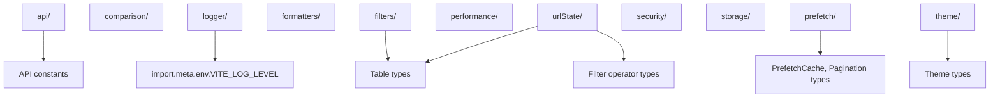

# Utils Architecture

Shared utility layer for formatting, URL state encoding/decoding, storage, performance instrumentation, environment-aware API URL resolution, comparison helpers, filter adapters, and theme cookie management.

## Folder Structure

```
utils/
├── ARCHITECTURE.md          -> This overview
├── index.ts                 -> Root barrel (re-exports shallowEqual from comparison/)
├── api/
│   └── ARCHITECTURE.md      -> API base URL resolution
├── comparison/
│   └── ARCHITECTURE.md      -> Shallow object equality helpers
├── filters/
│   └── ARCHITECTURE.md      -> Table filter-options adapters
├── formatters/
│   └── ARCHITECTURE.md      -> Locale-aware date/number/currency formatters
├── logger/
│   └── ARCHITECTURE.md      -> Level-aware, tree-shakeable application logger
├── performance/
│   └── ARCHITECTURE.md      -> Render tracking utilities
├── prefetch/
│   └── index.ts             -> Barrel: firePrefetch, prefetchNextPage, resolveFromCacheOrFetch
├── security/
│   └── ARCHITECTURE.md      -> Security helpers (CSP nonce parsing)
├── storage/
│   └── ARCHITECTURE.md      -> Cookie/localStorage read/write utilities
├── theme/
│   └── ARCHITECTURE.md      -> Theme cookie read/write helpers
└── urlState/
    └── ARCHITECTURE.md      -> URL compact state serialization
```

## Dependency Overview



## Subfolder Documentation

| Folder         | Description                                                                                                                                                |
| -------------- | ---------------------------------------------------------------------------------------------------------------------------------------------------------- |
| `api/`         | `getApiBaseUrl` — SSR/client-aware API base URL resolver                                                                                                   |
| `comparison/`  | `shallowEqual` — one-level object comparison for store diffing                                                                                             |
| `filters/`     | `createStaticFilterOptions` — static array → Table filter contract                                                                                         |
| `formatters/`  | `formatDate`, `formatCurrency`, `formatNumber`, `parseDate`, etc.                                                                                          |
| `logger/`      | `createLogger`, `logger` — level-filtered, tree-shakeable app logging                                                                                      |
| `performance/` | `renderTracker`, `useRenderTracker` — dev-time render inspection                                                                                           |
| `prefetch/`    | `resolveFromCacheOrFetch`, `prefetchNextPage`, `firePrefetch` — generic prefetch cache resolution, page prefetch creation, and ref-applied prefetch firing |
| `security/`    | `getRequestCspNonce` — standardized `x-csp-nonce` request header parser                                                                                    |
| `storage/`     | `parseCookies`, `readFromCookie`, `writeToCookie`, `writeToLocalStorage`                                                                                   |
| `theme/`       | `getThemeFromCookie` (`getThemeFromCookie.util.ts`), `setThemeCookie` (`setThemeCookie.util.ts`)                                                           |
| `urlState/`    | `encodeStateToURL`, `decodeStateFromURL`, `readTableStateFromURL`                                                                                          |
