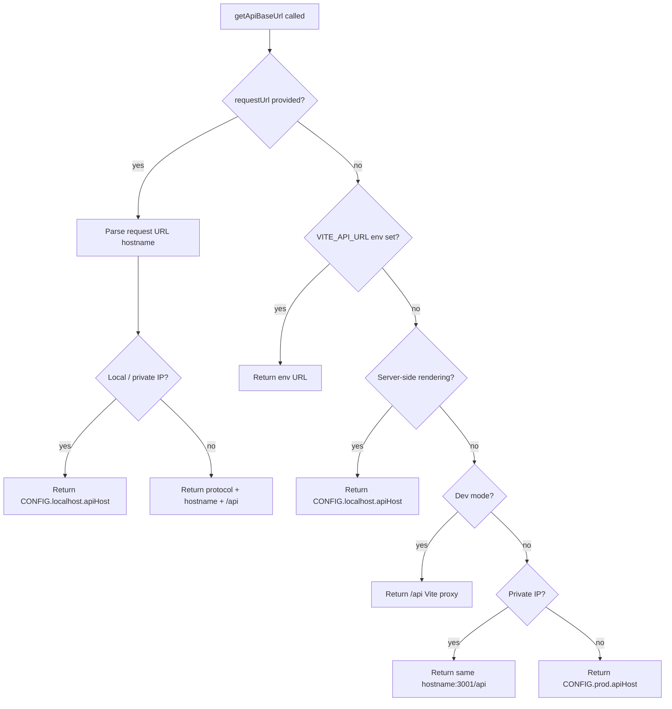

# API Utility Architecture

Resolves the correct API base URL and provides shared request helpers for use in loaders, actions, and client-side code across SSR and development environments.

## File

| File                                | Description                                                                                  |
| ----------------------------------- | -------------------------------------------------------------------------------------------- |
| `api.util.ts`                       | Exports `getApiBaseUrl(requestUrl?)` — resolves the API base URL                             |
| `buildPaginatedQueryParams.util.ts` | Builds `limit`/`skip`/`sort`/`filter` `URLSearchParams` shared by paginated service fetchers |
| `fetchAndValidate.util.ts`          | Fetches a URL, asserts OK, parses JSON, and validates the body shape via a type guard        |
| `fakeDelay.util.ts`                 | Simulated network latency helper for mock data paths                                         |

## Priority Strategy

## Consumers

- `src/services/carSales.api.ts`
- `src/services/enterpriseOrders.api.ts`
