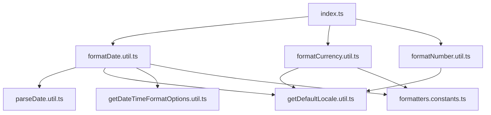
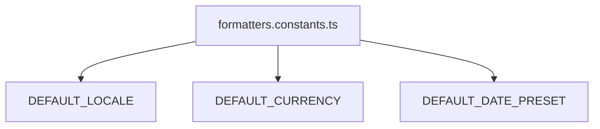
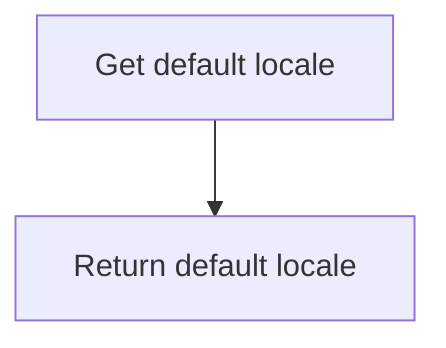
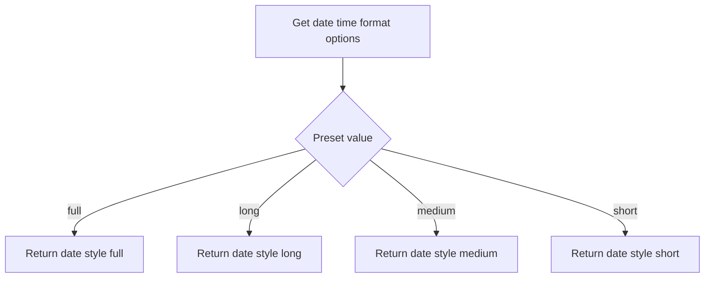
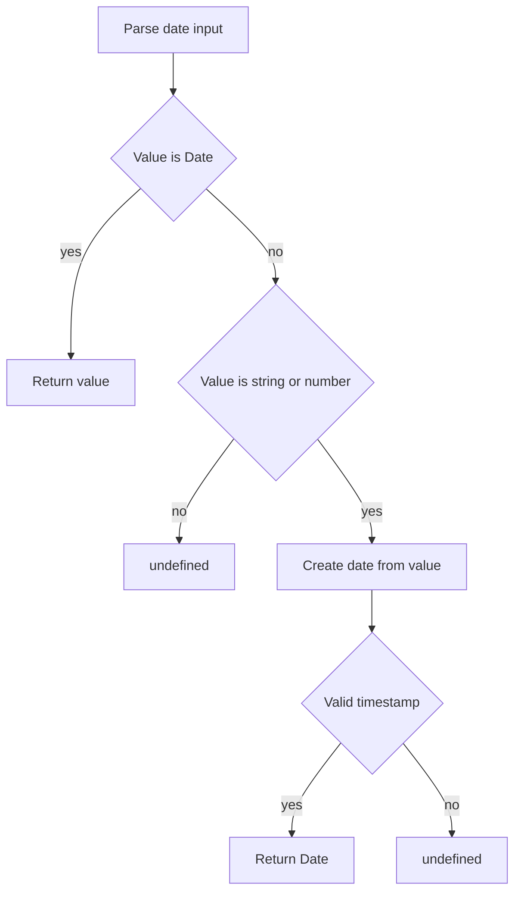
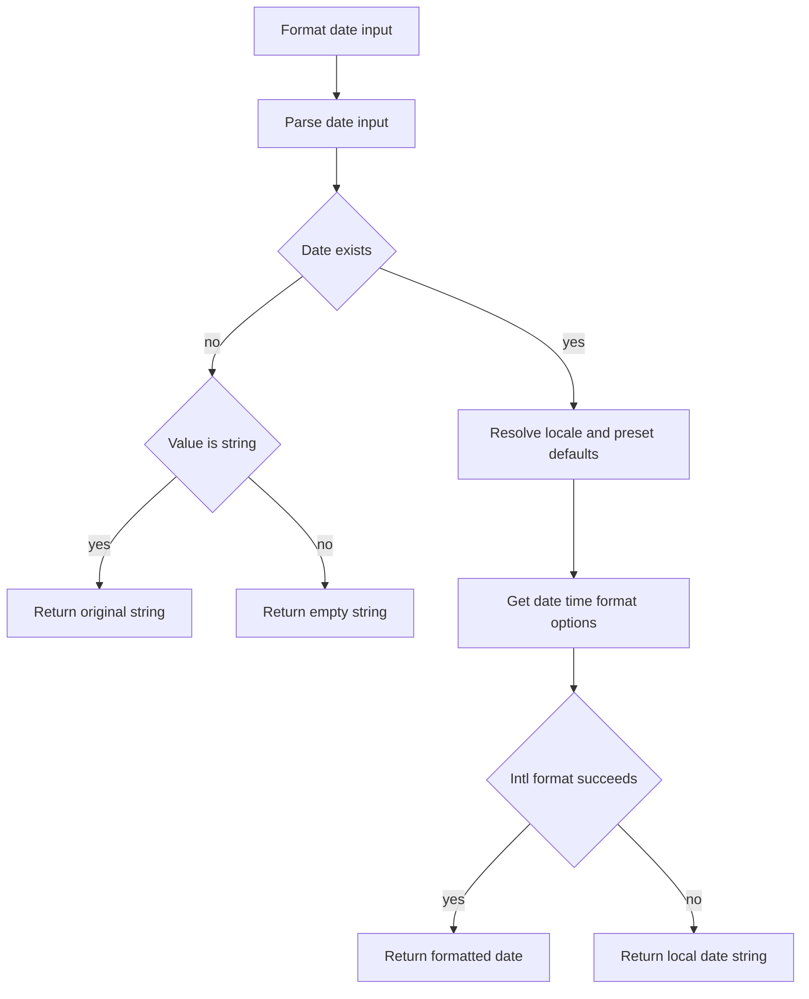
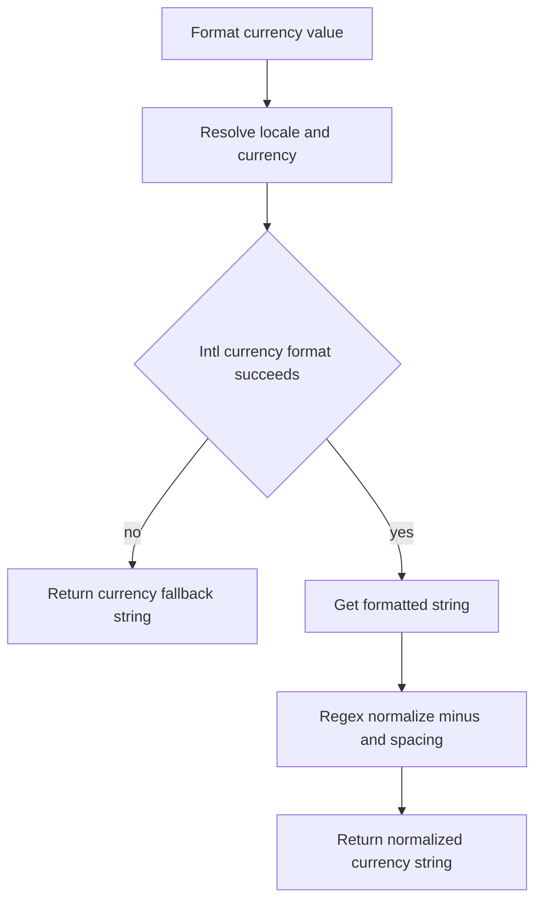
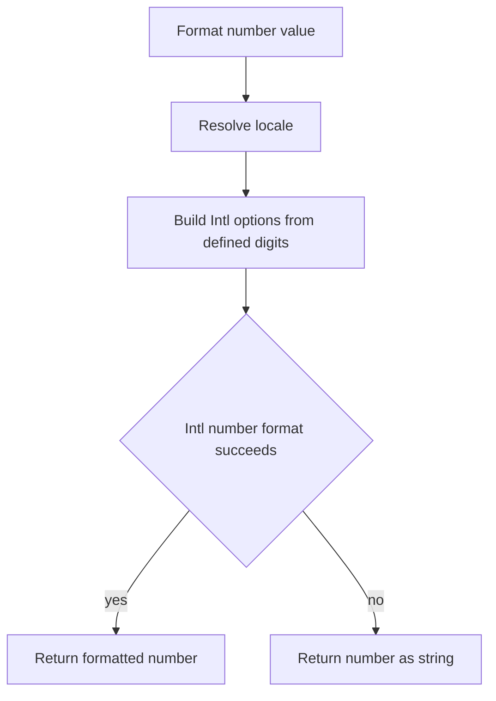

# Formatters Utils Architecture

Locale-safe, SSR-consistent formatting helpers for numbers, currency, and dates.

## File Structure

```
formatters/
├── ARCHITECTURE.md
├── index.ts
├── formatters.constants.ts
├── getDefaultLocale.util.ts
├── getDateTimeFormatOptions.util.ts
├── parseDate.util.ts
├── formatDate.util.ts
├── formatCurrency.util.ts
└── formatNumber.util.ts
```

## Dependency Graph



## Utilities

### formatters.constants.ts

Defines module defaults:

- `DEFAULT_LOCALE = 'en-US'`
- `DEFAULT_CURRENCY = 'USD'`
- `DEFAULT_DATE_PRESET = 'medium'`



### getDefaultLocale.util.ts

Returns deterministic locale default to avoid SSR/client hydration mismatches.



### getDateTimeFormatOptions.util.ts

Maps date preset names to `Intl.DateTimeFormatOptions`.



### parseDate.util.ts

Normalizes unknown date-like input into a valid `Date` or returns `undefined`.



### formatDate.util.ts

Formats unknown value as localized date string with safe fallbacks.



Key behavior:

- Accepts `unknown` input and defends against invalid date values.
- Preserves incoming string when parsing fails (useful for opaque backend values).

### formatCurrency.util.ts

Formats number as currency and normalizes symbol/sign output.



Normalization rules:

- Moves leading minus after currency symbol when needed.
- Ensures a space between symbol and numeric sign/value.

### formatNumber.util.ts

Formats number with optional precision controls.



Key behavior:

- Omits undefined fraction digit options to avoid unintended defaults.
- Gracefully degrades when Intl fails.

## Barrel Exports

`index.ts` exports only the public formatter entry points:

- `formatCurrency`
- `formatDate`
- `formatNumber`
