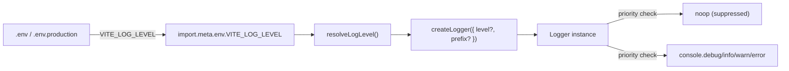

# Logger Architecture

Level-aware, tree-shakeable application logger controlled by the `VITE_LOG_LEVEL` environment variable.

## Purpose

Replace scattered `console.*` calls with a single utility that:

1. **Filters by level** — `silent < error < warn < info < debug`
2. **Tree-shakes in production** — `debug`, `info`, and `warn` method bodies are removed from the bundle when `import.meta.env.PROD` is `true`
3. **Supports prefixed instances** — `createLogger({ prefix: '[carSales]' })` for domain-specific loggers

## File Structure

```
logger/
├── ARCHITECTURE.md        -> This file
├── index.ts               -> Barrel (exports logger, createLogger, types)
├── logger.constants.ts    -> LOG_LEVEL_PRIORITY map, DEFAULT_LOG_LEVEL
├── logger.types.ts        -> LogLevel, Logger, CreateLoggerArgs types
└── logger.util.ts         -> createLogger factory + default logger singleton
```

## Log Level Priority

| Level    | Priority | Enables                  |
| -------- | -------- | ------------------------ |
| `silent` | 0        | Nothing                  |
| `error`  | 1        | error                    |
| `warn`   | 2        | error, warn              |
| `info`   | 3        | error, warn, info        |
| `debug`  | 4        | error, warn, info, debug |

## Configuration

| Environment File  | `VITE_LOG_LEVEL` | Use Case                    |
| ----------------- | ---------------- | --------------------------- |
| `.env`            | `debug`          | Local development (see all) |
| `.env.production` | `error`          | Production (errors only)    |

Override per-session: `VITE_LOG_LEVEL=silent vp dev`

## Usage

### Default singleton logger

```ts
import { logger } from '@/utils/logger';

logger.debug('Verbose trace'); // only when level >= debug
logger.info('General info'); // only when level >= info
logger.warn('Warning'); // only when level >= warn
logger.error('Error', err); // only when level >= error
```

### Domain-specific logger with prefix

```ts
import { createLogger } from '@/utils/logger';

const log = createLogger({ prefix: '[carSales]' });
log.debug('Fetching from URL:', url);
// console output: [carSales] Fetching from URL: http://...
```

## Tree-Shaking

In production builds, `debug`, `info`, and `warn` methods are replaced with no-ops at logger creation time because they are guarded by `import.meta.env.PROD`. Vite statically replaces this with `true` during production bundling, enabling dead code elimination.

Only `error` persists in production when `VITE_LOG_LEVEL` is `'error'` or higher.

## Data Flow



## Out of Scope

- **`entry.server.tsx`** — SSR crash errors stay as raw `console.error` for maximum visibility
- **Vite `customLogger`** — Controls Vite's own CLI/HMR output, not application logs
