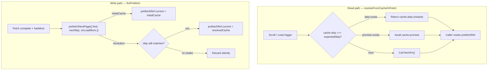

# Prefetch Utilities Architecture

Generic prefetch-cache helpers for paginated data fetching. Used by both the filter-options
pipeline (`useFetchFilterData`) and the table-rows pipeline (`useFetchMoreData`).

## Purpose

Eliminate duplicated cache-resolution and background-prefetch logic across hooks that
implement optimistic next-page prefetching with `useSyncExternalStore`-based stores.

## File Structure

```
prefetch/
├── ARCHITECTURE.md                    → This file
├── firePrefetch.util.ts               → Fire prefetch + apply to ref with staleness check
├── prefetchNextPage.util.ts           → Pure prefetch request creation (returns cache + promise)
└── resolveFromCacheOrFetch.util.ts    → Resolve from cache hit/in-flight or fallback fetch
```

## Utility Functions

| Function                  | Purity      | Description                                                                                         |
| ------------------------- | ----------- | --------------------------------------------------------------------------------------------------- |
| `resolveFromCacheOrFetch` | Pure async  | Resolves from cache (hit/in-flight) or falls back to `fetchFn()`; caller owns cache reset           |
| `prefetchNextPage`        | Pure sync   | Creates a prefetch request; returns `{ initialCache, resolution }` for the caller to apply to a ref |
| `firePrefetch`            | Side-effect | Calls `prefetchNextPage`, writes to `prefetchRef.current`, resolves with staleness guard            |

## Data Flow



## Consumers

| Hook                 | Location                                      | Read util                 | Write util     |
| -------------------- | --------------------------------------------- | ------------------------- | -------------- |
| `useFetchFilterData` | `Table/contexts/FiltersData/filters/actions/` | `resolveFromCacheOrFetch` | `firePrefetch` |
| `useFetchMoreData`   | `Table/contexts/TableData/data/actions/`      | `resolveFromCacheOrFetch` | `firePrefetch` |

## Key Design Decisions

- **`limit` is a required parameter** on `prefetchNextPage` and `firePrefetch` — callers pass their own page size constant (`DEFAULT_FILTER_PAGE_SIZE` for filters, dynamic `pageSize` from `metaStore` for rows).
- **No hardcoded constants** — all three utils are fully generic and import only `PrefetchCache` / `Pagination` types from `@/types/ui.types`.
- **Staleness guard** lives in `firePrefetch`: if `prefetchRef.current.skip` has changed by the time the prefetch resolves, the result is silently discarded.
- **Cache reset is the caller's responsibility** after consuming a response from `resolveFromCacheOrFetch`.
