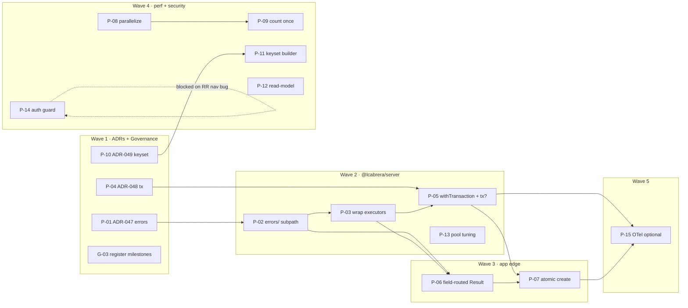

# Planning Session Summary (lcabrera-planner)

> Orchestrator synthesis of a two-agent planning session (Systems Architect +
> Implementation Engineer) over `docs/agents/decisions/architecture-improvement-plan.md`.
> **Draft — nothing created on GitHub.** Deliverables: [`issues.md`](./issues.md)
> (19 issues + 5 epics) and [`adrs/`](./adrs/) (ADR-047–050 drafts). Creating
> them is `vp run plan:issues`, which checks the backlog against the issue gate
> and the label taxonomy before it calls `gh`.

## High-level direction

Adopt the improvement plan's ranking verbatim — the code review confirmed every
cited location is real and the two "High/correctness" claims are **live defects**:

1. **`@lcabrera/server` is the leverage point.** Error translation, the transaction
   seam, and pool tuning land once in the flagship package and every Node consumer
   (react-router, admin_system, api-server, scan-ingestion) inherits them. Two
   per-app reinventions already exist (`hasPostgresErrorCode.util.ts`,
   `runMigrations.ts` BEGIN/ROLLBACK) — evidence the abstractions are missing, not
   speculative.
2. **The two correctness/security defects lead.** The `order_id` read-then-write
   race (unhandled `23505`) and the mis-routed `customer_name` error are shipped
   today; the auth guard is off on three entry points. These outrank the perf work.
3. **Reject DDD ceremony.** No `dto/`/`mapper/`/`repository/` folders, no nominal
   repository interfaces, no repo-wide `neverthrow`. The suffix system + build-
   enforced `.server/` boundary already deliver the separation.

## Load-bearing nuance (from the feasibility pass)

**Atomic create is not "just a transaction."** `SELECT MAX(order_id)+1` on one
connection still races under READ COMMITTED without `FOR UPDATE`/advisory-lock or
retry-on-`23505` (or migrating to a real Postgres sequence — the `scan-ingestion`
house style). ADR-048 must pick the strategy; P-07 implements it. This is the
highest-risk item and is sequenced late (Wave 3) behind the error layer that turns a
residual collision into a clean typed conflict.

## Milestones

| Milestone                      | Theme                          | Issues                                   |
| ------------------------------ | ------------------------------ | ---------------------------------------- |
| **M1 — Foundation**            | ADRs + governance              | P-01, P-04, P-10, G-01, G-02, G-03, G-04 |
| **M2 — Abstractions**          | flagship `@lcabrera/server`    | P-02, P-03, P-05, P-13                   |
| **M3 — Cross-App Integration** | wire abstractions into the app | P-06, P-07                               |
| **M4 — Hardening & QA**        | perf + security                | P-08, P-09, P-11, P-12, P-14             |
| **M5 — Release Prep**          | optional observability         | P-15                                     |

## Execution waves

- **Wave 1 — Exploration & ADRs:** P-01, P-04, P-10, G-01–G-04
- **Wave 2 — Foundational Refactors:** P-02, P-03, P-05, P-13
- **Wave 3 — Cross-App Improvements:** P-06, P-07
- **Wave 4 — Hardening & QA:** P-08, P-09, P-11, P-12, P-14
- **Wave 5 — Final Integration:** P-15

## Dependency graph

**Critical path:** P-01 → P-02 → P-03 → P-05 → P-07 (the atomic-create fix pulls in
the whole server foundation). P-08/P-12/P-13/P-14 are independent and parallelizable.

## Risks & mitigations

| Risk                                                      | Severity        | Mitigation                                                                                                |
| --------------------------------------------------------- | --------------- | --------------------------------------------------------------------------------------------------------- |
| `order_id` race → unhandled `23505`                       | High (live)     | P-07 after P-05/P-06; ADR-048 locks the strategy; error layer makes residual collisions clean             |
| Raw pg detail leaks / wrong field                         | High (live)     | P-02/P-03 translate at persistence, P-06 maps to field-routed DU                                          |
| Auth guard off on 3 entry points                          | High (security) | P-14 — but blocked on the RR fetcher→`/login` navigation bug; must return 401 JSON for `_api`             |
| Every `@lcabrera/server` change is a publish event        | Medium          | dual exports parity + `api-surface:verify` + changeset baked into P-02/P-05/P-11/P-13 acceptance criteria |
| Result DU-across-single-fetch enforced by convention only | Medium (silent) | keep classes server-side; review + serialization check (no gate)                                          |
| Planning IDs ≠ issue numbers                              | Low             | `plan:issues` captures real numbers as it creates, then wires sub-issues from them                        |

## Governance gaps found

1. **G-01** issue template lacks the `dependencies` block the convention mandates.
2. **G-02** no ADR `_TEMPLATE.md` under `docs/cqms/decisions/` (ADRs authored freehand).
3. **G-03** M1–M5 GitHub Milestones not confirmed registered.
4. **G-04** no single cross-app-abstraction guideline (extract vs duplicate/ADR-039).

## What is explicitly NOT planned

Nominal repository interfaces, entity classes, a repo-wide `neverthrow` Result
object, a mandated use-case file per action, or any `dto/`/`mapper/`/`repository/`
folder dialect.

## Next step (requires your approval — outward-facing)

1. Install/authenticate `gh` (`gh auth status`).
2. Preview with `vp run plan:issues -- --create --dry-run`, then run
   `vp run plan:issues -- --create` to create the Milestones and issues and
   attach each epic's children as real sub-issues.
3. Promote ADR-047–050 out of `adrs/` into `docs/cqms/decisions/` (P-01/P-04/P-10 +
   G-02), confirming the next-free number.
