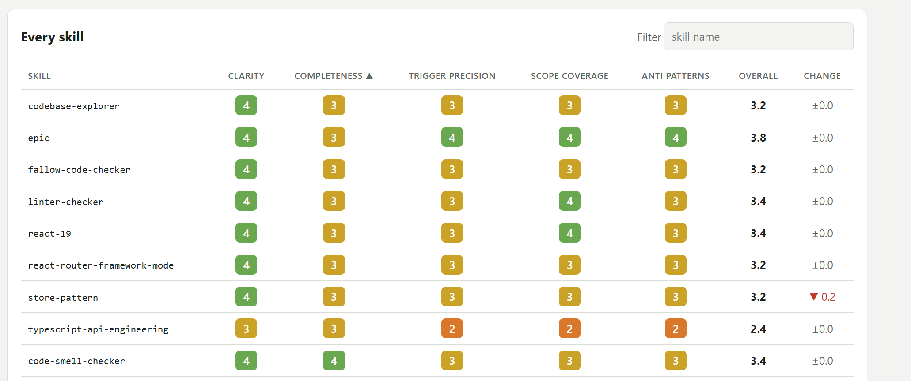

# A column says how its cells look, even when the server sends it

## Statement

My columns come from the server, and some of them should look like more than
text: a score as a pill coloured by its value, a change as a signed arrow, a
name in a fixed-width font. I want to say that in the column definition the
server sends, including colours the library does not know, and have the grid
draw it in both themes. When I need a look the library does not ship, I want to
register it once on the client and have it checked the same way as the
built-in ones.

## Acceptance

- `TableColumn` has a `cell` field holding a `{ kind, params }` call with no
  function member, and the no-function-path assertion in
  `enterprise-orders.loader.test.ts` still passes with `cell` and a
  `cellPalette` set. A `cellPalette` maps a tone name to a light and a dark
  pair of background and text colours.
- A cell renderer is registered on the client with a kind, a Standard Schema
  for its params and a render function. A test registers one backed by Zod
  while `@lcabrera/ui` declares no Zod dependency.
- `@lcabrera/ui` ships `badge`, `delta` and `text` renderers, and unit tests
  cover their rules, including rule order, threshold edges and a categorical
  match.
- A call whose kind is not registered, or whose params fail the renderer's
  schema, renders the column's `dataType` default, and a test shows neither
  throws.
- A renderer registered under an existing kind replaces the built-in one, and a
  test covers it.
- A tone name resolves against the built-in tokens, then the palette the loader
  sends, then the palette the client passes, with the last one winning. An
  unknown tone or an invalid colour renders as `neutral`. Tests cover each step.
- A palette tone uses its dark pair under the dark theme.
- A showcase route renders each built-in kind, and a tone only its loader
  defines, from data that loader returns.
- A badge shows its value as text, so colour is never the only signal.

## Notes

The screenshot is the target. Each of its columns is one call:

- the name is `text` with `monospace`,
- each score is a `badge` whose rules map 4, 3, 2 and below to four tones,
- the overall is bold `text` over a one-decimal number,
- the change is a `delta`.

Four steps in one column outrun the built-in tones, which have one step
(`warning`) between `success` and `error`. The fourth should not need a library
change: the loader names it, and the palette it sends defines it. ADR-130 holds
the decision, and #1318 the call and renderer types and the palette shape.

`render` already exists and does not answer this, because single-fetch replaces
a function with `undefined` on the client. ADR-009 hit that trap for filter
options. The answer here has the same shape as a tool call to an LLM: the
server sends a name and arguments, and the client validates the arguments
against the schema of the renderer it registered under that name, and then
runs it. The client merges renderers and tones by name, never by column key,
so the server stays the one place that decides which column looks how.
