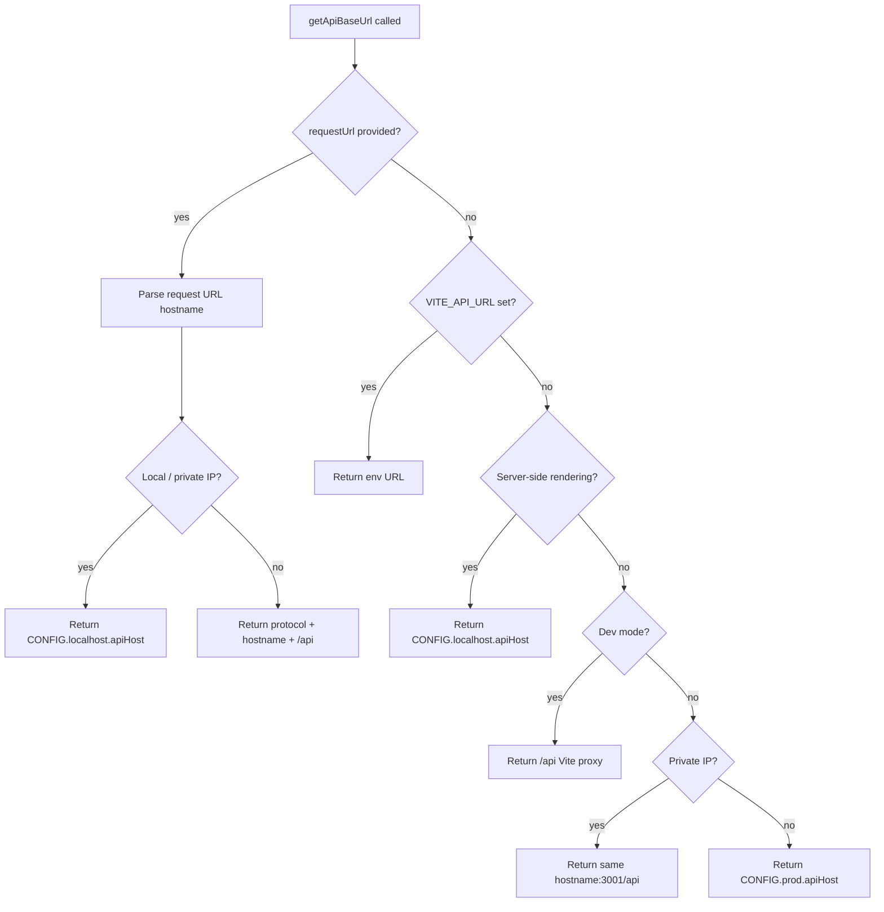

# Package Architecture (`@lcabrera/api`)

The **browser-safe** half of what used to be `@lcabrera/server`: resolving the
API base URL, fetching and validating responses, and the distinct-values
contract behind the Table's filter dropdowns.

## Why this package exists

`@lcabrera/server` held two things at once — browser `fetch` utilities and
Node/Postgres access — and [ADR-008](../../docs/decisions/ADR-008-packages-api-renamed-data-access.md)
accepted that deliberately, because nothing depended on only one half.

That stopped being true. `@lcabrera/ui` came to depend on the combined package for
exactly two helpers (`getApiBaseUrl`, `fetchDistinctValues`), which meant every
consumer of the UI component library also installed `pg`. Splitting the browser
half out removes that edge at the package boundary rather than papering over it.

## Design constraints

- **No Node, enforced by the compiler.** The generated `tsconfig.app.json` uses
  `createAppTsConfig` **without** appending `'node'` to `types` — DOM and
  `vite/client` are available, Node ambient globals are not. A `process`/`fs`
  reach-in fails typecheck here.
- **No server-only dependencies, enforced by the gate.** `packages/ui`'s
  `check:public-api` fails when any workspace package in its dependency closure
  contains a `node:*` import. That is what makes this split hold.
- **Relative imports carry explicit `.ts` extensions.** The package must resolve
  under both bundler mode (Vite/Vitest/tsc) and `moduleResolution: NodeNext`
  (`apps/shared`, both API servers). Extensionless imports are bundler-only —
  that is precisely why the old `src/api/` barrel could not be consumed from
  `apps/shared` at all.
- **Explicit per-file subpath exports, no barrel** (ADR-007). Consumers import
  the module they need, and tests mock that module rather than a barrel.
- **kebab-case `.util` files**, matching `@lcabrera/utils`. Asserted by the
  `filename-convention` rule's `suffixCase` option rather than by turning it off.
- **95% coverage gate** — public-facing, so `test:coverage` fails below it.

## Artifacts

| Domain      | File                                   | Description                                                                                     |
| ----------- | -------------------------------------- | ----------------------------------------------------------------------------------------------- |
| `config/`   | `config.constants.ts`                  | `API_SERVER_PORT` and the `CONFIG` per-environment host map                                     |
| `config/`   | `config.types.ts`                      | `ApiConfig` — the shape of `CONFIG`                                                             |
| `config/`   | `get-api-base-url.util.ts`             | Resolves the API base URL across SSR, dev-proxy, private-IP and production cases                |
| `http/`     | `fetch-and-validate.util.ts`           | Fetches, asserts OK, parses JSON, validates the body through a type guard                       |
| `http/`     | `build-paginated-query-params.util.ts` | Builds the `limit`/`skip`/`sort`/`filter` query params shared by paginated fetchers             |
| `distinct/` | `distinct.types.ts`                    | `DistinctValuesResponse` — the wire contract, also re-exported by `api-shared`                  |
| `distinct/` | `fetch-distinct-values.util.ts`        | Pages a distinct-values endpoint — the HTTP half of the ADR-009 descriptors                     |
| `distinct/` | `is-distinct-values-response.util.ts`  | Type guard for `DistinctValuesResponse`                                                         |
| `distinct/` | `parse-filter-options-params.util.ts`  | Parses filter-option search params into `fetchDistinctValues` args (page-size default injected) |

## Base-URL resolution

## Consumers

From `@lcabrera/ui`:

- `src/utils/filters/getFilterOptionsBaseUrl.util.ts` — `getApiBaseUrl`
- `src/utils/filters/resolveDistinctFilterOptions.util.ts` — `fetchDistinctValues`

From `apps/react-router`:

- `src/services/carSales.api.ts`, `src/services/wideAlltypes150.api.ts`
- `src/routes/enterprise-orders/fetchOrdersPage.service.ts`
- `src/routes/api/filter-options/filter-options.loader.ts`

From `apps/shared`:

- `src/types/api.types.ts` re-exports `DistinctValuesResponse` (NodeNext — the
  reason explicit extensions are mandatory here).
