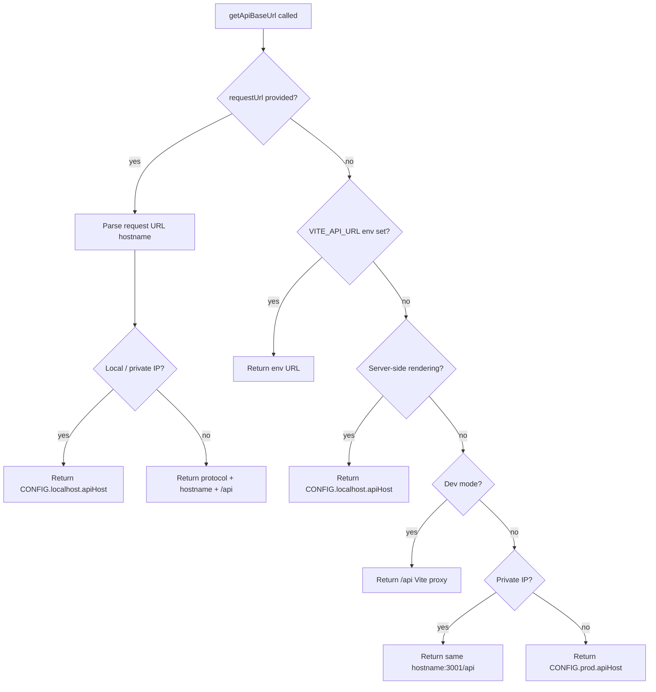

# API Utility Architecture

Resolves the correct API base URL and provides shared request helpers for use in loaders, actions, and client-side code across SSR and development environments.

## File

| File                                | Description                                                                                                                                              |
| ----------------------------------- | -------------------------------------------------------------------------------------------------------------------------------------------------------- |
| `api.constants.ts`                  | `API_SERVER_PORT` and the `CONFIG` host map consumed by `api.util.ts`                                                                                    |
| `api.types.ts`                      | `ApiConfig` (shape of `CONFIG`) and `DistinctValuesResponse`                                                                                             |
| `api.util.ts`                       | Exports `getApiBaseUrl(requestUrl?)` — resolves the API base URL                                                                                         |
| `buildPaginatedQueryParams.util.ts` | Builds `limit`/`skip`/`sort`/`filter` `URLSearchParams` shared by paginated service fetchers                                                             |
| `fetchAndValidate.util.ts`          | Fetches a URL, asserts OK, parses JSON, and validates the body shape via a type guard                                                                    |
| `fetchDistinctValues.util.ts`       | Pages a generic distinct-values endpoint (`?schemaName&tableName&columnName&limit&offset`) — the HTTP half of ADR-009 descriptors                        |
| `isDistinctValuesResponse.util.ts`  | Type guard for `DistinctValuesResponse` (`{ hasMore, values }`, type in `api.types.ts`)                                                                  |
| `parseFilterOptionsParams.util.ts`  | Parses the distinct-filter-options search params into `fetchDistinctValues` args (`defaultPageSize` injected by the caller, so no `@repo/ui` dependency) |
| `fakeDelay.util.ts`                 | Simulated network latency helper for mock data paths                                                                                                     |

## Priority Strategy

## Consumers

From `apps/react-router`:

- `src/services/carSales.api.ts`
- `src/services/wideAlltypes150.api.ts`
- `src/routes/enterprise-orders/fetchOrdersPage.service.ts`
- `src/routes/api/filter-options/filter-options.loader.ts`

From `@repo/ui`:

- `src/utils/filters/getFilterOptionsBaseUrl.util.ts` (`getApiBaseUrl`)
- `src/utils/filters/resolveDistinctFilterOptions.util.ts` (`fetchDistinctValues`)

The services fetch through `fetchAndValidate` and share the `isObject` guard
from `@repo/utils/guards/is-object.util` for their response-shape validators.

> **Note:** the two `@repo/ui` consumers are the whole reason `@repo/ui` depends
> on `@repo/data-access`, and therefore transitively on `pg`. Extracting this
> folder into a browser-only `@repo/api` package severs that edge — see issue
> #144.
