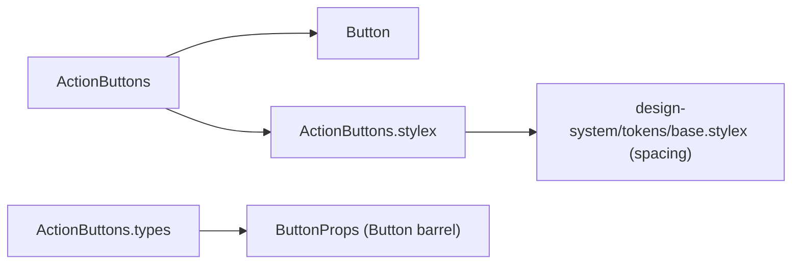

# ActionButtons Architecture

Descriptor-driven row of `Button`s — the single shared primitive for the
"group of action buttons in a flex container" shape that modal footers,
drawer footers, and settings action rows all need. Replaces the previously
hand-rolled `<Button>…</Button><Button>…</Button>` pairs.

## File Structure

```
ActionButtons/
├── index.ts                        → Barrel export (component only)
├── ActionButtons.component.tsx     → div wrapper + actions.map → Button
├── ActionButtons.types.ts          → ActionButtonDescriptor, ActionButtonsProps
├── ActionButtons.stylex.ts         → full-width flex row container (gap: sm)
└── ActionButtons.test.tsx          → render/click/prop-forwarding tests
```

## Dependencies



## Props

| Prop           | Type                                      | Description                                                          |
| -------------- | ----------------------------------------- | -------------------------------------------------------------------- |
| `actions`      | `readonly ActionButtonDescriptor[]`       | One entry per button, rendered in order                              |
| `customStylex` | `StyleXStyles \| readonly StyleXStyles[]` | Layout override applied after the base container style (always last) |
| `...div props` | `ComponentPropsWithoutRef<'div'>`         | Forwarded to the container div (spread before `stylex.props`)        |

`ActionButtonDescriptor` = `Omit<ButtonProps, 'children' | 'onClick'>` plus:

| Field     | Type                                  | Description                                                      |
| --------- | ------------------------------------- | ---------------------------------------------------------------- |
| `label`   | `string`                              | Required — rendered as the `Button` children and used as key     |
| `onClick` | `NonNullable<ButtonProps['onClick']>` | Required — the action handler                                    |
| `key`     | `string?`                             | Optional stable React key when labels are dynamic or may collide |

Descriptor defaults: `color: 'primary'` and `size: 'sm'` — the dominant
combination across consumers, so most actions only declare `label` +
`onClick`. Set either field to override. Note the `sm` default is applied
by `ActionButtons` itself (`Button`'s own default size is `md`).

## Layout Contract

- The container is `display: flex`, `gap: spacing.sm`, `width: 100%`.
- `width: 100%` is load-bearing: `Button` defaults to `width='full'`, so
  buttons fill-and-split the row exactly as they did when they were direct
  children of `Modal`'s footer or `SidePanelFooter`. Don't remove it.
- Vertical stacks (e.g. drawer "All Settings" sections) pass a `customStylex`
  with `flexDirection: 'column'` (`drawerSectionStyles.list`).

## Consumers

- Modal footers: `ConfirmDialog`, `PinSideModal`, `OrderConflictModal`,
  `UnpinConflictModal`, `PinConflictModal` (passed as `Modal`'s `footer`).
- Drawer footers: `ColumnSettingsDrawerFooter`, `TableSettingsDrawerFooter`
  (inside `SidePanelFooter`).
- Drawer bulk-action sections: `GeneralSectionFooter`, `AllSettingsSection`.
- Settings page: `SettingsActions`.

## Non-Goals / Future Candidates

Icon-only toolbars (`SectionToolbar`, `ClearResetToolbarButtons`,
`NavigationHeaderActions`, `SidePanelHeaderToolbar`) are **not** consumers:
`label` is required here and rendered as the button children, which conflicts
with `isIconOnly` buttons whose accessible name comes from elsewhere. If those
ever migrate, the descriptor needs an explicit icon-only story first.
`FormBodyFooter` keeps its `children` extension slot and stays as-is.
