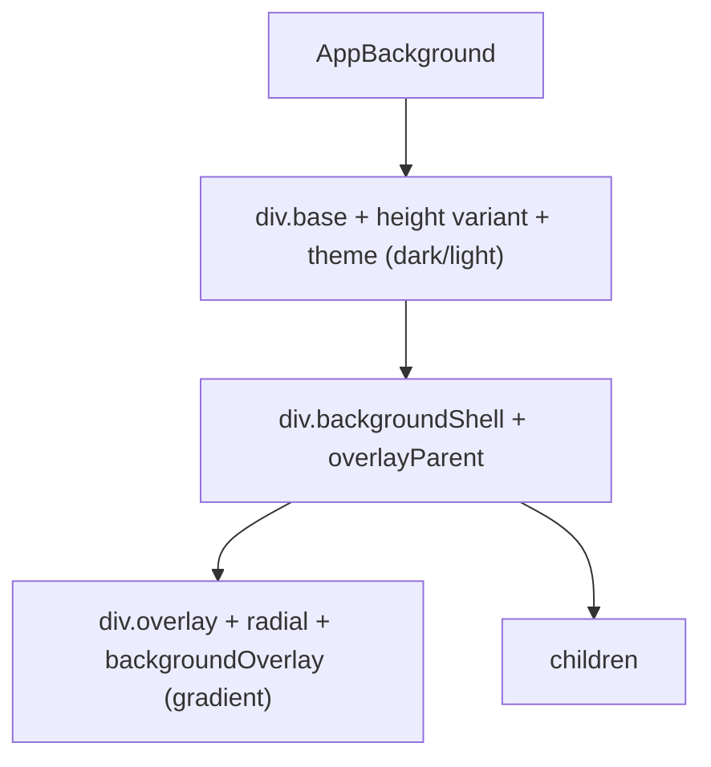
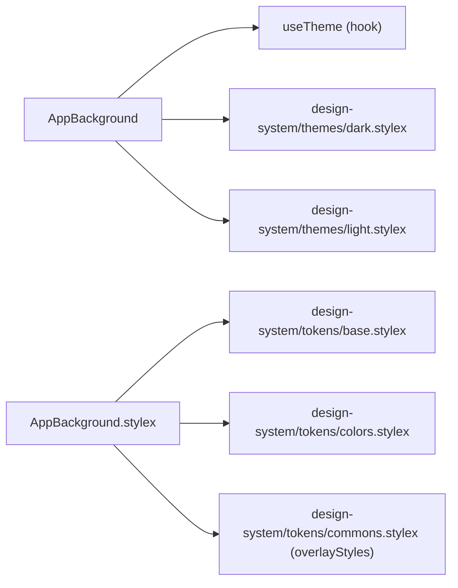

# AppBackground Architecture

Themed background surface: applies the active StyleX theme (dark/light), the base background color, and the radial gradient overlay behind its children. Used as the app-shell root (`AppShell`) and as the inner surface of `Modal`.

## File Structure

```
AppBackground/
├── index.ts                       → Barrel export
├── AppBackground.component.tsx    → Theme wrapper + overlay + children
├── AppBackground.types.ts         → AppBackgroundProps
└── AppBackground.stylex.ts        → base, height variants, shell/overlay styles
```

## Render Structure



## Sizing Contract

| `shouldFillViewport` | Height applied  | Use case                                              |
| -------------------- | --------------- | ----------------------------------------------------- |
| `true` (default)     | `height: 100vh` | App-shell root that owns the viewport (`AppShell`)    |
| `false`              | `height: 100%`  | Embedded inside a sized ancestor (`Modal`'s `dialog`) |

The `false` variant exists because a hardcoded `100vh` inside a smaller container (e.g. a `max-height`-capped `<dialog>`) forces children taller than their parent and creates phantom scrollbars.

## Props

| Prop                 | Type        | Required | Description                                            |
| -------------------- | ----------- | -------- | ------------------------------------------------------ |
| `children`           | `ReactNode` | ✓        | Content rendered above the gradient overlay            |
| `shouldFillViewport` | `boolean`   | —        | `true` → `100vh` (default); `false` → fill parent 100% |

## Dependencies



## Consumers

- `AppShell` — viewport-height app root (default).
- `Modal` — inside the native `<dialog>`, with `shouldFillViewport={false}`.
