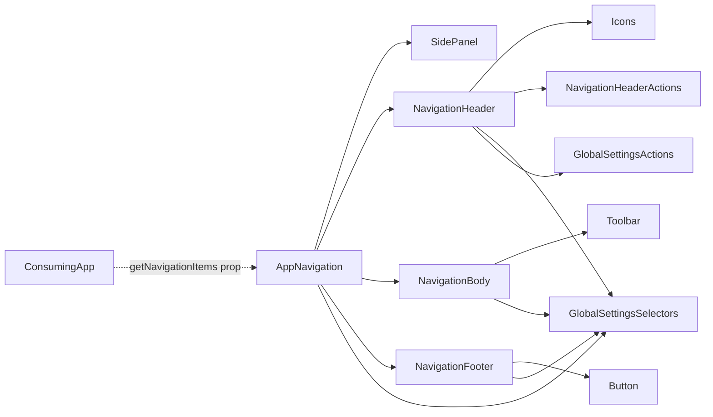
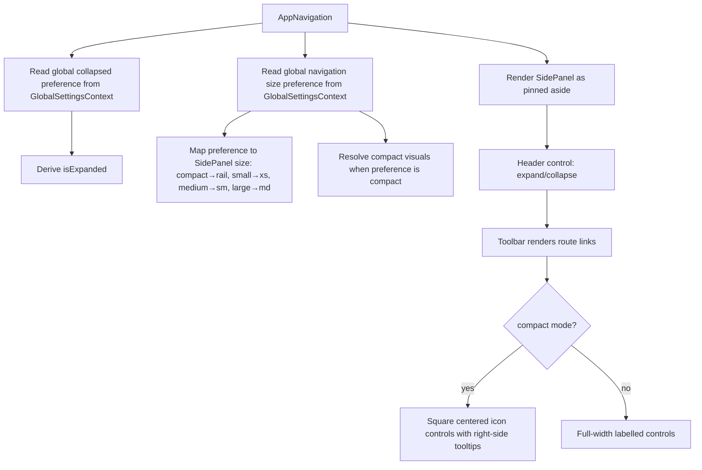

# AppNavigation Architecture

Application-owned sidebar navigation shell. It composes existing design-system
components rather than introducing a second navigation primitive.

## File Structure

```
AppNavigation/
├── index.ts                         → Barrel export
├── AppNavigation.component.tsx      → Shell: always-pinned SidePanel composing header/body/footer
├── AppNavigation.constants.ts       → NAV_DENSITY size-preference map
├── AppNavigation.stylex.ts          → Shared layout StyleX styles (consumed by subcomponents + utils)
├── AppNavigation.types.ts           → Props and local variant types
├── AppNavigation.test.tsx           → Integration tests (real GlobalSettingsProvider)
│
├── NavigationHeader/                → Brand + expand/collapse action placement
│   ├── NavigationHeader.component.tsx
│   └── NavigationHeader.test.tsx
│
├── NavigationBody/                  → Vertical toolbar of app-supplied route links
│   ├── NavigationBody.component.tsx
│   ├── NavigationBody.types.ts
│   └── NavigationBody.test.tsx
│
├── NavigationFooter/                → Theme toggle + optional session-actions slot
│   ├── NavigationFooter.component.tsx
│   ├── NavigationFooter.types.ts
│   └── NavigationFooter.test.tsx
│
├── NavigationHeaderActions/         → Expand/collapse control button
├── utils/                           → Density styles, labels (individually tested)
└── ARCHITECTURE.md                  → This document
```

## Dependencies



Each subcomponent reads the collapsed/size preferences it needs directly from
`GlobalSettingsContext` selectors. `NavigationHeader` takes no props at all;
the shell only forwards the pass-through consumer props (`getNavigationItems`,
`sessionActions`) and the theme state it reads from `useTheme`.

## The Panel Is Permanent

The sidebar is rendered as an always-pinned `SidePanel` — an `<aside>` that is
part of the layout, never a dismissible dialog. There is no pin/unpin control,
no floating launcher, and no open/closed state to hold: navigation to any route
is always one click away. Density still varies (see below), and the panel still
collapses to an icon rail, but collapsing narrows it rather than removing it.

## Render Flow



## Props

| Prop                 | Type                                                 | Default | Description                                              |
| -------------------- | ---------------------------------------------------- | ------- | -------------------------------------------------------- |
| `getNavigationItems` | `(iconSize: number) => readonly ToolbarItemConfig[]` | —       | Returns this app's own route links, sized to `iconSize`  |
| `sessionActions`     | `NavigationSessionActions`                           | —       | Optional footer slot for a session control (e.g. logout) |

## Route Items

`AppNavigation` is app-agnostic — it has no opinion on what routes exist.
Each consuming app supplies its own `getNavigationItems` function (e.g.
`apps/react-router/src/root/getNavigationItems.util.tsx`), passed down
through `AppShell`'s own `getNavigationItems` prop. Every returned item is
typed `ToolbarItemConfig` and rendered through the existing `Toolbar`/
`NavLink` contracts. This function previously lived inside this package
(`utils/getNavigationItems.util.tsx`) with `apps/react-router`'s routes
hardcoded into it — moved out because a shared package should not encode
one specific consuming app's route list.

## Compact Mode

Compact mode is controlled by the global navigation size preference. When set to
`compact`, `AppNavigation` uses `SidePanel` rail width, passes `isCompact` to
`Toolbar`, and renders icon-only controls with tooltips.

## Initial Expansion State

`AppNavigation` derives its runtime expansion state from the global navigation
preferences:

- `collapsed: 'collapsed'` starts the panel collapsed (`isExpanded = false`).
- A missing value falls back to `expanded`.

The header's expand/collapse action is write-through: it persists
`navigation.collapsed` immediately, so the panel re-renders from the preference
rather than from local state.
