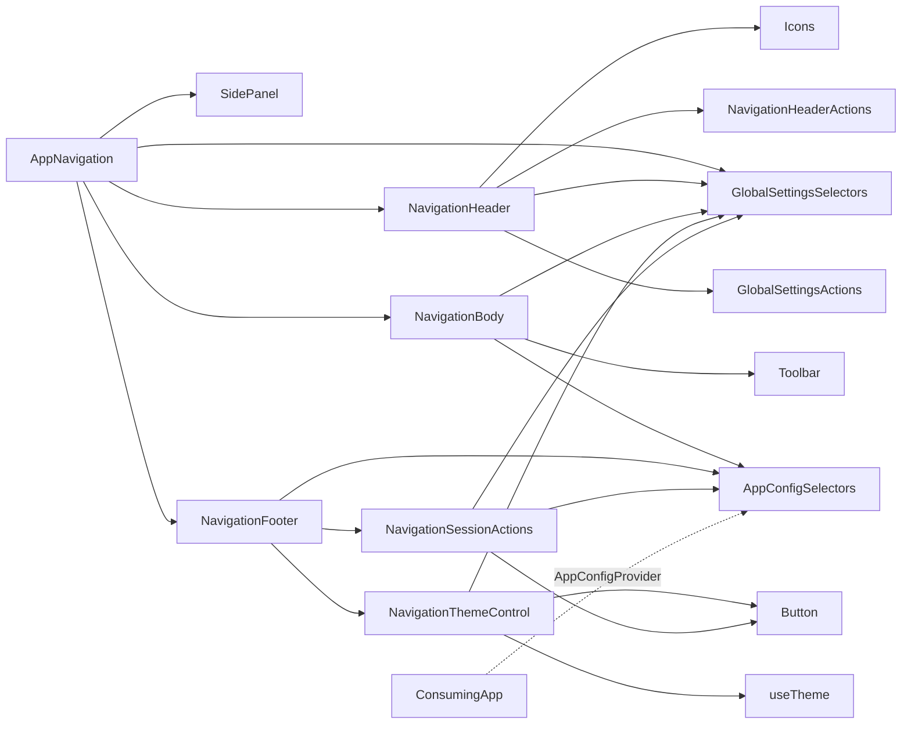
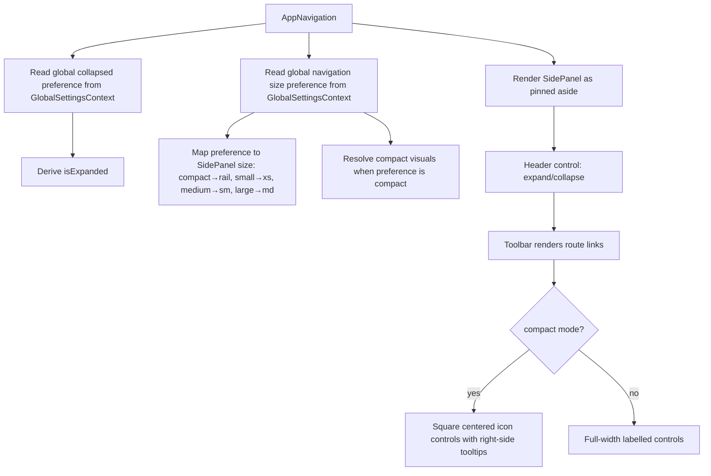

# AppNavigation Architecture

Application-owned sidebar navigation shell. It composes existing design-system
components rather than introducing a second navigation primitive.

## File Structure

```
AppNavigation/
├── index.ts                         → Barrel export
├── AppNavigation.component.tsx      → Shell: always-pinned SidePanel composing header/body/footer
├── AppNavigation.constants.ts       → NAV_DENSITY size-preference map
├── AppNavigation.stylex.ts          → Shared layout StyleX styles (consumed by subcomponents + utils)
├── AppNavigation.test.tsx           → Integration tests (real GlobalSettingsProvider)
│
├── NavigationHeader/                → Brand + expand/collapse action placement
│   ├── NavigationHeader.component.tsx
│   └── NavigationHeader.test.tsx
│
├── NavigationBody/                  → Vertical toolbar of app-supplied route links
│   ├── NavigationBody.component.tsx
│   └── NavigationBody.test.tsx
│
├── NavigationFooter/                → Thin shell: theme control + session controls
│   ├── NavigationFooter.component.tsx
│   ├── NavigationFooter.test.tsx
│   ├── NavigationThemeControl/      → Theme toggle (self-connected)
│   └── NavigationSessionActions/    → Logout form, rendered when isAuthEnabled
│
├── NavigationHeaderActions/         → Expand/collapse control button
├── utils/                           → Density styles, labels (individually tested)
└── ARCHITECTURE.md                  → This document
```

## Dependencies



Every subcomponent reads what it renders for itself — the collapsed/size
preferences from `GlobalSettingsContext`, and the app's route links / session
configuration from `AppConfigContext`. Nothing is passed down: the shell holds
only the panel's own geometry, and every delegate is zero-prop.

## The Panel Is Permanent

The sidebar is rendered as an always-pinned `SidePanel` — an `<aside>` that is
part of the layout, never a dismissible dialog. There is no pin/unpin control,
no floating launcher, and no open/closed state to hold: navigation to any route
is always one click away. Density still varies (see below), and the panel still
collapses to an icon rail, but collapsing narrows it rather than removing it.

## State Ownership Rule

| Delegate                   | Reads                                                                |
| -------------------------- | -------------------------------------------------------------------- |
| `AppNavigation`            | `collapsed`, `size` preferences — for the panel's own geometry       |
| `NavigationHeader`         | `collapsed`, `size` preferences (+ the preference actions it writes) |
| `NavigationBody`           | `getNavigationItems`; `collapsed`, `size` preferences                |
| `NavigationFooter`         | `isAuthEnabled` — composition only                                   |
| `NavigationThemeControl`   | `useTheme()`; `collapsed`, `size` preferences                        |
| `NavigationSessionActions` | `logoutRoute`; `collapsed`, `size` preferences                       |

## Render Flow



## Props

None. `AppNavigation` takes no props at all, so it has no `.types.ts` — the
panel's geometry comes from `GlobalSettingsContext` and everything app-specific
from `AppConfigContext`.

## Route Items

`AppNavigation` is app-agnostic — it has no opinion on what routes exist.
Each consuming app supplies its own `getNavigationItems` function (e.g.
`apps/react-router/src/root/getNavigationItems.util.tsx`) through
`AppConfigProvider`, and `NavigationBody` reads it there. Every returned item is
typed `ToolbarItemConfig` and rendered through the existing `Toolbar`/
`NavLink` contracts. This function previously lived inside this package
(`utils/getNavigationItems.util.tsx`) with `apps/react-router`'s routes
hardcoded into it — moved out because a shared package should not encode
one specific consuming app's route list. It then spent a while being drilled
through `AppShell` and `AppNavigation`, neither of which read it; the context is
what removed that ([ADR-053](../../../../../docs/decisions/ADR-053-package-owned-app-root-and-app-config-context.md)).

## Session Controls

The footer renders `NavigationSessionActions` — a POST `<Form>` to the app's
`logoutRoute` — only when the app declared `isAuthEnabled` through
`AppConfigProvider`. An app with no session concept sets nothing and the footer
shows the theme control alone. Logging out mutates session state, so it is a
POST rather than a link: a GET is something a prefetch can fire on its own.

## Compact Mode

Compact mode is controlled by the global navigation size preference. When set to
`compact`, `AppNavigation` uses `SidePanel` rail width, passes `isCompact` to
`Toolbar`, and renders icon-only controls with tooltips.

## Initial Expansion State

`AppNavigation` derives its runtime expansion state from the global navigation
preferences:

- `collapsed: 'collapsed'` starts the panel collapsed (`isExpanded = false`).
- A missing value falls back to `expanded`.

The header's expand/collapse action is write-through: it persists
`navigation.collapsed` immediately, so the panel re-renders from the preference
rather than from local state.
