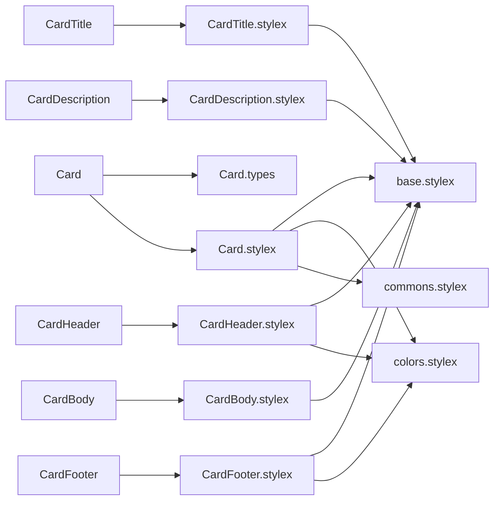
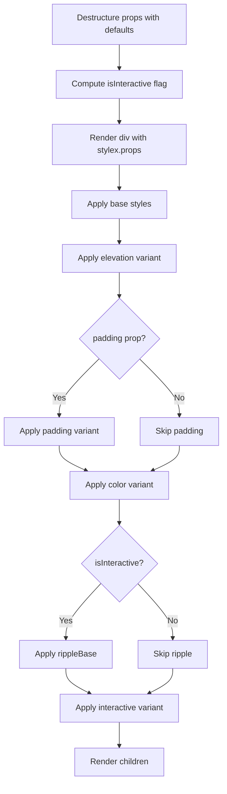
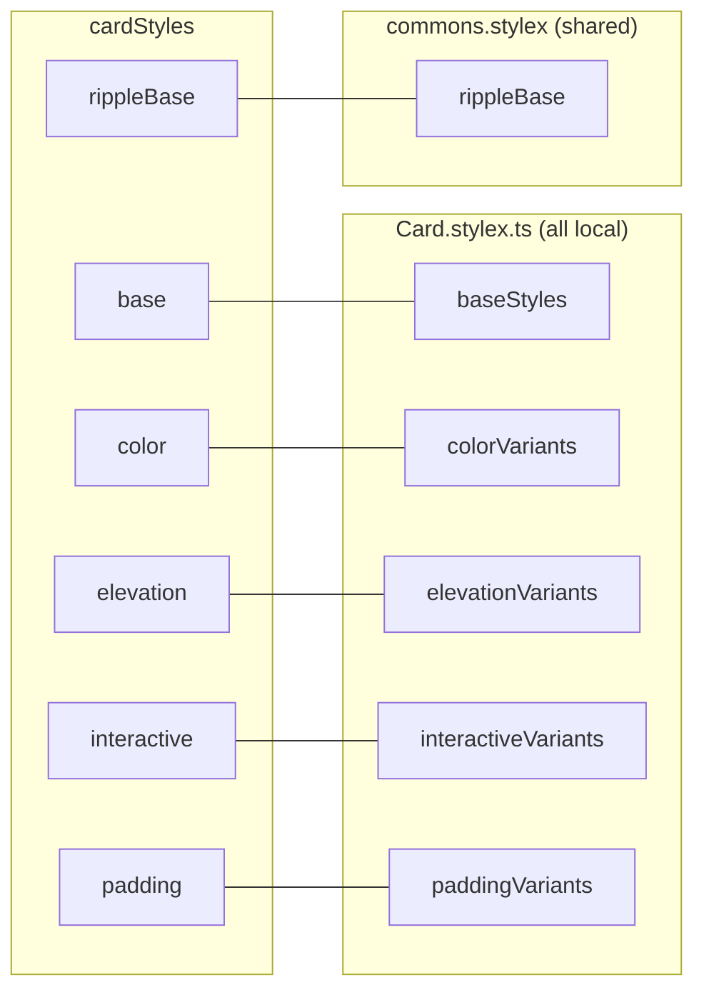
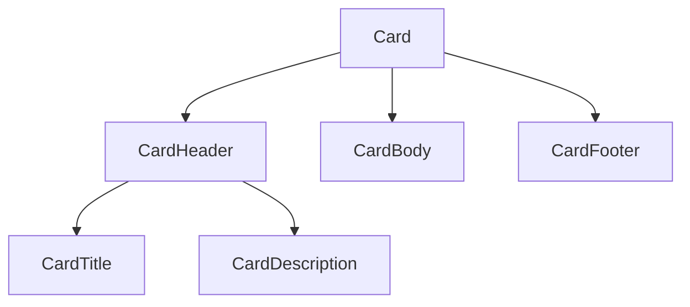

# Card Component Architecture

## File Structure

```
Card/
├── index.ts                 → Barrel export: Card + all sub-components + types
├── Card.component.tsx       → Root container component
├── Card.types.ts            → CardProps + variant types (local, not from design-system)
├── Card.stylex.ts           → Style composition (local variants + shared tokens)
│
├── CardHeader/              → Top section with bottom border
│   ├── index.ts
│   ├── CardHeader.component.tsx
│   ├── CardHeader.types.ts  → extends div
│   └── CardHeader.stylex.ts
│
├── CardTitle/               → h3 heading with optional icon
│   ├── index.ts
│   ├── CardTitle.component.tsx
│   ├── CardTitle.types.ts  → extends h3 + icon?: ReactNode
│   └── CardTitle.stylex.ts
│
├── CardDescription/         → Paragraph text below title
│   ├── index.ts
│   ├── CardDescription.component.tsx
│   ├── CardDescription.types.ts  → extends p
│   └── CardDescription.stylex.ts
│
├── CardBody/                → Main content area
│   ├── index.ts
│   ├── CardBody.component.tsx
│   ├── CardBody.types.ts   → extends div
│   └── CardBody.stylex.ts
│
└── CardFooter/              → Bottom section with top border
    ├── index.ts
    ├── CardFooter.component.tsx
    ├── CardFooter.types.ts  → extends div
    └── CardFooter.stylex.ts
```

## Dependencies



## Render Flow



## Props

`CardProps` extends `ComponentPropsWithoutRef<'div'>` plus:

| Prop          | Type              | Default     |
| ------------- | ----------------- | ----------- |
| `color`       | `CardColor`       | `'default'` |
| `elevation`   | `CardElevation`   | `'sm'`      |
| `interactive` | `CardInteractive` | `'static'`  |
| `padding`     | `CardPadding`     | —           |

### Variant Enums (defined in Card.types.ts)

| Type              | Values                                                                   |
| ----------------- | ------------------------------------------------------------------------ |
| `CardColor`       | `default`, `error`, `info`, `primary`, `secondary`, `success`, `warning` |
| `CardElevation`   | `flat`, `sm`, `md`, `lg`, `xl`                                           |
| `CardInteractive` | `static`, `hoverable`, `clickable`                                       |
| `CardPadding`     | `none`, `sm`, `md`, `lg`, `xl`                                           |

## Style Composition

`cardStyles` in `Card.stylex.ts` is a composed object. All variants are defined locally
(unlike Button which shares from `commons.stylex`). Only `rippleBase` comes from shared tokens.



**Base styles** (`baseStyles.card`):

- `borderRadius: lg`, `border: solid 1px`, `overflow: hidden`
- `transition: all normal easeInOut`
- `containerName: 'card'`, `containerType: inline-size`

**Interactive variants**:

- `static` → no interaction styles
- `hoverable` → hover shadow + pointer cursor
- `clickable` → hover shadow + pointer cursor + radial-gradient ripple on hover

## Sub-Components

All sub-components are simple wrappers: they extend a native HTML element, apply local
StyleX styles, and render `children`. No logic or state.

| Component         | HTML Element | Extra Props        | Key Styles                                                          |
| ----------------- | ------------ | ------------------ | ------------------------------------------------------------------- |
| `CardHeader`      | `div`        | —                  | `padding: lg`, bottom border                                        |
| `CardTitle`       | `h3`         | `icon?: ReactNode` | `fontSize: lg`, `fontWeight: semibold`, flex row with optional icon |
| `CardDescription` | `p`          | —                  | `fontSize: sm`, `marginTop: xs`                                     |
| `CardBody`        | `div`        | —                  | `padding: lg`                                                       |
| `CardFooter`      | `div`        | —                  | `padding: lg`, top border, secondary background                     |

### Intended Composition



## Consumers

Used in App.tsx and OrderDetail route component.
