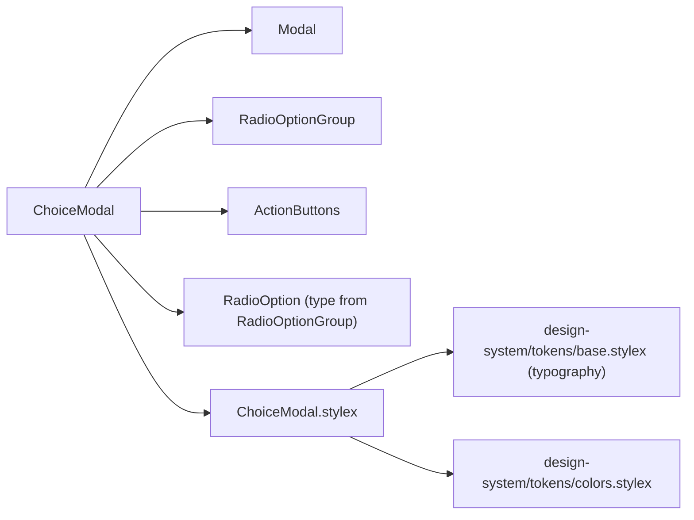
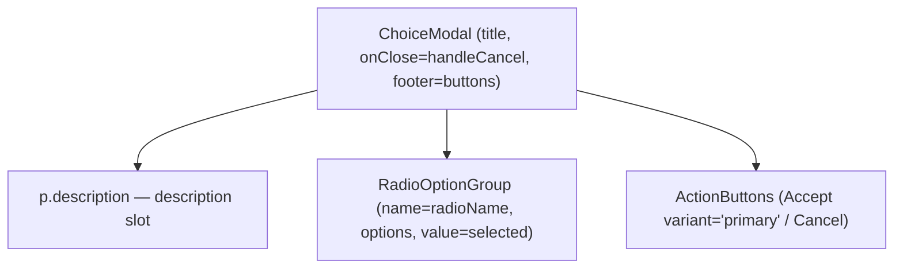
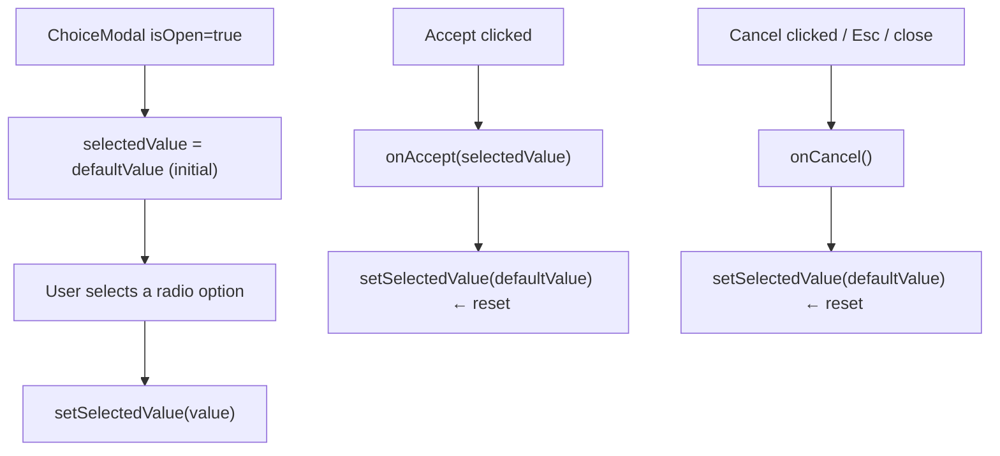

# ChoiceModal Architecture

Generic, store-agnostic modal for resolving a single-choice prompt: it renders a
description, a `RadioOptionGroup` of options, and Accept/Cancel actions, and owns
the ephemeral selection state. Generic over the resolution union `TValue` so each
consumer keeps its options and accept callback type-safe.

It is the shared shell behind every "pick one option, then accept or cancel"
modal in the Table settings drawer — `PinSideModal` and the pin/unpin/order
conflict modals each configure it with their own copy, options, and data wiring.
For a plain yes/no prompt (no options), use `ConfirmDialog` instead.

## File Structure

```
ChoiceModal/
├── index.ts                     → Barrel export (component only)
├── ChoiceModal.component.tsx    → Modal + RadioOptionGroup + ActionButtons composition
├── ChoiceModal.types.ts         → ChoiceModalProps<TValue>
└── ChoiceModal.stylex.ts        → description paragraph style
```

## Dependencies



## Component Hierarchy



## State & Flow



**Reset on close:** `selectedValue` always resets to `defaultValue` after Accept
or Cancel — and `onAccept` fires with the pre-reset selection — so the modal
starts fresh the next time it opens.

## Props (`ChoiceModalProps<TValue extends string>`)

| Prop           | Type                             | Description                                                    |
| -------------- | -------------------------------- | -------------------------------------------------------------- |
| `title`        | `string`                         | Modal heading                                                  |
| `description`  | `ReactNode`                      | Prompt above the options; free-form so callers can interpolate |
| `options`      | `readonly RadioOption<TValue>[]` | Selectable resolution options                                  |
| `defaultValue` | `TValue`                         | Value seeded on open and reset to after accept/cancel          |
| `radioName`    | `string`                         | Shared `name` attribute for the radio inputs                   |
| `isOpen`       | `boolean`                        | Controls Modal visibility                                      |
| `onAccept`     | `(value: TValue) => void`        | Called with the chosen value when Accept is clicked            |
| `onCancel`     | `() => void`                     | Called when Cancel is clicked or the modal is closed           |

## Consumers

Store-agnostic — feature modals wrap it with their own store wiring:
`PinSideModal` (via the `ColumnOrderPinSideModal` owner), `PinConflictModal`,
`UnpinConflictModal`, and `OrderConflictModal`.
