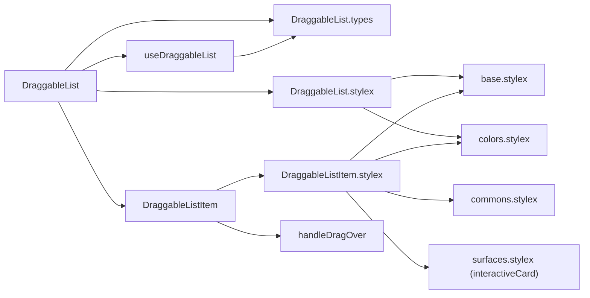
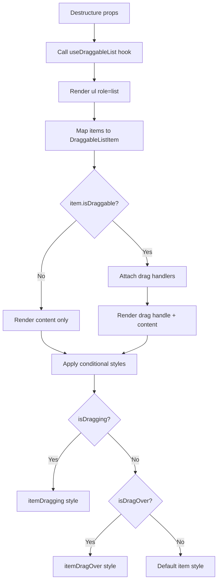
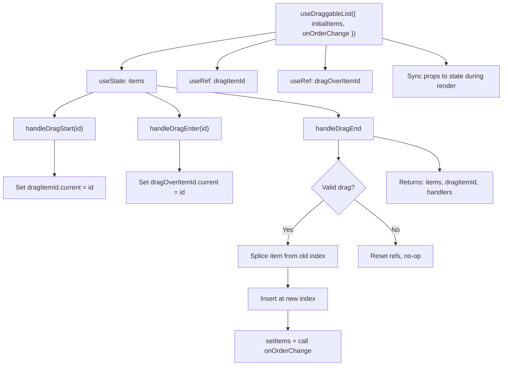

# DraggableList Component Architecture

## File Structure

```
DraggableList/
├── index.ts                       → Barrel export: DraggableList + types
├── DraggableList.component.tsx    → ul shell; maps items to DraggableListItem
├── DraggableList.types.ts         → DraggableItem, DraggableListProps, UseDraggableListProps
├── DraggableList.stylex.ts        → The ul shell only (`list`)
│
├── DraggableListItem/             → Private delegate (no barrel): li + drag state/wiring per item
│   ├── DraggableListItem.component.tsx
│   ├── DraggableListItem.stylex.ts → Row layout + drag/focus states; card surface from surfaces.stylex
│   ├── DraggableListItem.test.tsx
│   └── DraggableListItem.types.ts → { dragItemId, isBusy, item, onDragEnd, onDragEnter, onDragStart }
│
├── hooks/
│   ├── index.ts
│   └── useDraggableList.hook.ts   → State & drag handlers (HTML5 Drag and Drop)
│
└── utils/
    ├── index.ts
    └── handleDragOver.util.ts     → preventDefault helper for dragover events
```

## Dependencies



The row's card surface — fill, hover, border, radius — comes from
`surfaceStyles.interactiveCard`, shared with `FilterItem` and `RadioOptionGroup`
(`design-system/ARCHITECTURE.md` → Shared Surface Recipes). `DraggableListItem.stylex`
keeps only layout and the drag/focus states. Its `borderColor` restates the
recipe's default next to the `:focus-visible` accent on purpose: a value-level
conditional replaces the whole property key, so omitting the default would drop
the resting border.

## Render Flow



## Props

`DraggableListProps`:

| Prop            | Type                               | Default | Description                 |
| --------------- | ---------------------------------- | ------- | --------------------------- |
| `items`         | `DraggableItem[]`                  | —       | Array of items to render    |
| `onOrderChange` | `(items: DraggableItem[]) => void` | —       | Callback when order changes |

`DraggableItem`:

| Prop          | Type        | Default | Description                      |
| ------------- | ----------- | ------- | -------------------------------- |
| `id`          | `string`    | —       | Unique identifier                |
| `content`     | `ReactNode` | —       | Content to render                |
| `isDraggable` | `boolean`   | `true`  | Whether this item can be dragged |

## Hook: useDraggableList

Manages all drag-and-drop state using native HTML5 Drag and Drop API (no external libraries).



**Key details**:

- Uses `useRef` for drag source/target IDs (avoids re-renders during drag)
- Syncs local state with prop changes during render (not in `useEffect`)
- Guards against invalid drops: same item, missing IDs, out-of-bounds indices

## Style Composition

All styles are local in `DraggableList.stylex.ts`. No shared variants or composed style objects.

| Style Key          | Purpose                                                |
| ------------------ | ------------------------------------------------------ |
| `list`             | Flex column, no list-style, gap between items          |
| `item`             | Bordered row, grab cursor, hover highlight, focus ring |
| `itemDragging`     | Opacity 0.5 + grabbing cursor                          |
| `itemDragOver`     | Dashed border with brand color                         |
| `itemNotDraggable` | Default cursor (no grab)                               |
| `dragHandle`       | Shrink-proof grip icon, grab/grabbing cursor           |
| `content`          | Flex-grow, min-width 0 for text truncation             |

## Consumers

Every staged list in the Table settings drawer, and no other surface:

- `ActiveGroupKeyList` (grouping section — the keys, in nesting order)
- `ActiveAggregateList` (grouping section — the measures, in staged order)
- `ActiveSortList` (sorting section)
- `ColumnOrderSectionBody` (column reordering)
- `useReorderColumns` hook (type import only)

The list is the whole drawer's reorder affordance, so it is worth restating why
it is the same primitive four times: each of those orders is **state the user
arranged**, not a view preference — the sort precedence, the grouping's nesting
order, the column order, and (since #832) the order the measures are listed in.
A staged list that could not be reordered would be the odd one out in a single
screenshot of the drawer, which is what #832 closed.

Keep this list current when a fifth arrives. It named two consumers while there
were three, which is how it came to be checked as part of adding the fourth.
