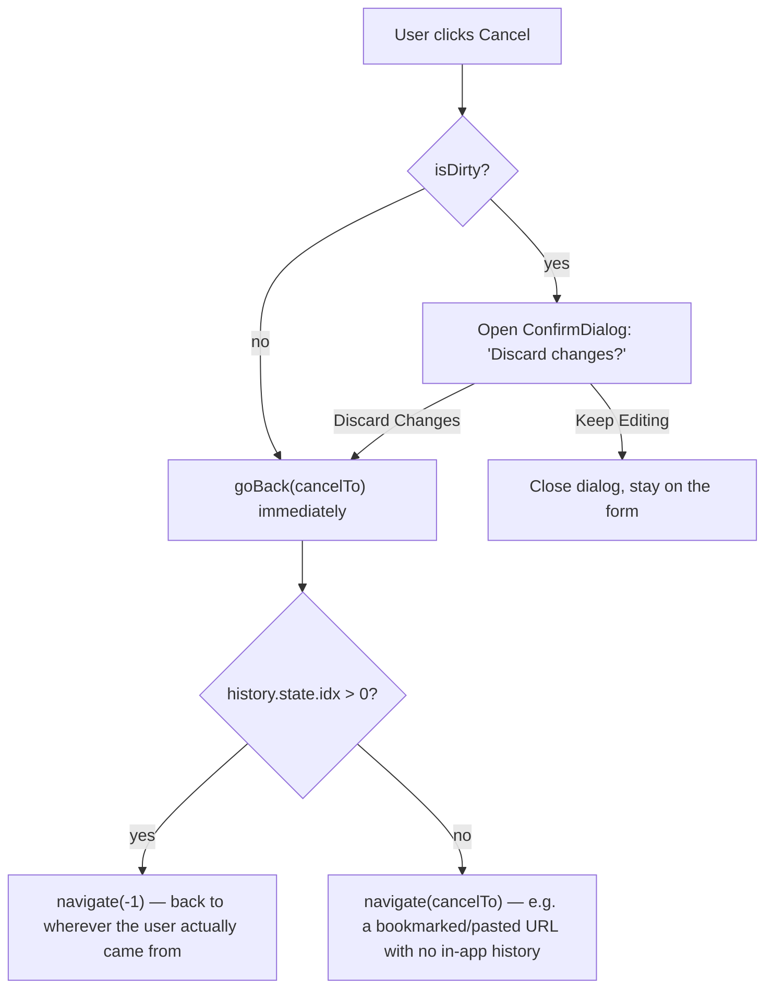

# Form Architecture

Declarative, `fields`-driven form component — the `Table`/`columns` philosophy
applied to forms (`fields` instead of `columns`). Renders from a recursive
`group`/`row`/`tab`/leaf field tree, submits through React Router 7's native
`<Form>` (or `useFetcher().Form` as an opt-in), and supports `create`/`edit`/
`view` modes with dirty-check-gated edit submission and a built-in
Accept/Cancel footer (see ADR-005, and ADR-014 for the `path` field type
and Cancel's discard-changes confirmation).

## File Structure

Every component gets its own directory with its own `.types.ts` (bundle
pattern) — including internal, non-barrel-exported delegates like `FormBody`,
`FormFields`, `FormField`, and each leaf field, matching `Table`'s own
`TableContent` precedent for private view delegates.

```
Form/
├── ARCHITECTURE.md
├── Form.component.tsx        → Root: computes leafFields/initial values, composes FormProvider + FormBody
├── Form.test.tsx             → Integration tests via react-router's createRoutesStub
├── Form.types.ts             → FieldNode union, FormProps, FormMode
├── index.ts                  → Barrel: Form + public types
│
├── FormBody/
│   ├── FormBody.component.tsx → The actual view: RR7 Form/fetcher.Form, footer, submit gating
│   ├── FormBody.stylex.ts
│   ├── FormBody.types.ts
│   └── index.ts
│
├── contexts/
│   ├── index.ts               → Barrel: FormProvider + all selectors/actions
│   └── FormContext/
│       ├── FormContext.context.ts    → createContext (undefined default)
│       ├── FormContext.provider.tsx  → Provider: creates fieldsStore + metaStore, syncs serverErrors/mode props
│       ├── FormContext.types.ts      → FormFieldsState, FormMetaState, FormContextValue, FormProviderProps
│       ├── useFormContextValue.hook.ts → use(FormContext) with guard (infra only)
│       ├── useFieldsStore.hook.ts     → Shared useSyncExternalStore wrapper over fieldsStore (mirrors Table's useColumnsStore/useFiltersStore)
│       ├── useMetaStore.hook.ts       → Shared useSyncExternalStore wrapper over metaStore (mirrors Table's useMetaStore)
│       ├── actions/
│       │   ├── useSetFieldValue.hook.ts  → Writes one field's value into fieldsStore
│       │   └── useSubmitForm.hook.ts     → Pre-submit gate: reads metaStore + fieldsStore, dirty-check + validateFields
│       └── selectors/
│           ├── useGetFieldError.hook.ts   → useFieldsStore((s) => s.errors[accessor])
│           ├── useGetFieldValue.hook.ts   → useFieldsStore((s) => s.values[accessor])
│           ├── useGetFormMode.hook.ts     → useMetaStore((s) => s.mode)
│           └── useGetIsFormDirty.hook.ts  → useFieldsStore((s) => isFormDirty(...))
│
├── FormFields/
│   ├── FormFields.component.tsx  → Recursive walker: computes stable key, dispatches each node type to its subcomponent
│   ├── FormFields.stylex.ts      → `stack` layout only
│   ├── FormFields.types.ts
│   ├── FormFieldGroup/           → `group` node: optional label + nested FormFields (.component + .types + .stylex + .test)
│   ├── FormFieldRow/             → `row` node: horizontal equal-flex cells of nested FormFields (.component + .types + .stylex + .test)
│   ├── FormFieldTabs/            → `tab` node: one Tabs panel per tab (.component + .types + .test)
│   └── utils/
│       ├── collectAccessors.util.ts → Node → flattened leaf accessors (recursive, + .test)
│       └── getFieldKey.util.ts      → Node → stable `type:accessor|accessor` React key (+ .test)
├── FormField/
│   ├── FormField.component.tsx   → Registry dispatch by field.type
│   ├── FormField.types.ts
│   └── FormField.constants.ts    → fieldRegistry: type → leaf component
├── FormFieldChrome/
│   ├── FormFieldChrome.component.tsx → Shared label/description/error wrapper
│   └── FormFieldChrome.types.ts
│
├── fields/
│   ├── useFormField.hook.ts → Shared per-leaf-field wiring: useId + value/error/mode selectors + isDisabled + accessor-bound setValue (every leaf field consumes it)
│   ├── TextField/     → text | email | password | textarea (new bare input)
│   ├── NumberField/   → number (new bare input)
│   ├── DateField/     → date | datetime (new bare input)
│   ├── BooleanField/  → wraps Checkbox or ToggleSwitch
│   ├── SelectField/   → wraps VirtualSelect + hidden inputs for FormData
│   ├── RadioField/    → wraps RadioOptionGroup
│   ├── PathField/     → path — text input + Browse… button, opens inline PathBrowserModal list panel
│   │   └── PathBrowserModal/ → Private delegate — breadcrumb-free directory drill-down panel, fetches @repo/ui/routing/browseDirectory.loader via useFetcher().load
│   └── CustomField/   → escape hatch via field.renderField(...)
│   (each: <Name>.component.tsx + <Name>.types.ts, TextField/RadioField/PathBrowserModal also <Name>.stylex.ts)
│
└── utils/
    ├── flattenFields.util.ts    → Recursive walker → readonly LeafFieldDef[]
    ├── getInitialValues.util.ts → leafFields + initialValues → full TValues
    ├── validateFields.util.ts   → Hand-rolled client validation (non-Zod, instant feedback only)
    └── isFormDirty.util.ts      → Subset compare (array-aware) for edit-mode gating
```

## Store Pattern

**Two stores in one `FormContext`, not one combined store** — matching
`Table`'s `TableConfigContextValue` (`columnsStore` + `metaStore` together)
rather than treating "one context" as "one store." Split by rate-of-change
and by whether the state is keyed to a single field, per the `store-pattern`
skill:

```typescript
// Low-frequency, form-level — not keyed by any field
FormMetaState = {
  mode: FormMode;
};

// High-frequency, every slice keyed by accessor
FormFieldsState<TValues> = {
  errors: FieldErrors<TValues>;
  initialValues: TValues;  // frozen pristine snapshot from mount — edit-mode dirty baseline
  values: TValues;
};
```

Each store gets its own thin `useSyncExternalStore` wrapper —
`useFieldsStore(selector)` and `useMetaStore(selector)` — exactly mirroring
`Table`'s `useColumnsStore`/`useMetaStore`/`useFiltersStore`. Every selector
hook (`useGetFieldValue`, `useGetFieldError`, `useGetFormMode`,
`useGetIsFormDirty`) is then a one-line call into the matching store-hook
with its own selector function — including the accessor-keyed ones
(`useGetFieldValue(accessor)` selects `state.values[accessor]`), the same
shape as `Table`'s `useGetNormalizedColumn(columnKey)` and `FiltersData`'s
`useGetFilterData(columnKey)`. Components never touch `fieldsStore.get()`/
`.set()` or `metaStore.get()`/`.set()` directly — only these selector hooks
and the action hooks (`useSetFieldValue`, `useSubmitForm`).

Why split at all, given `useSyncExternalStore`'s snapshot-equality check
already prevents unnecessary re-renders regardless: every write to either
store still wakes every subscriber of _that_ store to re-run its selector,
even when the result doesn't change enough to re-render. Keeping `values`
(written on every keystroke) out of the same store as `mode` (written
essentially never) means a value change doesn't invoke `mode`'s selector at
all — the same reasoning `Table` already applies by keeping `columnsStore`
separate from `dataStore`. `useSubmitForm` is the one action that needs
both stores (mode to decide whether to run the dirty check, values/
initialValues to run it) — reading multiple stores from one action and
snapshotting each once is an explicitly allowed action responsibility, the
same as `Table`'s `useSetColumnFilter` reading both `TableConfig` and
`TableData`.

`Form.component.tsx` is the only place that creates the stores (via
`FormProvider`) and computes the initial snapshot (`flattenFields` +
`getInitialValues`) — it renders no fields itself. `FormBody` (its own
directory) is the actual view: it reads `mode`/`isDirty` via selectors and
submits via the `useSubmitForm` action.

## Submission Flow


`noValidate` is set on the `<form>` element deliberately: leaf inputs still
carry native `required`/`min`/`max` attributes for accessibility, but native
HTML5 constraint validation would otherwise intercept the click before the
`submit` event — and therefore before `handleSubmit`/`preventDefault` — ever
runs, silently defeating this whole flow.

Client validation (`validateFields.util.ts`) is progressive enhancement only
— instant feedback, not authority. The consuming route's action + Zod schema
is the real gate; `serverErrors` (from `useActionData()`) flows back in via
`FormProvider`'s `serverErrors` prop and is re-synced into the store whenever
it changes identity.

## Mode Semantics

- **`create`**: normal submit, gated by client validation only.
- **`edit`**: submit button disabled and submission blocked client-side
  unless at least one field's value differs from the frozen `initialValues`
  baseline (`isFormDirty`, array-aware — a regenerated-but-unchanged array
  from `VirtualSelect` does not count as dirty). Avoids writing to the DB
  when nothing actually changed.
- **`view`**: every leaf field forced `isDisabled`; the footer (submit/
  cancel buttons) is not rendered at all.

## Cancel & Discard-Changes Flow

The footer's Cancel button is always rendered (whenever the footer itself
renders — `create`/`edit`, never `view`) and its behavior is entirely
built into `FormBody`, not left to each consumer to wire up:



- **`cancelTo`** (required prop) is the fallback route — conventionally the
  entity's list route (`/cqms/projects`), but a consumer scoped to one
  parent entity can point narrower (`trigger-scan` cancels to that
  project's detail page, not the top-level project list).
- **`useBackNavigate`** (`packages/ui/src/hooks/`) owns the "was there a
  real in-app previous page" decision via `history.state.idx` — react-
  router's own browser-history position marker — so Cancel doesn't
  strand the user on an external referrer or a blank tab. Generic, reused
  anywhere a "Back" affordance needs the same judgment call, not
  Form-specific.
- **`ConfirmDialog`** (`packages/ui/src/components/ConfirmDialog/`) is a
  plain, Form-agnostic yes/no prompt built on `Modal` — the "would lose
  changes" gate reuses the exact same `isDirty` the submit button already
  computes, so "don't bother the API with no changes" (submit-disabled)
  and "don't silently lose changes on cancel" (confirm-gated) are two
  faces of the same dirty check.

## Registry Dispatch, Not a Switch

`FormField.constants.ts`'s `fieldRegistry` maps `field.type` → component.
Adding a new leaf type is a new registry entry, not a growing conditional.
Each leaf component is generic over its own `TValues`; erased to a loose
`AnyFieldComponent` shape at the registry boundary and narrowed back inside
each leaf via its own concrete field-def type — the one intentional `any`
in this component, confined to that single boundary.

## Native Form Participation

Native `<input>`/`<textarea>`/radio inputs participate in `FormData`
automatically via `name`. Two components need explicit handling:

- **`VirtualSelect`** renders no native form control at all — `SelectField`
  mirrors the current selection into hidden `<input type="hidden">`
  elements so RR7's `Form`/`fetcher.Form` still submits real `FormData`.
- **Native checkboxes** are omitted from `FormData` entirely when unchecked
  (standard HTML behavior, not a bug here) — the consuming action's Zod
  schema must treat an absent boolean field as `false`.

## Consumer Map

CQMS's `new-project` and `trigger-scan` route actions (Implementation Plan
step 8) are the first real consumers, both using `mode: 'create'`.
`edit-project` (`mode: 'edit'`) is the first `path`-type-field consumer —
`localPath` browses the server's real filesystem via
`@repo/ui/routing/browseDirectory.loader` (re-exported as a thin resource
route, `admin_system`'s `_action/browse-directory`), deliberately
unscoped — this app registers local repos that can live anywhere on the
machine, so there's no meaningful root to sandbox browsing to.
