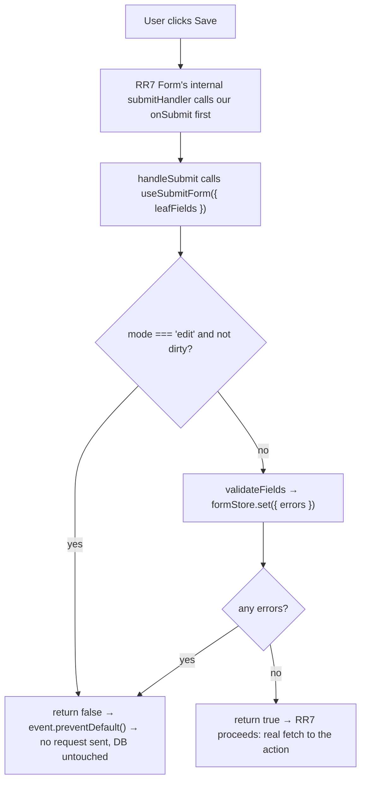

# Form Architecture

Declarative, `fields`-driven form component — the `Table`/`columns` philosophy
applied to forms (`fields` instead of `columns`). Renders from a recursive
`group`/`row`/`tab`/leaf field tree, submits through React Router 7's native
`<Form>` (or `useFetcher().Form` as an opt-in), and supports `create`/`edit`/
`view` modes with dirty-check-gated edit submission. See ADR-005.

## File Structure

Every component gets its own directory with its own `.types.ts` (bundle
pattern) — including internal, non-barrel-exported delegates like `FormBody`,
`FormFields`, `FormField`, and each leaf field, matching `Table`'s own
`TableContent` precedent for private view delegates.

```
Form/
├── ARCHITECTURE.md
├── Form.component.tsx        → Root: computes leafFields/initial values, composes FormProvider + FormBody
├── Form.test.tsx             → Integration tests via react-router's createRoutesStub
├── Form.types.ts             → FieldNode union, FormProps, FormMode
├── index.ts                  → Barrel: Form + public types
│
├── FormBody/
│   ├── FormBody.component.tsx → The actual view: RR7 Form/fetcher.Form, footer, submit gating
│   ├── FormBody.stylex.ts
│   ├── FormBody.types.ts
│   └── index.ts
│
├── contexts/
│   ├── index.ts               → Barrel: FormProvider + all selectors/actions
│   └── FormContext/
│       ├── FormContext.context.ts    → createContext (undefined default)
│       ├── FormContext.provider.tsx  → Provider: creates formStore, syncs serverErrors prop
│       ├── FormContext.types.ts      → FormState, FormContextValue, FormProviderProps
│       ├── useFormContextValue.hook.ts → use(FormContext) with guard (infra only)
│       ├── actions/
│       │   ├── useSetFieldValue.hook.ts  → Writes one field's value
│       │   └── useSubmitForm.hook.ts     → Pre-submit gate: edit dirty-check + validateFields
│       └── selectors/
│           ├── useGetFieldError.hook.ts
│           ├── useGetFieldValue.hook.ts
│           ├── useGetFormMode.hook.ts
│           └── useGetIsFormDirty.hook.ts
│
├── FormFields/
│   ├── FormFields.component.tsx  → Single recursive walker for group/row/tab/leaf
│   └── FormFields.types.ts
├── FormField/
│   ├── FormField.component.tsx   → Registry dispatch by field.type
│   ├── FormField.types.ts
│   └── FormField.constants.ts    → fieldRegistry: type → leaf component
├── FormFieldChrome/
│   ├── FormFieldChrome.component.tsx → Shared label/description/error wrapper
│   └── FormFieldChrome.types.ts
│
├── fields/
│   ├── TextField/     → text | email | password | textarea (new bare input)
│   ├── NumberField/   → number (new bare input)
│   ├── DateField/     → date | datetime (new bare input)
│   ├── BooleanField/  → wraps Checkbox or ToggleSwitch
│   ├── SelectField/   → wraps VirtualSelect + hidden inputs for FormData
│   ├── RadioField/    → wraps RadioOptionGroup
│   └── CustomField/   → escape hatch via field.renderField(...)
│   (each: <Name>.component.tsx + <Name>.types.ts, TextField/RadioField also <Name>.stylex.ts)
│
└── utils/
    ├── flattenFields.util.ts    → Recursive walker → readonly LeafFieldDef[]
    ├── getInitialValues.util.ts → leafFields + initialValues → full TValues
    ├── validateFields.util.ts   → Hand-rolled client validation (non-Zod, instant feedback only)
    └── isFormDirty.util.ts      → Subset compare (array-aware) for edit-mode gating
```

## Store Pattern

One external store per `Form` instance (`FormState<TValues>`), following the
same `useStore` + split Context/selector/action architecture as `Table`
(see the `store-pattern` skill). Components never touch `formStore.get()`/
`.set()` directly — only selector hooks (`useGetField*`) and action hooks
(`useSetFieldValue`, `useSubmitForm`).

```typescript
FormState<TValues> = {
  errors: FieldErrors<TValues>;
  initialValues: TValues;  // frozen pristine snapshot from mount — edit-mode dirty baseline
  mode: FormMode;
  values: TValues;
};
```

`Form.component.tsx` is the only place that creates the store (via
`FormProvider`) and computes the initial snapshot (`flattenFields` +
`getInitialValues`) — it renders no fields itself. `FormBody` (its own
directory) is the actual view: it reads `mode`/`isDirty` via selectors and
submits via the `useSubmitForm` action.

## Submission Flow



`noValidate` is set on the `<form>` element deliberately: leaf inputs still
carry native `required`/`min`/`max` attributes for accessibility, but native
HTML5 constraint validation would otherwise intercept the click before the
`submit` event — and therefore before `handleSubmit`/`preventDefault` — ever
runs, silently defeating this whole flow.

Client validation (`validateFields.util.ts`) is progressive enhancement only
— instant feedback, not authority. The consuming route's action + Zod schema
is the real gate; `serverErrors` (from `useActionData()`) flows back in via
`FormProvider`'s `serverErrors` prop and is re-synced into the store whenever
it changes identity.

## Mode Semantics

- **`create`**: normal submit, gated by client validation only.
- **`edit`**: submit button disabled and submission blocked client-side
  unless at least one field's value differs from the frozen `initialValues`
  baseline (`isFormDirty`, array-aware — a regenerated-but-unchanged array
  from `VirtualSelect` does not count as dirty). Avoids writing to the DB
  when nothing actually changed.
- **`view`**: every leaf field forced `isDisabled`; the footer (submit/
  cancel buttons) is not rendered at all.

## Registry Dispatch, Not a Switch

`FormField.constants.ts`'s `fieldRegistry` maps `field.type` → component.
Adding a new leaf type is a new registry entry, not a growing conditional.
Each leaf component is generic over its own `TValues`; erased to a loose
`AnyFieldComponent` shape at the registry boundary and narrowed back inside
each leaf via its own concrete field-def type — the one intentional `any`
in this component, confined to that single boundary.

## Native Form Participation

Native `<input>`/`<textarea>`/radio inputs participate in `FormData`
automatically via `name`. Two components need explicit handling:

- **`VirtualSelect`** renders no native form control at all — `SelectField`
  mirrors the current selection into hidden `<input type="hidden">`
  elements so RR7's `Form`/`fetcher.Form` still submits real `FormData`.
- **Native checkboxes** are omitted from `FormData` entirely when unchecked
  (standard HTML behavior, not a bug here) — the consuming action's Zod
  schema must treat an absent boolean field as `false`.

## Consumer Map

CQMS's `new-project` and `trigger-scan` route actions (Implementation Plan
step 8) are the first real consumers, both using `mode: 'create'`.
