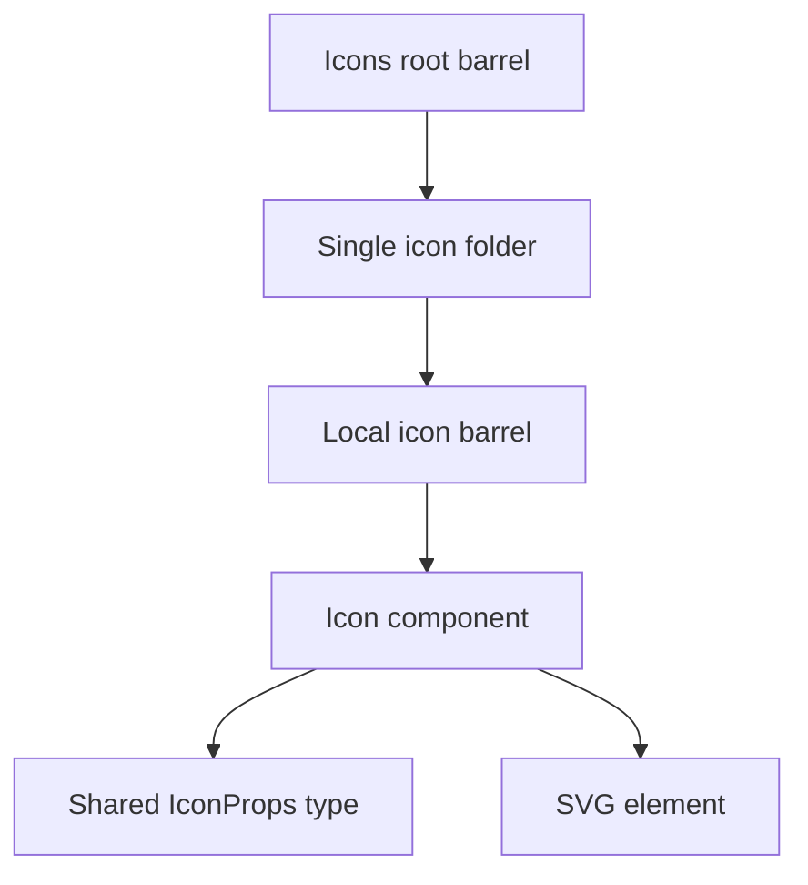
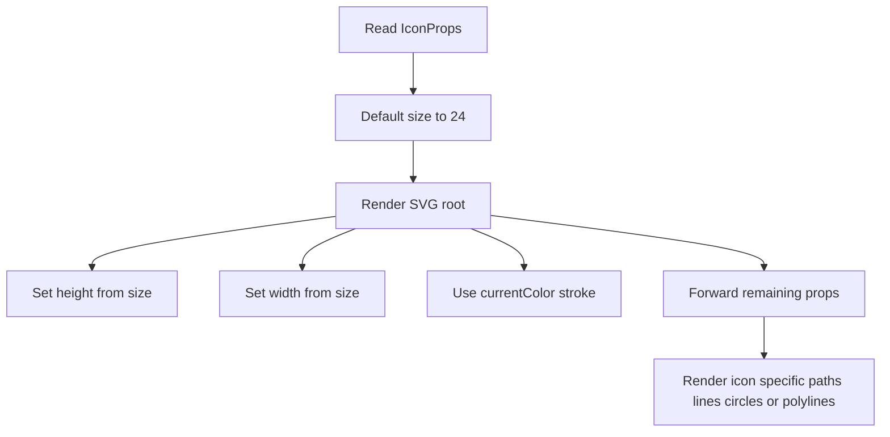
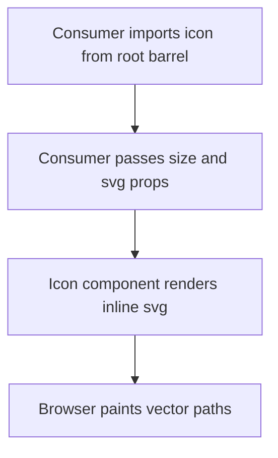

# Icons Component Architecture

Shared SVG icon library composed of small stateless React components with a
uniform public API and a central barrel export.

## Overview

The `Icons` directory is not a single component. It is a component family with:

- one shared type contract in `Icons.types.ts`
- one root barrel in `index.ts`
- one folder per icon
- one icon component per folder
- one local barrel per icon folder

Every icon follows the same structural pattern:

1. Accept `IconProps`
2. Default `size` to `24`
3. Render an inline SVG
4. Inherit color through `stroke='currentColor'`
5. Mark the root `<svg>` `aria-hidden='true'`
6. Forward remaining SVG props to the root `<svg>` element

## Accessibility — icons are decorative by default

Every icon sets `aria-hidden='true'` on its root `<svg>`, because every call
site already supplies the accessible name: a `Button`/menu item with its own
`aria-label`, or visible adjacent text. Announcing the icon as well would
duplicate that name ("Table settings, Table settings"). This is why the answer
to Biome's `a11y/noSvgWithoutTitle` here is `aria-hidden`, **not** a `<title>` —
a `<title>` would satisfy the linter while making screen-reader output worse.

Because the `{...props}` spread lands after `aria-hidden`, a caller that renders
an icon as meaningful standalone content (no surrounding label) can override:
`aria-hidden={false}` + `role='img'` + `aria-label='…'`. Nothing in the repo
does this today — if you add one, it must supply a name.

Note that routing an icon through `IconBase` also stops `noSvgWithoutTitle`
from firing, since the rule only inspects literal `<svg>` elements. That is
linter blindness, not an a11y fix — `IconBase` carries the real `aria-hidden`
so the whole family is correct rather than merely unflagged.

Icons in the 24×24 stroke family render through the shared `IconBase`
component, which owns the standard `<svg>` wrapper and forwards children
(paths/shapes) plus any svg props. This keeps the wrapper defined once instead
of being duplicated across every stroke icon.

## File Structure

```
Icons/
├── ARCHITECTURE.md              -> This documentation
├── Icons.types.ts               -> Shared IconProps type
├── index.ts                     -> Root barrel exporting all icons
│
├── IconBase/                    -> Shared 24×24 stroke <svg> wrapper
│   ├── IconBase.component.tsx
│   └── index.ts
├── BarChartIcon/
│   ├── BarChartIcon.component.tsx
│   └── index.ts
├── CheckIcon/
│   ├── CheckIcon.component.tsx
│   └── index.ts
├── CollapseAllIcon/
│   ├── CollapseAllIcon.component.tsx
│   └── index.ts
├── ColumnsOrderIcon/
│   ├── ColumnsOrderIcon.component.tsx
│   └── index.ts
├── EraserIcon/
│   ├── EraserIcon.component.tsx
│   └── index.ts
├── ErrorDescriptive/            -> Animated error-state illustration (see Descriptive Illustrations)
│   ├── ErrorDescriptive.component.tsx
│   ├── ErrorDescriptive.stylex.ts
│   ├── index.ts
│   ├── BrokenLink/
│   ├── ConnectionPulse/
│   ├── DisruptionParticles/
│   ├── LaptopClient/
│   ├── ServerRack/
│   └── WarningBadge/
├── ErrorIcon/
│   ├── ErrorIcon.component.tsx
│   └── index.ts
├── ExpandAllIcon/
│   ├── ExpandAllIcon.component.tsx
│   └── index.ts
├── EyeIcon/
│   ├── EyeIcon.component.tsx
│   └── index.ts
├── FileTextIcon/
│   ├── FileTextIcon.component.tsx
│   └── index.ts
├── FilterIcon/
│   ├── FilterIcon.component.tsx
│   └── index.ts
├── HomeIcon/
│   ├── HomeIcon.component.tsx
│   └── index.ts
├── InfoIcon/
│   ├── InfoIcon.component.tsx
│   └── index.ts
├── ListAllIcon/
│   ├── ListAllIcon.component.tsx
│   └── index.ts
├── ListCheckedIcon/
│   ├── ListCheckedIcon.component.tsx
│   └── index.ts
├── ListOrderedIcon/
│   ├── ListOrderedIcon.component.tsx
│   └── index.ts
├── ListUncheckedIcon/
│   ├── ListUncheckedIcon.component.tsx
│   └── index.ts
├── LockIcon/
│   ├── LockIcon.component.tsx
│   └── index.ts
├── MaximizeIcon/
│   ├── MaximizeIcon.component.tsx
│   └── index.ts
├── MenuCloseIcon/
│   ├── MenuCloseIcon.component.tsx
│   └── index.ts
├── MenuIcon/
│   ├── MenuIcon.component.tsx
│   └── index.ts
├── MinimizeIcon/
│   ├── MinimizeIcon.component.tsx
│   └── index.ts
├── MoreVerticalIcon/
│   ├── MoreVerticalIcon.component.tsx
│   └── index.ts
├── NoDataDescriptive/           -> Animated no-data illustration (see Descriptive Illustrations)
│   ├── NoDataDescriptive.component.tsx
│   ├── NoDataDescriptive.stylex.ts
│   ├── NoDataDescriptive.test.tsx
│   ├── index.ts
│   ├── FloatingParticles/
│   ├── MagnifyingGlass/
│   ├── PulseHalo/
│   └── TableSheet/
├── PinIcon/
│   ├── PinIcon.component.tsx
│   └── index.ts
├── PinLeftIcon/
│   ├── PinLeftIcon.component.tsx
│   └── index.ts
├── PinOffIcon/
│   ├── PinOffIcon.component.tsx
│   └── index.ts
├── PinRightIcon/
│   ├── PinRightIcon.component.tsx
│   └── index.ts
├── RefreshIcon/
│   ├── RefreshIcon.component.tsx
│   └── index.ts
├── SettingsIcon/
│   ├── SettingsIcon.component.tsx
│   └── index.ts
├── SortAscIcon/
│   ├── SortAscIcon.component.tsx
│   └── index.ts
├── SortClearIcon/
│   ├── SortClearIcon.component.tsx
│   └── index.ts
├── SortDescIcon/
│   ├── SortDescIcon.component.tsx
│   └── index.ts
├── SortNeutralIcon/
│   ├── SortNeutralIcon.component.tsx
│   └── index.ts
├── SuccessIcon/
│   ├── SuccessIcon.component.tsx
│   └── index.ts
├── UserIcon/
│   ├── UserIcon.component.tsx
│   └── index.ts
└── WarningIcon/
    ├── WarningIcon.component.tsx
    └── index.ts
```

## Dependency Model



## Shared Type Contract

All icons use the same `IconProps` type:

- extends native React SVG props via `ComponentProps<'svg'>`
- adds optional `size?: number`

This allows every icon to accept:

- accessibility props like `aria-hidden`, `role`, `aria-label`
- styling hooks like `className`, `style`
- SVG attributes like `strokeWidth`, `viewBox`, `fill`
- a simplified size API through the shared `size` prop

## Icon Implementation Pattern

Every icon component follows the same render shape.



### Shared SVG conventions

Across the icon set, components consistently use:

- `fill='none'`
- `stroke='currentColor'`
- `strokeWidth='2'`
- `strokeLinecap='round'`
- `strokeLinejoin='round'`
- `viewBox='0 0 24 24'`
- `xmlns='http://www.w3.org/2000/svg'`

This creates a consistent visual language and makes icons respond naturally to
parent text color.

## Render Strategy

Icons are pure presentational components.



Key characteristics:

- no state
- no hooks
- no context
- no StyleX dependency
- no runtime branching beyond `size` defaulting

## Export Strategy

### Local icon barrels

Each icon folder exposes exactly one component through its local `index.ts`.

Example structure:

```ts
export { InfoIcon } from './InfoIcon.component';
```

### Root barrel

The root `index.ts` aggregates all icon folders into one public import surface.

Example usage:

```tsx
import { HomeIcon, SettingsIcon } from '@/components/Icons';
```

This keeps consumer imports stable and avoids long per-icon file paths.

## Icon Families

The set naturally groups into a few functional families:

| Family              | Icons                                                                                                                                                                                                             |
| ------------------- | ----------------------------------------------------------------------------------------------------------------------------------------------------------------------------------------------------------------- |
| Navigation          | `HomeIcon`, `UserIcon`, `MenuIcon`, `MoreVerticalIcon`, `SettingsIcon`                                                                                                                                            |
| Status and Feedback | `InfoIcon`, `SuccessIcon`, `WarningIcon`, `ErrorIcon`, `CheckIcon`                                                                                                                                                |
| Table and Data      | `ColumnsOrderIcon`, `FilterIcon`, `SortAscIcon`, `SortDescIcon`, `SortNeutralIcon`, `SortClearIcon`, `ListAllIcon`, `ListCheckedIcon`, `ListUncheckedIcon`, `ListOrderedIcon`, `ExpandAllIcon`, `CollapseAllIcon` |
| Pinning and Layout  | `PinIcon`, `PinLeftIcon`, `PinRightIcon`, `PinOffIcon`, `MaximizeIcon`, `MinimizeIcon`                                                                                                                            |
| Actions             | `RefreshIcon`, `EraserIcon`, `LockIcon`, `EyeIcon`, `MenuCloseIcon`, `FileTextIcon`, `BarChartIcon`                                                                                                               |

## Descriptive Illustrations

`ErrorDescriptive` and `NoDataDescriptive` are larger animated scenes (viewBox
`0 0 360 220`) rather than 24×24 stroke icons. They follow a different, shared
pattern:

- The root component owns only the `<svg>` element plus its accessible
  `<title>`/`<desc>` pair (`role='img'`, `aria-labelledby`), and composes one
  subcomponent per visual group in the scene.
- Each visual group lives in its own bundle directory
  (`Subcomponent.component.tsx` + `Subcomponent.stylex.ts` + `index.ts`) and
  renders a single `<g>` element. Groups without styling needs skip the stylex
  file (e.g. `DisruptionParticles`).
- Animation keyframes are colocated in the stylex file of the subcomponent
  that uses them, and every animation collapses under
  `@media (prefers-reduced-motion: reduce)`.
- All fills and strokes use `currentColor` so the illustration inherits the
  surrounding theme color.

Scene breakdown:

| Illustration        | Subcomponents                                                                                        |
| ------------------- | ---------------------------------------------------------------------------------------------------- |
| `ErrorDescriptive`  | `ServerRack`, `LaptopClient`, `ConnectionPulse`, `BrokenLink`, `DisruptionParticles`, `WarningBadge` |
| `NoDataDescriptive` | `PulseHalo`, `TableSheet`, `MagnifyingGlass`, `FloatingParticles`                                    |

## Representative Examples

### Informational icon pattern

`InfoIcon` demonstrates the standard circle + path composition using the shared
SVG defaults.

### Action icon pattern

`MenuCloseIcon` demonstrates a simple two-path cross icon using the same shared
contract.

### Data visualization icon pattern

`BarChartIcon` demonstrates multi-line icons that still follow the same SVG root
structure and prop contract.

## Accessibility Guidance

Icons themselves are visual primitives. Accessibility is determined by how they
are consumed.

Recommended usage:

- decorative icons: `aria-hidden='true'`
- meaningful standalone icons: provide `aria-label`
- button icons: let the parent button carry the accessible name unless the SVG
  itself needs explicit labeling

## Design Tradeoffs

- The icon set is intentionally handwritten instead of using a third-party icon
  package, which keeps styling predictable and bundle surface explicit.
- The repeated component shape is verbose but easy to audit and tree-shake.
- Icons do not currently use a generator or shared icon factory helper, so
  structural consistency depends on contributor discipline.

## Public Surface

Public imports should come from the root barrel:

- `@/components/Icons`

Internal folder barrels exist to support the root barrel and local organization,
not to encourage deep consumer imports.
