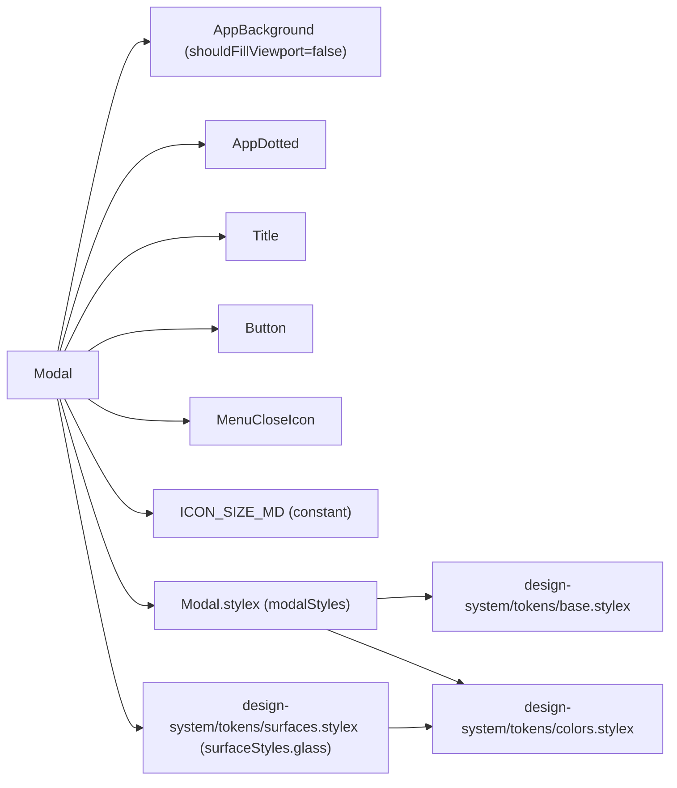
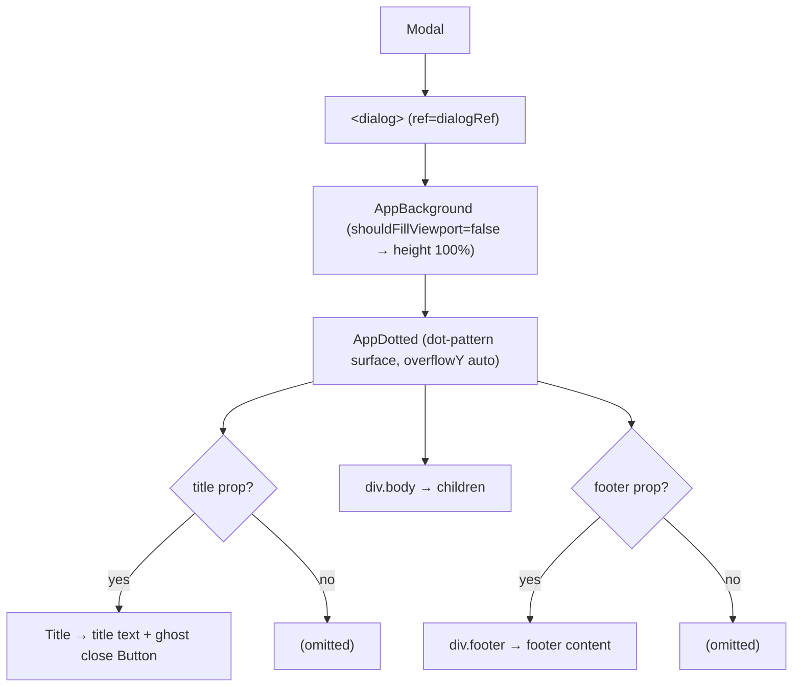
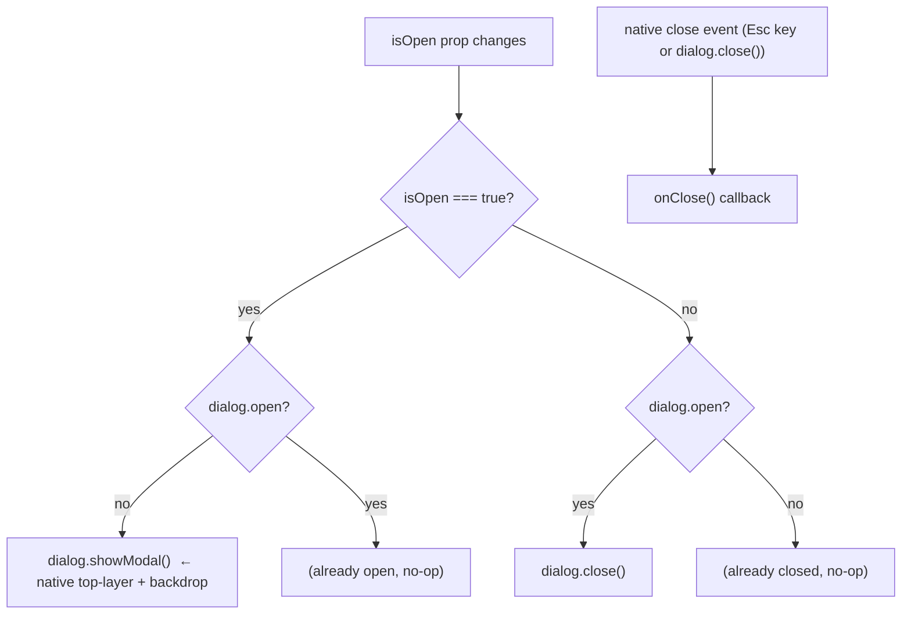

# Modal Architecture

Controlled dialog using the native `<dialog>` element with `showModal()` / `close()`, animated backdrop, header, scrollable body, and optional footer.

## File Structure

```
Modal/
├── index.ts                  → Barrel export
├── Modal.component.tsx       → Native dialog wrapper
├── Modal.types.ts            → ModalProps
├── Modal.stylex.ts           → dialog frame/layout, backdrop, body, footer styles (glass surface via surfaceStyles.glass)
└── Modal.test.tsx            → Tests
```

## Dependencies



The glass surface (blur + translucent fill + gradient tint) is supplied by the
shared `surfaceStyles.glass` recipe, composed ahead of the dialog's own
frame/layout styles: `stylex.props(surfaceStyles.glass, modalStyles.dialog)`.
The gradient lives in the theme-invariant `glassGradientBackground` /
`glassGradientBackdrop` tokens (see `design-system/ARCHITECTURE.md`), so the
dialog and its `::backdrop` no longer inline a hardcoded gradient.

## Render Structure



## Open / Close Flow



Two separate `useEffect`s are used:

1. **Open/close effect** — syncs `isOpen` prop to `dialog.showModal()` / `dialog.close()`.
2. **Close-event effect** — listens for the native `close` event (fired on Esc key press) and calls `onClose()` to keep the parent in sync.

## Layout Sections

| Section | Condition        | Styles                                       | Contents                        |
| ------- | ---------------- | -------------------------------------------- | ------------------------------- |
| Header  | `title` present  | `Title` component                            | title text + ghost close Button |
| Body    | always           | `padding.lg`, flex column, `overflowY: auto` | `children`                      |
| Footer  | `footer` present | `padding.lg`, border-top, flex-end           | `footer` slot (ReactNode)       |

The body is a **flex column**, not a wrapping row. Plain content stacks and the
body scrolls when it overflows; a single child that asks for `flex: 1 1 auto`
instead receives the whole body height and may run its own scroll region. That
second mode is what `Form` uses (`Form/ARCHITECTURE.md` → Layout): a form's
footer lives inside its `<form>` element, so it can only stay pinned if the
scrolling happens _below_ the modal body rather than at it.

Its scrollbar gutter is reserved on **both** edges
(`scrollbarGutter: stable both-edges`), so content keeps its width whether or
not the bar is showing _and_ stays centred — reserving one edge only trades a
reflow for permanently off-centre content.

`padding.lg` is tuned for plain content. A child that carries its own
edge-to-edge chrome — a `Tabs` strip, which brings its own inline padding and
gutter — should zero the inline half via `bodyStylex` rather than stack two
insets. Keep the block padding, or the strip collides with the title rule and the
footer sits on the bottom edge.

Such a child should zero the **gutter** through the same prop
(`scrollbarGutter: 'auto'`). A reservation costs its inline space whether or not
a bar ever appears, so a body that can never scroll — because its child took the
full height — is otherwise paying for one twice over.

## Sizing

| Constraint  | Value              |
| ----------- | ------------------ |
| `width`     | `min(90vw, 520px)` |
| `maxHeight` | `min(85vh, 600px)` |

The dialog **hugs its content** vertically — `maxHeight` is a cap, not a fixed height. `AppBackground` inside the dialog must keep `shouldFillViewport={false}`: its default `100vh` height would make the children taller than the dialog and produce a phantom scrollbar.

The interior is a flex column (via `AppDotted`): the body has `flex: 1 1 auto` + `minHeight: 0`, so it absorbs any spare height (pushing the footer to the bottom edge) and scrolls internally when content exceeds the cap, while the header and footer (`flexShrink: 0`) stay pinned. To get a constant-size modal instead of content-hugging, change the dialog's `maxHeight` to `height` — the body/footer distribution handles both cases.

## Props

| Prop           | Type           | Required | Description                                                                                                                           |
| -------------- | -------------- | -------- | ------------------------------------------------------------------------------------------------------------------------------------- |
| `children`     | `ReactNode`    | ✓        | Scrollable body content                                                                                                               |
| `isOpen`       | `boolean`      | ✓        | Controls `showModal()` / `close()`                                                                                                    |
| `onClose`      | `() => void`   | ✓        | Called when close button clicked or Esc pressed                                                                                       |
| `customStylex` | `StyleXStyles` | —        | Consumer override on the `<dialog>` frame — composed last, so it wins over `modalStyles.dialog` (see Sizing)                          |
| `bodyStylex`   | `StyleXStyles` | —        | Consumer override on the body region — composed last. Use it to drop the default inset for self-padding content (see Layout Sections) |
| `title`        | `string`       | —        | Renders the header section with title + close button                                                                                  |
| `footer`       | `ReactNode`    | —        | Renders the footer section (typically action buttons)                                                                                 |

## Accessibility

| Feature        | Implementation                                             |
| -------------- | ---------------------------------------------------------- |
| Focus trap     | Native `<dialog>` `showModal()` traps focus automatically  |
| Esc key        | Native `<dialog>` fires `close` event → `onClose()` called |
| Backdrop click | Not natively handled — add `onClick` on backdrop if needed |
| `aria-label`   | Close button has `aria-label='Close'`                      |

## Usage Pattern

```tsx
<Modal
  isOpen={isOpen}
  onClose={() => setIsOpen(false)}
  title='Confirm Action'
  footer={
    <>
      <Button variant='outline' onClick={() => setIsOpen(false)}>
        Cancel
      </Button>
      <Button variant='primary' onClick={handleConfirm}>
        Confirm
      </Button>
    </>
  }
>
  <p>Are you sure?</p>
</Modal>
```
