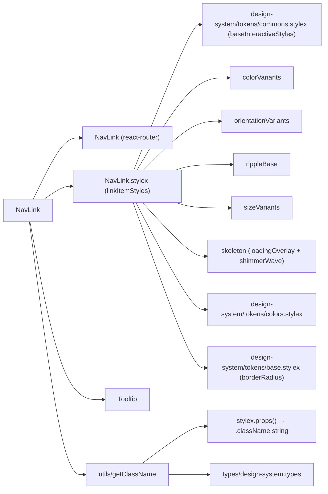
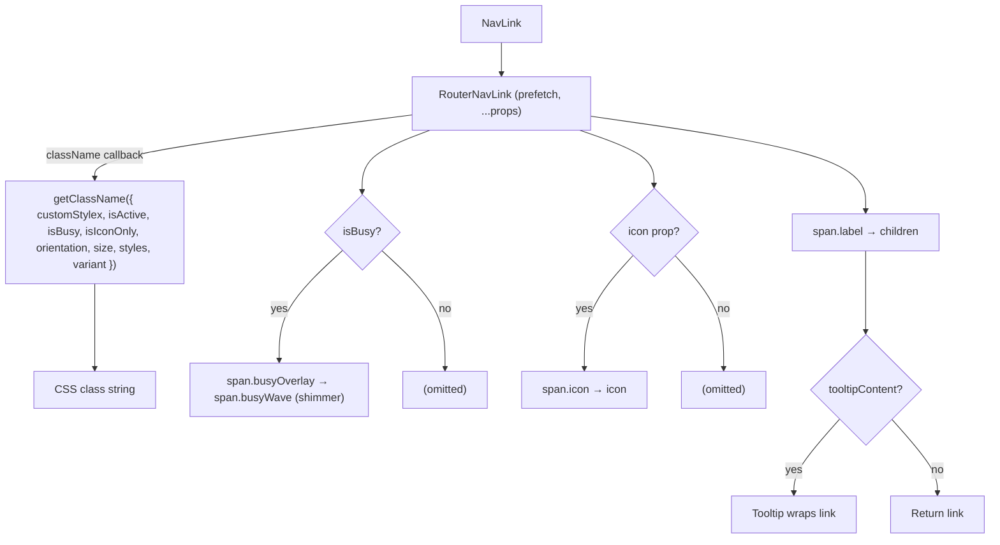

# NavLink Architecture

Design-system–styled wrapper around React Router's `NavLink` that applies active/inactive styles, design token variants (color, size, orientation, width), optional leading icon, optional icon-only layout, optional StyleX override, and optional tooltip.

## File Structure

```
NavLink/
├── index.ts                       → Barrel export
├── NavLink.component.tsx          → RouterNavLink wrapper
├── NavLink.types.ts               → NavLinkProps (extends RouterNavLinkProps)
├── NavLink.stylex.ts              → linkItemStyles (delegates to design-system tokens)
└── utils/
    ├── index.ts                   → Barrel export
    └── getClassName.util.ts       → Resolves StyleX class string for className prop
```

## Dependencies



## Render Flow



## `getClassName` Utility

React Router's `NavLink` accepts a `className` function `({ isActive }) => string`. `getClassName` calls `stylex.props(...)` and returns the resulting `.className` string, applying variant tokens in order:

```
base → orientation[x] → size[x] → color[x] → fullWidth → [active] → [busyLink] → [iconOnly] → customStylex
```

The `active` style (`backgroundColor: brandPrimary, color: brandPrimaryText, fontWeight: 600`) is conditionally appended when `isActive === true`. The `busyLink` style (`pointer-events: none`) is appended when `isBusy === true`, so the link stops responding to input while the shimmer overlay is shown — the anchor equivalent of `Button`'s `disabled` busy state.

## Style Token Variants

| Prop          | Type                      | Default      | Token source          |
| ------------- | ------------------------- | ------------ | --------------------- |
| `color`       | `DesignSystemColor`       | `'ghost'`    | `colorVariants`       |
| `size`        | `DesignSystemSize`        | `'md'`       | `sizeVariants`        |
| `orientation` | `DesignSystemOrientation` | `'vertical'` | `orientationVariants` |

## Props

Extends `RouterNavLinkProps` (all React Router `NavLink` props forwarded), with `children` overridden to `ReactNode`.

| Prop               | Type                                           | Default      | Description                                                                                                                                    |
| ------------------ | ---------------------------------------------- | ------------ | ---------------------------------------------------------------------------------------------------------------------------------------------- |
| `children`         | `ReactNode`                                    | —            | Link label text or element                                                                                                                     |
| `color`            | `DesignSystemColor`                            | `'ghost'`    | Visual color variant                                                                                                                           |
| `customStylex`     | `StyleXStyles`                                 | —            | Consumer override applied last                                                                                                                 |
| `icon`             | `ReactNode`                                    | —            | Optional leading icon                                                                                                                          |
| `isBusy`           | `boolean`                                      | `false`      | Renders the shimmer loading overlay and makes the link non-interactive (`pointer-events: none` + `aria-disabled`); mirrors `Button`'s `isBusy` |
| `isIconOnly`       | `boolean`                                      | `false`      | Centers icon and removes visual label layout                                                                                                   |
| `orientation`      | `DesignSystemOrientation`                      | `'vertical'` | Layout axis (`'horizontal'` for toolbars)                                                                                                      |
| `prefetch`         | `'none' \| 'intent' \| 'render' \| 'viewport'` | `'none'`     | React Router prefetch strategy                                                                                                                 |
| `size`             | `DesignSystemSize`                             | `'md'`       | Height / padding variant                                                                                                                       |
| `tooltipContent`   | `ReactNode`                                    | —            | Optional tooltip content                                                                                                                       |
| `tooltipPlacement` | `'bottom' \| 'left' \| 'right' \| 'top'`       | `'top'`      | Tooltip placement                                                                                                                              |

## Active State

React Router resolves `isActive` based on whether the current URL matches the `to` prop (supports relative paths, `end` prop, and `caseSensitive`). The `active` style overrides color and background with brand tokens.

## Container Naming

`linkItemStyles.base` includes `containerName: 'toolbarLink'` — allows parent CSS Container Queries to target NavLink items inside toolbar/nav containers.
