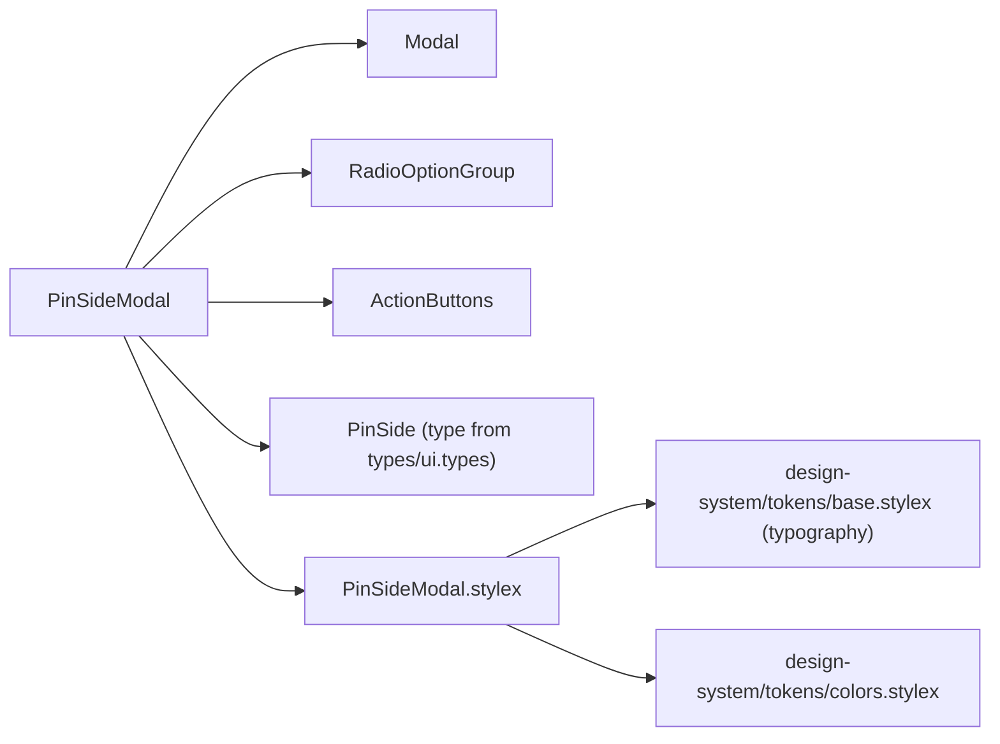
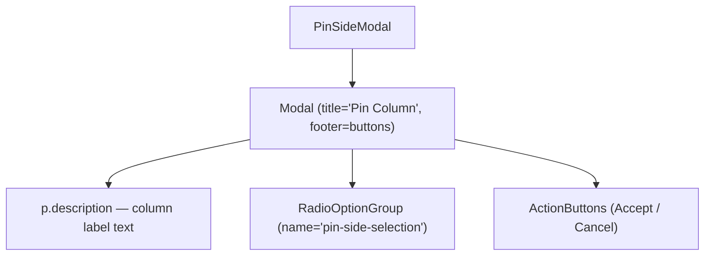
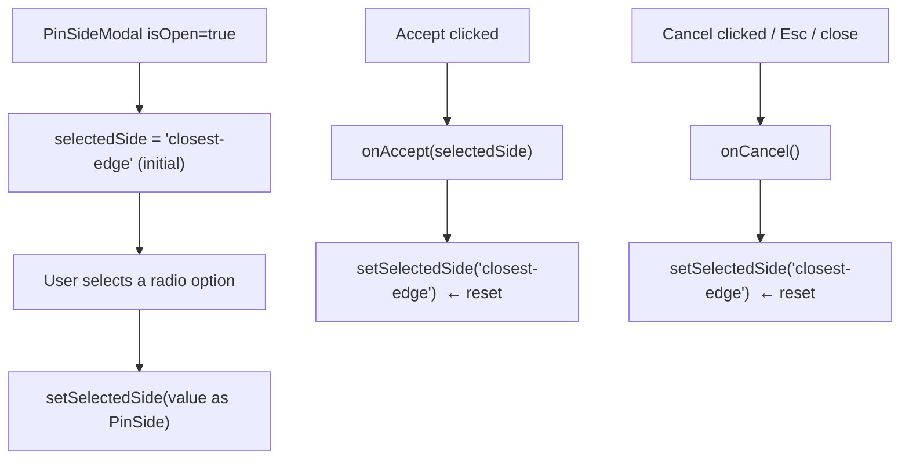

# PinSideModal Architecture

Confirmation modal for choosing which side to pin a table column to. Composes `Modal` + `RadioOptionGroup` with local selection state that resets on every open/close cycle.

## File Structure

```
PinSideModal/
├── index.ts                        → Barrel export
├── PinSideModal.component.tsx      → Modal + RadioOptionGroup composition
├── PinSideModal.types.ts           → PinSideModalProps
└── PinSideModal.stylex.ts          → description paragraph style
```

## Dependencies



## Component Hierarchy



## State & Flow



**Reset on close:** `selectedSide` always resets to `'closest-edge'` after Accept or Cancel so the modal starts fresh the next time it opens.

## Radio Options

| `value`          | `label`          | `description`                                    |
| ---------------- | ---------------- | ------------------------------------------------ |
| `'closest-edge'` | Closest edge     | Pin to the nearest edge based on column position |
| `'left'`         | Pin to the left  | —                                                |
| `'right'`        | Pin to the right | —                                                |

## Props

| Prop          | Type                      | Description                                             |
| ------------- | ------------------------- | ------------------------------------------------------- |
| `columnLabel` | `string`                  | Name of the column being pinned (shown in description)  |
| `isOpen`      | `boolean`                 | Controls Modal visibility                               |
| `onAccept`    | `(side: PinSide) => void` | Called with the chosen `PinSide` when Accept is clicked |
| `onCancel`    | `() => void`              | Called when Cancel is clicked or modal is closed        |

## `PinSide` Values (from `types/ui.types`)

| Value            | Meaning                                  |
| ---------------- | ---------------------------------------- |
| `'closest-edge'` | Resolve to nearest edge at drop/pin time |
| `'left'`         | Explicitly pin to left side              |
| `'right'`        | Explicitly pin to right side             |

## Consumers

Used by `TableSettingsDrawer` / `TableHeaderCell` when a pin action would conflict with the column's current position and the user needs to resolve which side explicitly.
