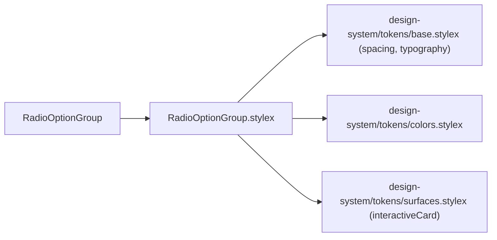
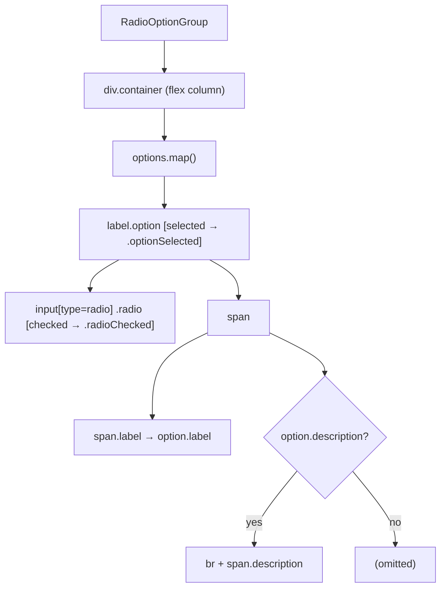
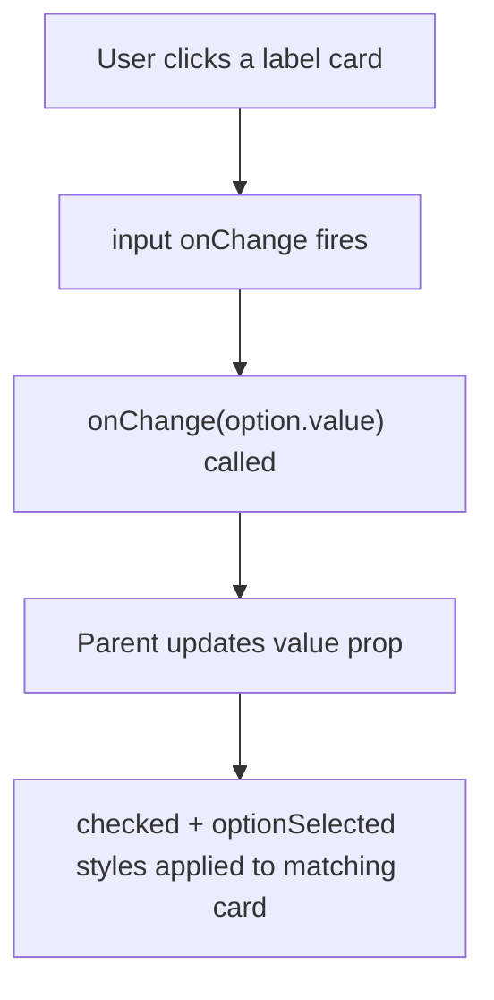

# RadioOptionGroup Architecture

Styled radio button group where each option is a clickable card with a label and optional description line.

## File Structure

```
RadioOptionGroup/
├── index.ts                              → Barrel export
├── RadioOptionGroup.component.tsx        → Fully controlled radio card list
├── RadioOptionGroup.types.ts             → RadioOption, RadioOptionGroupProps
└── RadioOptionGroup.stylex.ts            → Card, label, description, checked styles
```

## Dependencies



The option card's surface — fill, hover, border, radius — is the shared
`surfaceStyles.interactiveCard` recipe, the same one the settings drawer's
draggable rows and filter items use, so an option card reads as the same kind of
object as those (`design-system/ARCHITECTURE.md` → Shared Surface Recipes).
`RadioOptionGroup.stylex` keeps only layout and composes the two in its export:
`option: { ...surfaceStyles.interactiveCard, ...localStyles.option }`.

## Render Structure



## Selection Flow



The component is **fully controlled** — `value` is always the source of truth. There is no internal state.

## Visual States

| State       | Trigger                         | Style change                                                                             |
| ----------- | ------------------------------- | ---------------------------------------------------------------------------------------- |
| Default     | `value !== option.value`        | `interactiveCard` surface: `glassBackgroundColorSecondary` fill, `borderPrimary` border  |
| Hover       | pointer over an unselected card | fill lifts to `surfaceElevated` over `transitions.fast` (from the recipe)                |
| Selected    | `value === option.value`        | `borderColor: brandSecondary` (accent), `backgroundColor: brandPrimaryBackground`        |
| Radio dot   | checked                         | `brandSecondary` fill + border, inner ring via `box-shadow inset brandPrimaryBackground` |
| Radio focus | keyboard focus on the `<input>` | `2px solid brandPrimary` outline at `2px` offset                                         |

A **selected** card does not lift on hover. `optionSelected` sets a flat
`backgroundColor`, which replaces the recipe's whole `backgroundColor` key —
`:hover` included — and that is the wanted behaviour: a chosen card holds its
accent rather than reacting like an unchosen one.

## Types

### `RadioOption`

| Field         | Type     | Required | Description                       |
| ------------- | -------- | -------- | --------------------------------- |
| `value`       | `string` | ✓        | Machine value submitted on change |
| `label`       | `string` | ✓        | Primary display text              |
| `description` | `string` | —        | Secondary helper text below label |

### `RadioOptionGroupProps`

| Prop       | Type                      | Description                                    |
| ---------- | ------------------------- | ---------------------------------------------- |
| `name`     | `string`                  | HTML `name` attribute shared across all radios |
| `options`  | `RadioOption[]`           | Ordered list of options to render              |
| `value`    | `string`                  | Currently selected value (controlled)          |
| `onChange` | `(value: string) => void` | Called with new value when selection changes   |

## Notes

- The custom radio dot uses `appearance: none` + a tokenized `box-shadow: inset 0 0 0 3px brandPrimaryBackground` over a `brandSecondary` fill to create the inner circle — no SVG or pseudo-elements needed. Selected option cards also gain a tokenized `brandSecondary` accent border.
- Each `<label>` wraps the `<input>` so the entire card is clickable without `htmlFor`.
- The radio's accessible name comes from the label text only; optional description text is attached separately via `aria-describedby`.
- The focus ring sits on the `<input>`, not the card. `appearance: none` strips the native one, and the `<label>` never takes focus — so `:focus-visible` on the card would match nothing, and `:has(:focus-visible)` has no precedent in this package.
- The fill/border transition comes from the shared recipe and is tokenized (`transitions.fast`); it is no longer declared here.
