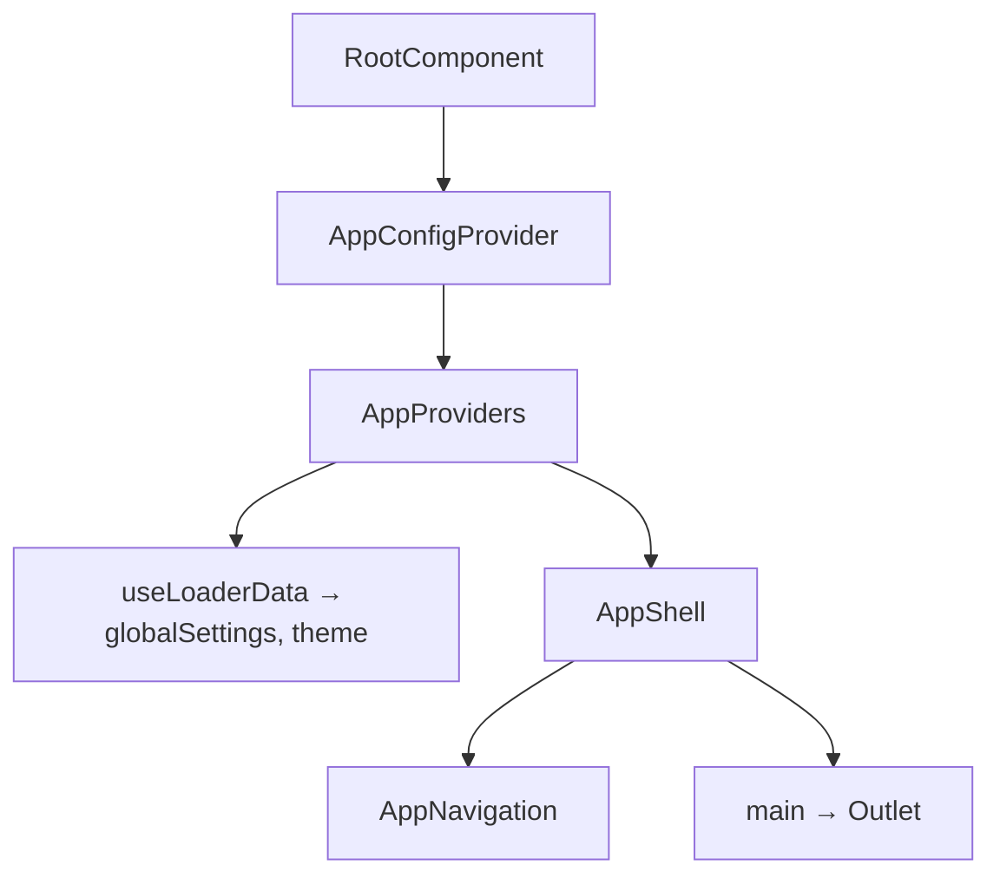

# RootComponent Architecture

## Purpose

The whole root route of a consuming app, in one component. It publishes the
app's configuration and composes the providers and shell that read it, so an app
supplies only what genuinely depends on the app rather than reproducing the
assembly. Same reasoning as `hydrateApp` and `createHandleRequest` one layer
down — see [ADR-053](../../../../../docs/decisions/ADR-053-package-owned-app-root-and-app-config-context.md).

## Public API

`RootComponentProps` (`RootComponent.types.ts`):

| Prop                 | Type                 | Default   | Description                                                                         |
| -------------------- | -------------------- | --------- | ----------------------------------------------------------------------------------- |
| `appId`              | `string`             | —         | Scopes the theme / global-settings cookies, which are shared across ports on a host |
| `defaultTheme`       | `ThemeMode`          | `'light'` | Theme used when the request carries no theme cookie                                 |
| `getNavigationItems` | `GetNavigationItems` | —         | This app's own route links, sized to the navigation's density                       |
| `isAuthEnabled`      | `boolean`            | `false`   | Whether the app has a session, i.e. whether the navigation shows session controls   |
| `logoutRoute`        | `string`             | `/logout` | Where those session controls POST                                                   |

This component reads no loader data. The root loader's `theme` and
`globalSettings` are read by `AppProviders`, their only consumer — see
`AppProvidersLoaderData` in its `ARCHITECTURE.md`.

## Composition



`AppConfigProvider` sits outermost because it carries values fixed at mount;
`AppProviders` owns the state that changes (theme, global settings,
notifications). Neither ordering affects behaviour — this one reads in the
direction of "configuration, then state".

Nothing is threaded past `AppShell`: `getNavigationItems`, `isAuthEnabled` and
`logoutRoute` reach the delegate that renders them through `AppConfigContext`.

## File Structure

- `RootComponent.component.tsx` — the provider composition
- `RootComponent.types.ts` — props
- `RootComponent.component.test.tsx` — tests

There is no `index.ts`: the component is published from `public-api.ts` (i.e.
`@lcabrera/ui`), and a barrel nobody imports through is the deep-barrel ADR-007
rule 3 bans — fallow flags it as an unused file.

## Consuming It

```tsx
import { RootComponent } from '@lcabrera/ui';

import { LOGOUT_ROUTE } from '@/auth/auth.constants';
import { APP_ID } from '@/constants/app.constants';

import { getNavigationItems } from './getNavigationItems.util';

export const Root = () => (
  <RootComponent
    appId={APP_ID}
    defaultTheme='light'
    getNavigationItems={getNavigationItems}
    isAuthEnabled
    logoutRoute={LOGOUT_ROUTE}
  />
);
```

An app that needs a different assembly still has the pieces: `AppConfigProvider`
(`@lcabrera/ui/contexts/AppConfigContext`), `AppProviders` and `AppShell` are all
individually exported. `RootComponent` is the assembled default, not the only
path.

The document shell stays app-owned — `Root.layout.tsx` reads `cspNonce` through
`useRouteLoaderData('root')` outside the router's component tree, and each app's
compiled StyleX stylesheet URL is a per-app build artifact.
