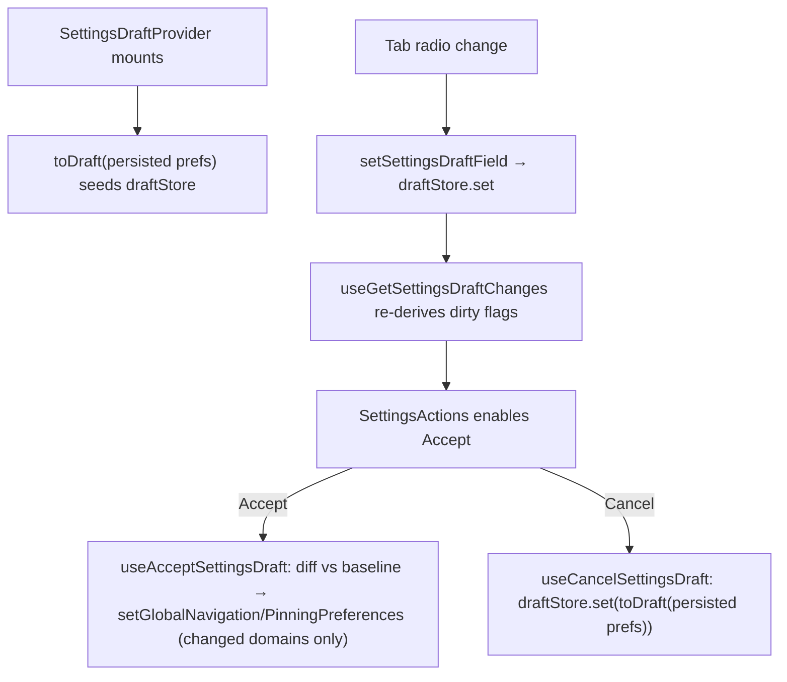

# Settings Architecture

Global settings page (navigation + pinning preferences) with staged edits:
changes are held in a draft store and only committed to the global
preferences on Accept. A thin shell composing self-connected delegates
(PATTERNS.md § Thin Shell + Self-Connected Delegates).

## State Ownership Rule

| Delegate                | Reads (selectors)                                   | Dispatches (actions)                     |
| ----------------------- | --------------------------------------------------- | ---------------------------------------- |
| `Settings`              | — (pure composition inside `SettingsDraftProvider`) | —                                        |
| `SettingsTabs`          | — (pure composition)                                | —                                        |
| `NavigationSettingsTab` | settingsDraft                                       | setSettingsDraftField                    |
| `PinningSettingsTab`    | settingsDraft                                       | setSettingsDraftField                    |
| `SettingsActions`       | settingsDraftChanges (hasChanges)                   | acceptSettingsDraft, cancelSettingsDraft |

The draft is shared staged state across the tabs and the actions row, so it
lives in a small store-pattern context (`SettingsDraftContext`), not in a
parent `useState` with drilled setters.

## File Structure

```
Settings/
├── Settings.component.tsx           → Thin shell: title + SettingsTabs + SettingsActions in provider
├── Settings.types.ts                → SettingsDraft + update-builder args
├── Settings.constants.ts            → Default preference fallbacks
├── Settings.stylex.ts               → Shared page/tab/action styles
├── Settings.component.test.tsx      → Integration tests (mock only GlobalSettings modules)
├── settings.meta.ts
│
├── SettingsDraftContext/            → Draft store (store-pattern)
│   ├── SettingsDraftContext.context.ts
│   ├── SettingsDraftContext.provider.tsx   → Seeds draft from persisted prefs via toDraft
│   ├── SettingsDraftContext.constants.ts   → DEFAULT_SETTINGS_DRAFT snapshot fallback
│   ├── SettingsDraftContext.types.ts
│   ├── useSettingsDraftContextValue.hook.ts
│   ├── useDraftStore.hook.ts               → useSyncExternalStore + selector infra
│   ├── selectors/
│   │   ├── useGetSettingsDraft.hook.ts
│   │   └── useGetSettingsDraftChanges.hook.ts → per-domain dirty flags vs baseline
│   └── actions/
│       ├── useSetSettingsDraftField.hook.ts   → stage one field
│       ├── useAcceptSettingsDraft.hook.ts     → commit changed domains to global prefs
│       └── useCancelSettingsDraft.hook.ts     → reset draft from persisted prefs
│
├── SettingsTabs/                    → Tab set (pure composition, private delegate)
├── SettingsActions/                 → Accept/Cancel row (self-connected, private delegate)
├── NavigationSettingsTab/           → Navigation prefs tab (self-connected)
├── PinningSettingsTab/              → Pinning prefs tab (self-connected)
├── SettingsOptionSection/           → Presentational radio-group section
│
└── utils/
    ├── toDraft.util.ts                          → Persisted prefs → draft (default resolution)
    ├── getSettingsDraftChanges.util.ts          → Pure per-domain diff vs baseline
    ├── toGlobalNavigationPreferencesUpdate.util.ts → Draft → minimal navigation update
    └── toGlobalPinningPreferencesUpdate.util.ts    → Draft → pinning update
```

## Data Flow



## Notes

- Baseline comparison and commit both resolve defaults through the same
  `toDraft`, so preference additions stay in one place.
- `useAcceptSettingsDraft` snapshots the draft store once per execution
  (store-pattern snapshot rule).
- Consumers (`apps/*/src/routes/settings/root.ts`) render `<Settings />`
  with no props — the refactor is API-compatible.
