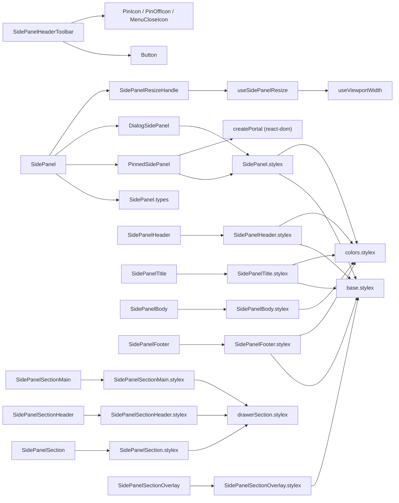
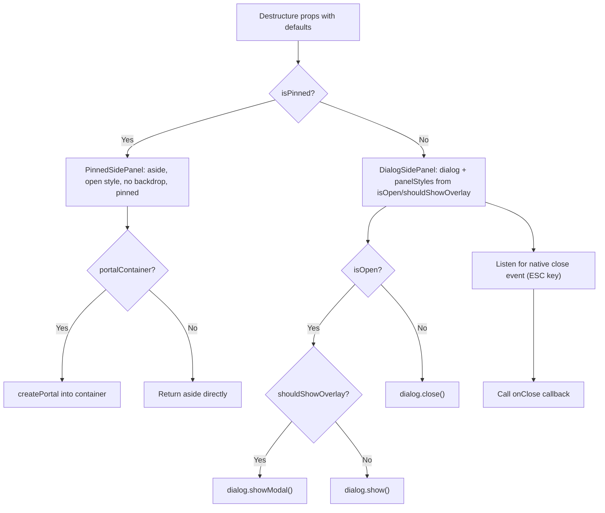
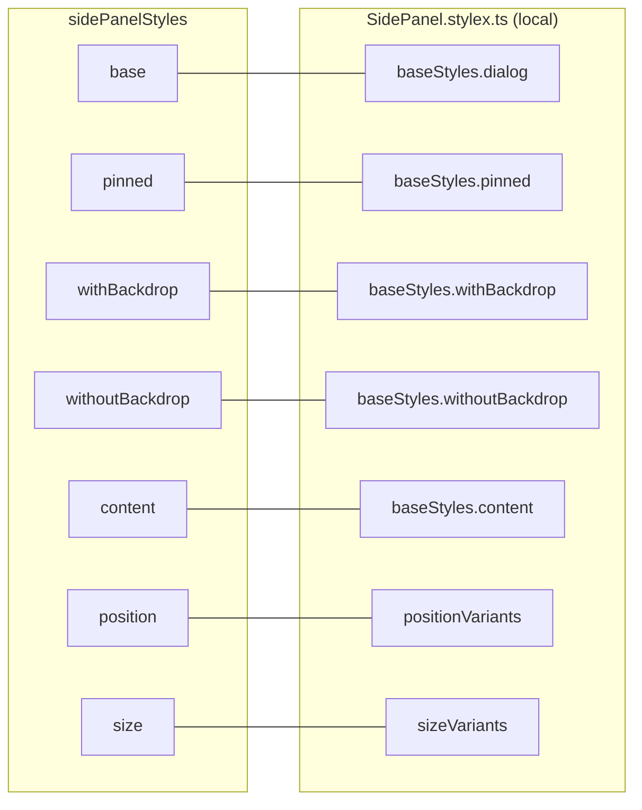
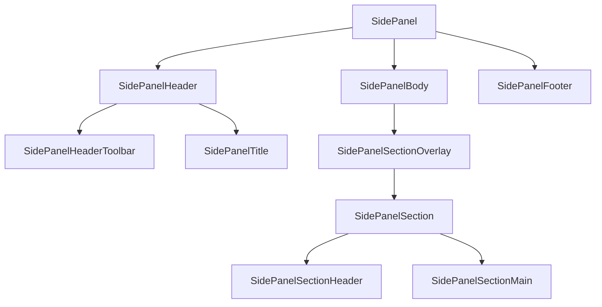

# SidePanel Component Architecture

## File Structure

```
SidePanel/
├── index.ts                          → Barrel export: SidePanel + all sub-components
├── SidePanel.component.tsx           → Root selector: isPinned ? PinnedSidePanel : DialogSidePanel
├── SidePanel.types.ts               → SidePanelProps + variant types
├── SidePanel.stylex.ts               → All root styles (local variants)
├── SidePanel.constants.ts            → The resize band: min width, max viewport ratio, keyboard steps
├── hooks/useSidePanelResize.hook.ts  → Pointer + keyboard resize gesture, and the band it stays inside
├── hooks/useSidePanelHostWidth.hook.ts → The panel's painted width, for a panel with no width of its own
├── utils/                            → Bounds, the width a drag resolves to, the keyboard action, the surface styles, the drag session
│
├── PinnedSidePanel/                  → Private delegate (no barrel): always-visible aside, optional portal, zero effects
│   ├── PinnedSidePanel.component.tsx
│   └── PinnedSidePanel.types.ts      → children, portalContainer?, position, resizeHandle?, size, width?
│
├── DialogSidePanel/                  → Private delegate (no barrel): native dialog lifecycle + close-event forwarding
│   ├── DialogSidePanel.component.tsx
│   └── DialogSidePanel.types.ts      → children, isOpen, onClose?, position, resizeHandle?, shouldShowOverlay, size, width?
│
├── SidePanelHeader/                  → Top section with actions slot
│   ├── index.ts
│   ├── SidePanelHeader.component.tsx
│   ├── SidePanelHeader.types.ts     → extends div + actions?: ReactNode
│   └── SidePanelHeader.stylex.ts
│
├── SidePanelHeaderToolbar/           → Reusable pin + close buttons for drawer headers
│   ├── index.ts
│   ├── SidePanelHeaderToolbar.component.tsx
│   └── SidePanelHeaderToolbar.types.ts → isPinned, onClose, onTogglePin
│
├── SidePanelResizeHandle/            → ARIA window splitter on the panel's inner edge
│   ├── index.ts
│   ├── SidePanelResizeHandle.component.tsx
│   ├── SidePanelResizeHandle.types.ts → onWidthChange, onWidthCommit?, position, width
│   └── SidePanelResizeHandle.stylex.ts
│
├── SidePanelTitle/                   → h2 heading with optional icon
│   ├── index.ts
│   ├── SidePanelTitle.component.tsx
│   ├── SidePanelTitle.types.ts      → extends h2 + icon?: ReactNode
│   └── SidePanelTitle.stylex.ts
│
├── SidePanelBody/                    → Scrollable main content area
│   ├── index.ts
│   ├── SidePanelBody.component.tsx
│   ├── SidePanelBody.types.ts       → extends div
│   └── SidePanelBody.stylex.ts
│
├── SidePanelFooter/                  → Bottom section with top border
│   ├── index.ts
│   ├── SidePanelFooter.component.tsx
│   ├── SidePanelFooter.types.ts     → extends div
│   └── SidePanelFooter.stylex.ts
│
├── SidePanelSection/                 → Section container (uses shared drawerSection tokens)
│   ├── index.ts
│   ├── SidePanelSection.component.tsx
│   ├── SidePanelSection.types.ts    → extends div
│   └── SidePanelSection.stylex.ts
│
├── SidePanelSectionHeader/           → Section header with title + toolbar slot
│   ├── index.ts
│   ├── SidePanelSectionHeader.component.tsx
│   ├── SidePanelSectionHeader.types.ts → extends div + title: string, toolbar?: ReactNode
│   └── SidePanelSectionHeader.stylex.ts
│
├── SidePanelSectionMain/             → Section main content area
│   ├── index.ts
│   ├── SidePanelSectionMain.component.tsx
│   ├── SidePanelSectionMain.types.ts → extends div
│   └── SidePanelSectionMain.stylex.ts
│
└── SidePanelSectionOverlay/          → Blur overlay for inactive sections
    ├── index.ts
    ├── SidePanelSectionOverlay.component.tsx
    ├── SidePanelSectionOverlay.types.ts → children + isOpen: boolean
    └── SidePanelSectionOverlay.stylex.ts
```

## Dependencies



## Render Flow



Switching to pinned mode unmounts `DialogSidePanel`; removing the `<dialog>`
from the document closes it natively, so no cross-mode guard effects exist.

## Props

`SidePanelProps` extends `ComponentPropsWithoutRef<'dialog'>` plus:

| Prop                | Type                     | Default   |
| ------------------- | ------------------------ | --------- |
| `children`          | `ReactNode`              | —         |
| `isOpen`            | `boolean`                | —         |
| `isPinned`          | `boolean`                | —         |
| `onClose`           | `() => void`             | —         |
| `portalContainer`   | `RefObject<HTMLElement>` | —         |
| `position`          | `SidePanelPosition`      | `'right'` |
| `shouldShowOverlay` | `boolean`                | `true`    |
| `size`              | `SidePanelSize`          | `'md'`    |

### Variant Enums

| Type                | Values                                                                |
| ------------------- | --------------------------------------------------------------------- |
| `SidePanelPosition` | `left`, `right`                                                       |
| `SidePanelSize`     | `rail` (72px), `xs` (256px), `sm` (320px), `md` (416px), `lg` (512px) |

## Style Composition

Layout, position and size styles are local to `SidePanel.stylex.ts`. The one
shared piece is the **surface**: both delegates compose
`surfaceStyles.glassPanel` (blur + translucent fill) ahead of
`sidePanelStyles.base`, the same recipe `TableActionsPopover` uses — so a menu
floating over the grid and the drawer beside it cannot drift into different
materials. `base` therefore declares no `backdropFilter`/`backgroundColor` of its
own; the recipe must stay first in the `stylex.props` call so the panel's own
styles can still override it.



**Key behaviors**:

- **Glass surface** from the shared `surfaceStyles.glassPanel` recipe
- **Fixed positioning** with `height: 100vh`, slides in/out via `translateX`
- **Pinned mode** switches to `position: relative` with `flexShrink: 0`
- **Native `::backdrop`** styled with overlay color or transparent
- **Container query** enabled: `containerName: 'side-panel'`
- **Rail size** provides a compact pinned navigation panel for consumers that
  rely on icon-only interactive controls.

## Sub-Components

| Component                 | HTML Element | Extra Props                            | Key Styles                                                      |
| ------------------------- | ------------ | -------------------------------------- | --------------------------------------------------------------- |
| `SidePanelHeader`         | `div`        | `actions?: ReactNode`                  | `padding: lg`, bottom border, flex row with actions             |
| `SidePanelHeaderToolbar`  | fragment     | `isPinned`, `onClose`, `onTogglePin`   | No styles — composes Button + Icons                             |
| `SidePanelTitle`          | `h2`         | `icon?: ReactNode`                     | `fontSize: xl`, `fontWeight: semibold`, flex with icon          |
| `SidePanelBody`           | `div`        | —                                      | `flex: 1`, `overflowY: auto`, thin scrollbar                    |
| `SidePanelFooter`         | `div`        | —                                      | `padding: sm`, top border, flex row                             |
| `SidePanelSection`        | `div`        | —                                      | Uses shared `drawerSectionStyles.container`                     |
| `SidePanelSectionHeader`  | `div`        | `title: string`, `toolbar?: ReactNode` | Uses shared `drawerSectionStyles` (headerRow + headerTitle)     |
| `SidePanelSectionMain`    | `div`        | —                                      | Uses shared `drawerSectionStyles.sectionMain`                   |
| `SidePanelSectionOverlay` | `div`        | `isOpen: boolean`                      | Blur overlay (`backdropFilter: blur(4px)`), absolute positioned |

### Intended Composition



## Consumers

Used heavily in Table settings drawers:

- `App.tsx` — demo usage with Header/Body/Footer/Title
- `AppNavigation` — left sidebar navigation, always pinned, with compact/full
  states
- `ColumnSettingsDrawer` — FilterSection, PinningSection, GeneralSection, SortingSection
- `TableSettingsDrawer` — SortingSection, GeneralSettingsSection, AddSortSection, ActiveSortList, ColumnOrderSection

## The panel resizes, and the width belongs to whoever opened it

`SidePanel` owns the gesture and not the number. `isResizable` puts
`SidePanelResizeHandle` on the panel's inner edge — left of a right-hand panel,
right of a left-hand one — and the consumer says how wide the panel is through
`width`, which overrides the `size` variant.

**The handle speaks for the width the panel paints, not the width it was told.**
`useSidePanelHostWidth` measures the host element and that measurement wins: a
panel that has never been resized carries no `width` at all and paints from its
`size` variant, and a panel handed a stored width wider than the CSS ceiling
paints the ceiling. Starting a gesture from either declared value would snap the
edge on the first move. It measures `offsetWidth` rather than `clientWidth`
because the panel has a border and the width written back is a border-box one.

**The grab strip sits inside the panel, and it has to.** Both delegates set
`overflow: hidden` on the panel element, which is also the handle's containing
block — so a strip straddling the edge with a negative offset is clipped to half
its declared width, indicator included. The strip starts at the panel's inner
edge instead, and each position variant places the indicator on that edge. The imperative half
of the gesture is `startHorizontalDragSession`, shared with the column splitter —
the frame throttling, the `AbortController` teardown and the document's drag
cursor were written twice before.

The two callbacks are the point of the split. `onWidthChange` fires once per
animation frame while the pointer moves, and `onWidthCommit` fires once the
gesture ends, so a consumer can hold the live width somewhere cheap and persist
only the settled one. That is what the Table drawers do: the meta store on every
frame, the UI-flags cookie once
([ADR-114](../../../../../docs/decisions/ADR-114-the-settings-panel-takes-the-shape-the-reader-gives-it.md)).

**The band is enforced twice, and both are load-bearing.** The gesture clamps to
`SIDE_PANEL_MIN_WIDTH`–`SIDE_PANEL_MAX_WIDTH_RATIO × viewport`, and the style
clamps again as `max(320px, min(<width>px, 90vw))` — because a width persisted on
a wide display is handed back on a narrow one, where the gesture has not run and
only the CSS stands between the panel and the far edge of the screen.

**The splitter's accessible name is the consumer's to give.** It defaults to
`SIDE_PANEL_RESIZE_LABEL` — "Resize panel", the package's own noun — and
`resizeLabel` overrides it, the way the column splitter builds its label from
the `columnLabel` it is handed. A published component naming one consumer's use
of it ("settings panel") is the same mistake `.claude/rules/package-rationale.md`
governs in prose.

**The announced band never excludes the width being announced.**
`resolveSidePanelWidthBounds` takes `currentWidth` and floors its ceiling at it,
because the server renders with no viewport at all: `useViewportWidth` reports
`0` there, so a ceiling derived from the viewport alone would announce
`aria-valuemax` below `aria-valuenow` until hydration. The pointer session
resolves its bounds the same way, so keyboard and drag agree.

The handle is the ARIA window-splitter pattern: focusable, `role='separator'`
with `aria-valuenow`/`min`/`max`, arrows and Home/End on the keyboard. Its host
is a `<button>`, not a `<div>` with a `tabIndex` — the keyboard half is only
reachable if the splitter is in the tab order, and a native button is focusable
by construction rather than by attribute. What remains is the role itself, which
`useSemanticElements` and Sonar's `S6819` both read as an `<hr>` they could
substitute; `<hr>` can take neither focus nor a value, so both splitters in the
repo are named in `biome.jsonc` and the Sonar findings are accepted the same
way.
