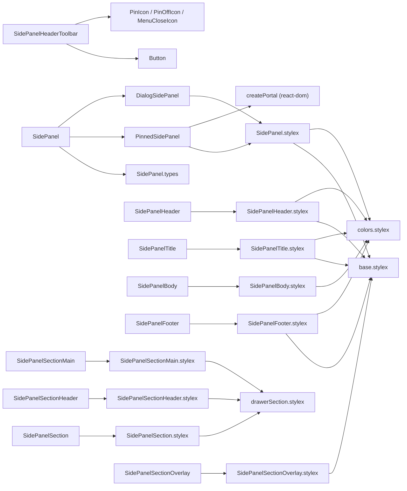
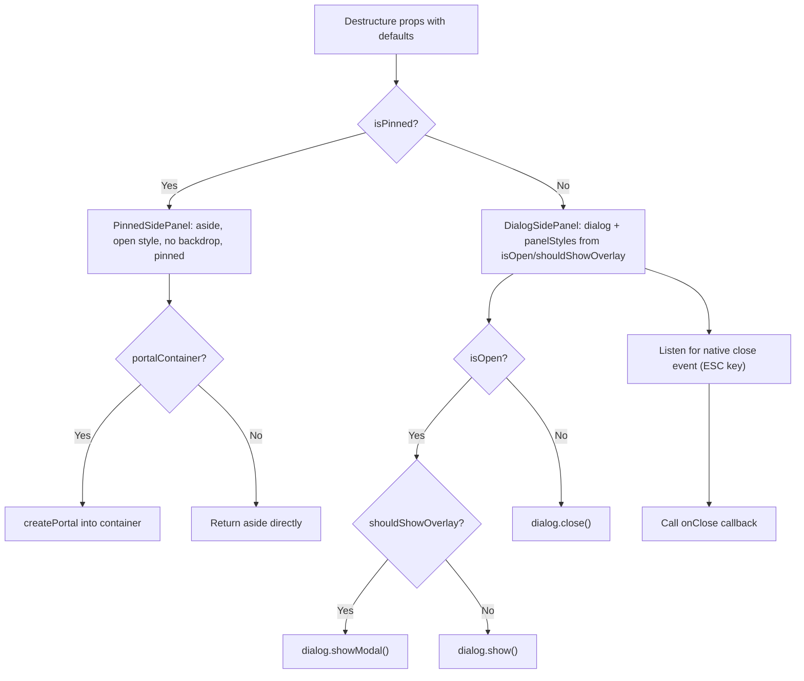
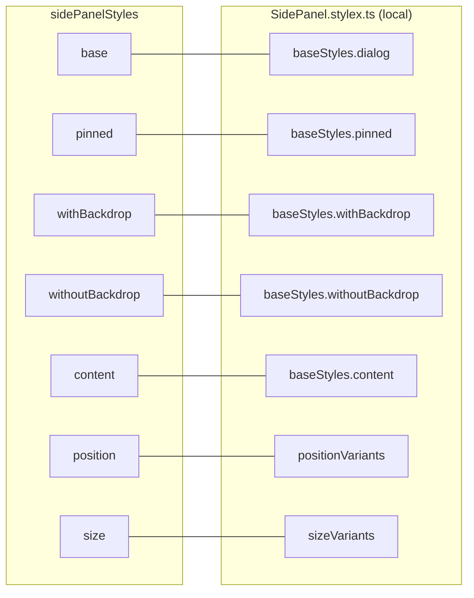
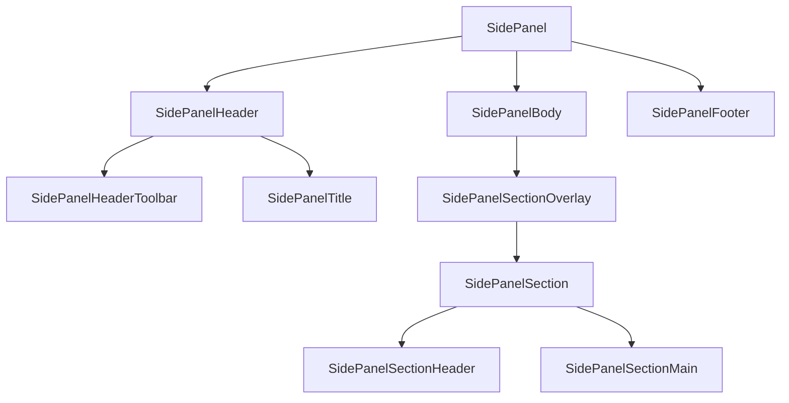

# SidePanel Component Architecture

## File Structure

```
SidePanel/
├── index.ts                          → Barrel export: SidePanel + all sub-components
├── SidePanel.component.tsx           → Root selector: isPinned ? PinnedSidePanel : DialogSidePanel
├── SidePanel.types.ts               → SidePanelProps + variant types
├── SidePanel.stylex.ts               → All root styles (local variants)
│
├── PinnedSidePanel/                  → Private delegate (no barrel): always-visible aside, optional portal, zero effects
│   ├── PinnedSidePanel.component.tsx
│   └── PinnedSidePanel.types.ts      → children, portalContainer?, position, size
│
├── DialogSidePanel/                  → Private delegate (no barrel): native dialog lifecycle + close-event forwarding
│   ├── DialogSidePanel.component.tsx
│   └── DialogSidePanel.types.ts      → children, isOpen, onClose?, position, shouldShowOverlay, size
│
├── SidePanelHeader/                  → Top section with actions slot
│   ├── index.ts
│   ├── SidePanelHeader.component.tsx
│   ├── SidePanelHeader.types.ts     → extends div + actions?: ReactNode
│   └── SidePanelHeader.stylex.ts
│
├── SidePanelHeaderToolbar/           → Reusable pin + close buttons for drawer headers
│   ├── index.ts
│   ├── SidePanelHeaderToolbar.component.tsx
│   └── SidePanelHeaderToolbar.types.ts → isPinned, onClose, onTogglePin
│
├── SidePanelTitle/                   → h2 heading with optional icon
│   ├── index.ts
│   ├── SidePanelTitle.component.tsx
│   ├── SidePanelTitle.types.ts      → extends h2 + icon?: ReactNode
│   └── SidePanelTitle.stylex.ts
│
├── SidePanelBody/                    → Scrollable main content area
│   ├── index.ts
│   ├── SidePanelBody.component.tsx
│   ├── SidePanelBody.types.ts       → extends div
│   └── SidePanelBody.stylex.ts
│
├── SidePanelFooter/                  → Bottom section with top border
│   ├── index.ts
│   ├── SidePanelFooter.component.tsx
│   ├── SidePanelFooter.types.ts     → extends div
│   └── SidePanelFooter.stylex.ts
│
├── SidePanelSection/                 → Section container (uses shared drawerSection tokens)
│   ├── index.ts
│   ├── SidePanelSection.component.tsx
│   ├── SidePanelSection.types.ts    → extends div
│   └── SidePanelSection.stylex.ts
│
├── SidePanelSectionHeader/           → Section header with title + toolbar slot
│   ├── index.ts
│   ├── SidePanelSectionHeader.component.tsx
│   ├── SidePanelSectionHeader.types.ts → extends div + title: string, toolbar?: ReactNode
│   └── SidePanelSectionHeader.stylex.ts
│
├── SidePanelSectionMain/             → Section main content area
│   ├── index.ts
│   ├── SidePanelSectionMain.component.tsx
│   ├── SidePanelSectionMain.types.ts → extends div
│   └── SidePanelSectionMain.stylex.ts
│
└── SidePanelSectionOverlay/          → Blur overlay for inactive sections
    ├── index.ts
    ├── SidePanelSectionOverlay.component.tsx
    ├── SidePanelSectionOverlay.types.ts → children + isOpen: boolean
    └── SidePanelSectionOverlay.stylex.ts
```

## Dependencies



## Render Flow



Switching to pinned mode unmounts `DialogSidePanel`; removing the `<dialog>`
from the document closes it natively, so no cross-mode guard effects exist.

## Props

`SidePanelProps` extends `ComponentPropsWithoutRef<'dialog'>` plus:

| Prop                | Type                     | Default   |
| ------------------- | ------------------------ | --------- |
| `children`          | `ReactNode`              | —         |
| `isOpen`            | `boolean`                | —         |
| `isPinned`          | `boolean`                | —         |
| `onClose`           | `() => void`             | —         |
| `portalContainer`   | `RefObject<HTMLElement>` | —         |
| `position`          | `SidePanelPosition`      | `'right'` |
| `shouldShowOverlay` | `boolean`                | `true`    |
| `size`              | `SidePanelSize`          | `'md'`    |

### Variant Enums

| Type                | Values                                                                |
| ------------------- | --------------------------------------------------------------------- |
| `SidePanelPosition` | `left`, `right`                                                       |
| `SidePanelSize`     | `rail` (72px), `xs` (256px), `sm` (320px), `md` (416px), `lg` (512px) |

## Style Composition

All root styles are local in `SidePanel.stylex.ts`. No shared variant objects.



**Key behaviors**:

- **Fixed positioning** with `height: 100vh`, slides in/out via `translateX`
- **Pinned mode** switches to `position: relative` with `flexShrink: 0`
- **Native `::backdrop`** styled with overlay color or transparent
- **Container query** enabled: `containerName: 'side-panel'`
- **Rail size** provides a compact pinned navigation panel for consumers that
  rely on icon-only interactive controls.

## Sub-Components

| Component                 | HTML Element | Extra Props                            | Key Styles                                                      |
| ------------------------- | ------------ | -------------------------------------- | --------------------------------------------------------------- |
| `SidePanelHeader`         | `div`        | `actions?: ReactNode`                  | `padding: lg`, bottom border, flex row with actions             |
| `SidePanelHeaderToolbar`  | fragment     | `isPinned`, `onClose`, `onTogglePin`   | No styles — composes Button + Icons                             |
| `SidePanelTitle`          | `h2`         | `icon?: ReactNode`                     | `fontSize: xl`, `fontWeight: semibold`, flex with icon          |
| `SidePanelBody`           | `div`        | —                                      | `flex: 1`, `overflowY: auto`, thin scrollbar                    |
| `SidePanelFooter`         | `div`        | —                                      | `padding: sm`, top border, flex row                             |
| `SidePanelSection`        | `div`        | —                                      | Uses shared `drawerSectionStyles.container`                     |
| `SidePanelSectionHeader`  | `div`        | `title: string`, `toolbar?: ReactNode` | Uses shared `drawerSectionStyles` (headerRow + headerTitle)     |
| `SidePanelSectionMain`    | `div`        | —                                      | Uses shared `drawerSectionStyles.sectionMain`                   |
| `SidePanelSectionOverlay` | `div`        | `isOpen: boolean`                      | Blur overlay (`backdropFilter: blur(4px)`), absolute positioned |

### Intended Composition



## Consumers

Used heavily in Table settings drawers:

- `App.tsx` — demo usage with Header/Body/Footer/Title
- `AppNavigation` — left sidebar navigation with compact/full and pin/unpin
  states
- `ColumnSettingsDrawer` — FilterSection, PinningSection, GeneralSection, SortingSection
- `TableSettingsDrawer` — SortingSection, GeneralSettingsSection, AddSortSection, ActiveSortList, ColumnOrderSection
