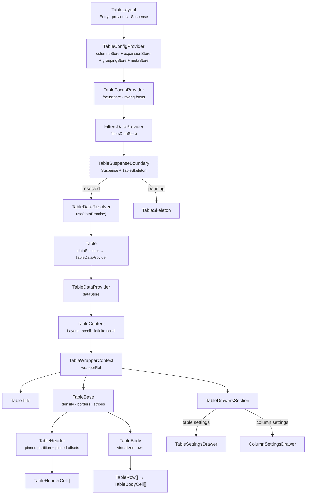
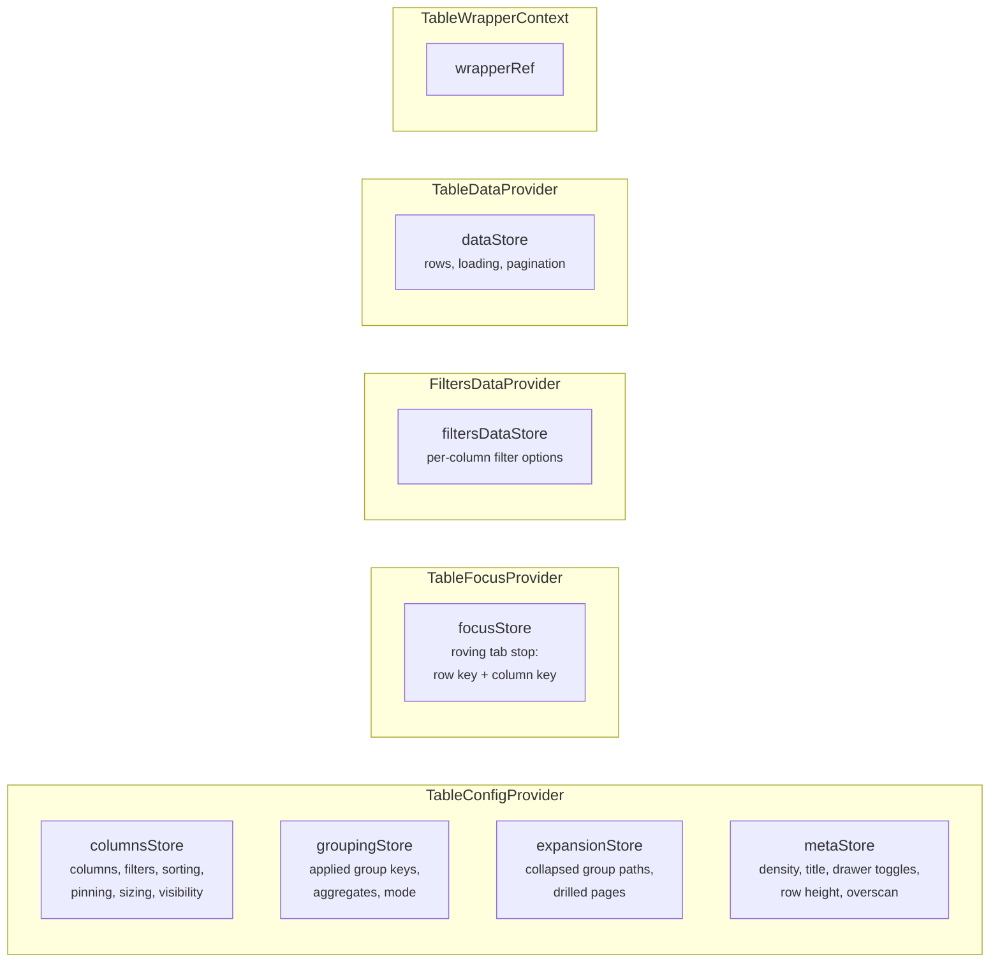
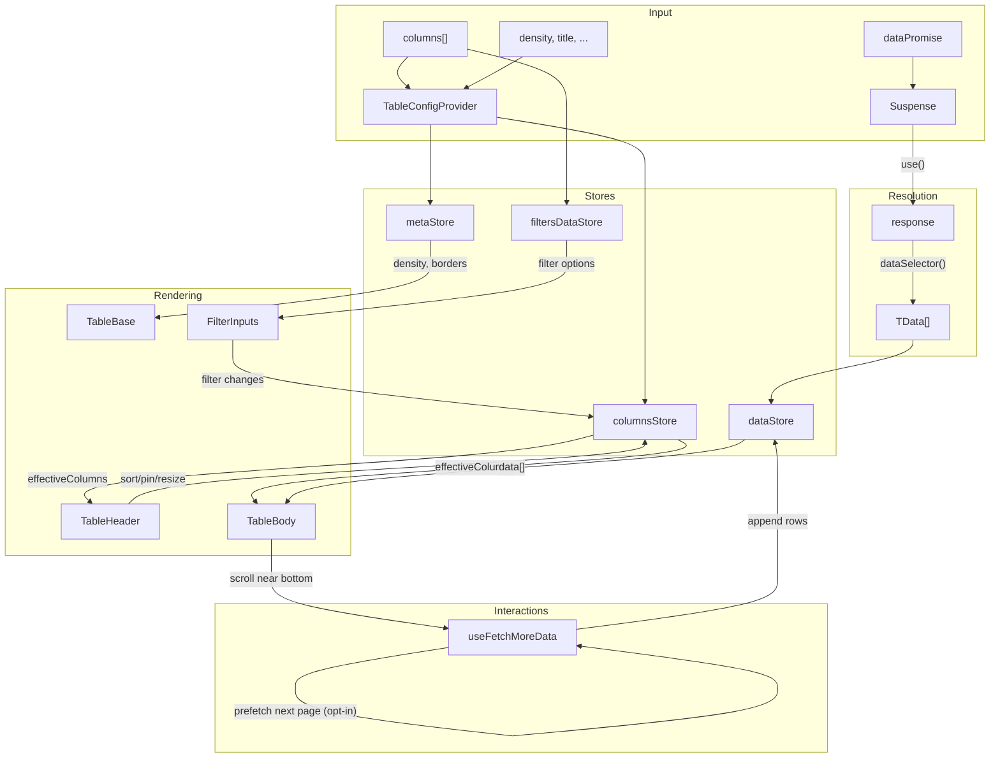
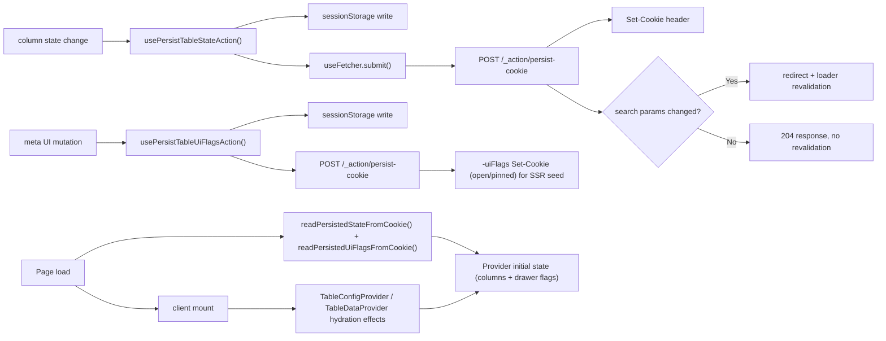

# Table Component Architecture

Feature-rich data table with virtualized rendering, column pinning, sorting,
filtering, infinite scroll, settings drawers, and cookie-based persistence.

## Entry Points

| Component     | Use Case                                                          |
| ------------- | ----------------------------------------------------------------- |
| `TableLayout` | Route-level: receives `dataPromise`, sets up providers + Suspense |
| `Table`       | Inner: receives resolved `response`, creates `TableDataProvider`  |

## Component Hierarchy



## File Structure Overview

```
Table/
├── Table.component.tsx            → Inner entry: data → TableDataProvider → TableContent
├── Table.test.tsx                 → Unit tests for response mapping and wrapper behavior
├── Table.types.ts                 → 25+ exported types (columns, state, props)
├── Table.constants.ts             → Defaults (row height, page size, thresholds)
├── Table.stylex.ts                → Flex wrapper styles
├── index.ts                       → Public barrel: Table, types
│
├── TableLayout/                   → Route-level entry with provider stack
├── TableContent/                  → Layout: title + scroll area + drawers
├── TableBase/                     → <table> with density/border/stripe styles
├── TableHeader/                   → <thead> → TableRow → TableHeaderCell[]
├── TableHeaderCell/               → Interactive <th>: sort, pin, resize, settings
├── TableBody/                     → Virtualised <tbody>: row windowing
├── TableBodyCell/                 → Auto-formatted <td> with type detection
├── TableRow/                      → Styled <tr> with stripe/header variants
├── SpacerRow/                     → Vertical virtual-scroll spacer <tr>
├── SpacerCell/                    → Horizontal virtual-scroll spacer <td>/<th>
├── TableTitle/                    → Title bar with icon + actions slot
├── TableCheckDisplay/             → Boolean checkbox display
├── TableSkeleton/                 → Loading placeholder (reuses Table)
├── TableSuspenseBoundary/         → Suspense wrapper + skeleton fallback
├── TableDataResolver/             → use(dataPromise) → children(response)
├── TableDrawersSection/           → Conditional drawer rendering
│
├── contexts/                      → Context providers (config, focus, data, filters, wrapper)
├── ColumnSettingsDrawer/          → Per-column settings panel
├── TableSettingsDrawer/           → Table-wide settings panel (filters, sort, columns)
├── filters/                       → Filter input components (boolean, text, number, date, select)
├── hooks/                         → useColumnResize, useColumnDragSession, useInfiniteScroll, useScrollResetAfterLoad
├── utils/                         → Column processing + persistence utilities
└── docs/                          → Supplementary architecture docs
```

## State Management

Context providers over external stores, one graph per provider:



All stores use `useSyncExternalStore` for granular subscriptions.
See [contexts/ARCHITECTURE.md](contexts/ARCHITECTURE.md) for details.

**Grouping is split across two of them, and the split is the loader boundary.**
`groupingStore` holds the applied keys, aggregates and mode — the _configuration_,
which is URL state and travels through the loader
([ADR-061](../../../../../docs/decisions/ADR-061-grouping-config-in-url-expansion-in-store.md)).
`expansionStore` holds which paths are collapsed and which groups have drilled,
which are _client_ state and do not: `TableGroupingState` is also the URL codec's
and the loader's type, and a `Set` does not survive that boundary (ADR-009).
Collapse is stored as the **collapsed** set rather than the expanded one, so a
newly-arrived group is open by default and a refetch cannot silently fold rows
([ADR-067](../../../../../docs/decisions/ADR-067-expansion-is-the-collapsed-set-and-a-group-row-is-a-tree-node.md)).

## Data Flow



## Accessibility

The Table is a **grid**, and its roles are declared rather than inherited: the
`display` overrides that make virtualization work take every structural element
out of the table formatting context, and a browser drops an element's implicit
table role along with its table `display`
([ADR-062](../../../../../docs/decisions/ADR-062-grid-semantics-roving-focus-and-row-identity.md)).

The `<table>` is the exception and keeps `display: table`, so `role='grid'` there
upgrades an implicit role rather than replacing a missing one. `<thead>` and the
empty-state `<tbody>` set no overriding `display` either, so neither declares a
role — where the implicit one survives, none is added.

| Element                  | Carries                                                                                                           |
| ------------------------ | ----------------------------------------------------------------------------------------------------------------- |
| `TableBase` `<table>`    | `role='grid'` / `'treegrid'`, `aria-rowcount`, the roving tab stop                                                |
| `TableBody` `<tbody>`    | `role='rowgroup'` — on the populated branch only                                                                  |
| `TableRow` `<tr>`        | `role='row'`, `aria-rowindex`, and under a tree `aria-level` / `aria-posinset` / `aria-setsize` / `aria-expanded` |
| `TableHeaderCell` `<th>` | `role='columnheader'`, `scope='col'`, `aria-sort`                                                                 |
| `TableBodyCell` `<td>`   | `role='gridcell'`, `tabIndex` 0 on exactly one cell                                                               |
| `SpacerRow` `<tr>`       | `aria-hidden='true'`, and no role at all                                                                          |

Exactly one element carries `tabIndex={0}` at any time — the focused cell while
the grid holds focus and that row is rendered, the grid container otherwise.
Arrow, `Home`, `End`, `PageUp` and `PageDown` move it; the focus target is held
in the store as a data-derived row key so it survives the row being unmounted by
a scroll. The model is
[contexts/TableFocus/ARCHITECTURE.md](contexts/TableFocus/ARCHITECTURE.md); the
end-to-end behaviour is pinned by `Table.gridFocus.test.tsx`.

Under grouping the grid upgrades to `role='treegrid'`, every row states its
level, position and set size, `ArrowRight`/`ArrowLeft` expand and collapse a
group row, and everything the grid counts — the virtualization window,
`aria-rowcount`, the row indices, the focus store's `rowIndex` — counts the rows
a collapse leaves standing rather than every loaded row
([ADR-067](../../../../../docs/decisions/ADR-067-expansion-is-the-collapsed-set-and-a-group-row-is-a-tree-node.md)),
pinned by `Table.treeExpansion.test.tsx` and `Table.groupedGridSemantics.test.tsx`.

**A group row is one row of that grid, with cells of its own.** It is not a
banner beside the data: it carries the same `aria-rowindex` sequence, the same
one cell per rendered column, and therefore the same roving tab stop
([ADR-065](../../../../../docs/decisions/ADR-065-grouped-rows-render-a-hierarchy-column.md)).
`Table.groupedGridSemantics.test.tsx` is where the two models meet.

## Grouped rows

### Grouping requires a SQL-backed paginated endpoint

**A `Table` handed an array cannot be grouped, and this is a precondition rather
than an unfinished feature.** Every grouped row the grid renders is produced by
the server: the grouping sets, the `GROUPING()` mask that separates a subtotal
from a real NULL, the aggregates and the guard rails all come from
`@lcabrera/server`'s `group-query-builder`
([ADR-059](../../../../../docs/decisions/ADR-059-aggregation-is-builder-generated.md)).
The grid renders a grouped result; it does not compute one.

A route qualifies by serving a paginated read the grouping request can be sent
to, and declares it with a **capability on the loader meta**
([ADR-063](../../../../../docs/decisions/ADR-063-request-shaping-capabilities-on-the-loader-meta.md)).
Without that declaration the grouping drawer is not offered, so an array-backed
table never presents a control it could not honour.

**Why no client-side path is offered.** Grouping an array in the browser would
have to re-implement the parts that are not the `GROUP BY`: `rollup` and `cube`
set expansion, subtotal disambiguation, the aggregate legality rules that come
from the pg catalogue rather than from a column's TypeScript type
([ADR-058](../../../../../docs/decisions/ADR-058-grouping-legality-by-analytical-role.md),
and #550 settled that `TableColumnDataType` cannot answer it), and the
cardinality guard rails. That is a second implementation of the same semantics
with no way to hold the two in step — and it would still be wrong for the case
the feature exists for, where the rows being summarised are the ones the client
does **not** have. A consumer who genuinely needs to summarise an in-memory array
should aggregate it before handing it to the `Table`, and render the result as
ordinary rows.

### Which guard rails this side can break by construction

`@lcabrera/server`'s `group-query-builder.constants.ts` carries a family of guard
rails ([ADR-066](../../../../../docs/decisions/ADR-066-grouping-guard-rails-and-per-query-timeout.md)),
and they do not all stand in the same relation to the UI. Some are a property of
the **request** — a configuration alone decides whether they hold, so a surface
offering past one builds a state the read then refuses. Others are a property of
the **data**, refused on an estimate at read time, and no configuration can
predict them. The table below is that enumeration (#842), and the second group is
named rather than left out: "not enforced here" and "not knowable here" are
different facts, and only the first is a gap.

| Rail (server)                                         | Predictable from a configuration?     | What holds it on this side                                                                                                                                                                                                                                                         |
| ----------------------------------------------------- | ------------------------------------- | ---------------------------------------------------------------------------------------------------------------------------------------------------------------------------------------------------------------------------------------------------------------------------------- |
| `MAX_GROUP_KEYS` — group-key depth                    | Yes                                   | `MAX_TABLE_GROUP_KEYS` (a pinned duplicate), `areGroupKeysLegal`, `sanitizeGroupingByColumns`, and both add-key surfaces                                                                                                                                                           |
| `MAX_KEYS_BY_GROUPING` — depth per mode               | Yes, and unreached today              | Its lower bound is `cube`'s, and `TABLE_GROUPING_MODES` ships no `cube`. **Nothing gates that**: `groupingContract.test.ts` asserts only that every mode the UI sends is one the builder expands, which a UI-side `cube` would satisfy. Adding one means duplicating this rail too |
| `MAX_COUNT_DISTINCT_AGGREGATES` — per **read**        | Yes                                   | `MAX_TABLE_COUNT_DISTINCT_AGGREGATES` (pinned the same way), through `utils/isWithinCountDistinctBudget.util.ts` and `utils/hasCountDistinctBudgetLeft.util.ts` — #842                                                                                                             |
| A repeated group key                                  | Yes                                   | `areGroupKeysLegal` and the sanitizer, both refusing whole                                                                                                                                                                                                                         |
| A repeated `(columnKey, fn)` → `assertGroupAliases`   | Yes                                   | `areGroupAggregatesLegal` and the sanitizer (#831)                                                                                                                                                                                                                                 |
| A granularity naming a column that is not a key       | Yes                                   | The sanitizer, refusing whole (#786)                                                                                                                                                                                                                                               |
| Group-key and aggregate legality by type              | Only because the verdict is shipped   | The catalogue's per-column answer on the loader meta (ADR-058/063), read through `resolveGroupKeyAvailability` and `resolveOfferableAggregates`. No threshold is duplicated here                                                                                                   |
| `MAX_GROUP_KEY_DISTINCT`, `UNIQUE_ISH_DISTINCT_RATIO` | The verdict, never the number         | Arrive pre-answered as `canGroup: false` plus a refusal reason; this side never evaluates the ratio                                                                                                                                                                                |
| `MAX_IDENTIFIER_LENGTH` — alias length and collision  | In principle, deliberately not        | The alias is derived server-side from the function and the column name, and the way past it is an explicit `alias` the `grouping` param has no slot for (#569). Duplicating a name-building rule is not the trade that duplicating a number is                                     |
| `MAX_GROUP_ROWS_REFUSE` / `MAX_GROUP_ROWS_WARN`       | **No**                                | An estimate over the data, which ADR-066 lets answer `unknown` on an unanalysed table. Rendered as a refusal instead (ADR-068)                                                                                                                                                     |
| The per-query statement timeout                       | **No**                                | Refuses on elapsed cost. Same treatment                                                                                                                                                                                                                                            |
| "A grouped query needs at least one aggregate"        | Not reachable through the read helper | `toGroupAggregates` prepends `count(*)` to every grouped read, so a grouping carrying no measures still asks for one — a property of that helper rather than of this package                                                                                                       |

The first group follows
[ADR-039](../../../../../docs/decisions/ADR-039-duplicate-over-undeclared-edges.md)'s
pattern, without exception: this package is client-safe and cannot import the
Node-only builder, so a rail it must respect is **duplicated** and then pinned to
the server's value by a contract test in `apps/react-router` — the one workspace
that legitimately depends on both packages. Two constants and one assertion each,
never a copy left to drift.

### Layout

While grouping is applied, two derivations reshape the column list, in an order
that matters. `withAggregateColumns` runs first and replaces each **measured**
column with one column per aggregate applied to it; `withGroupedColumnLayout`
then hoists each group key to the head of the order and of the left pin, in key
order, and forces it visible
([ADR-080](../../../../../docs/decisions/ADR-080-a-group-key-renders-in-its-own-column.md)).
Both are derivations and never state, so neither reaches the cookie the column
layout persists through nor the list the drawer offers — which is what makes
ungrouping free, and what means a deselected aggregate needs no pruning: the
next derivation simply does not produce its column.

**Keeping that true takes work at the two edges where a user acts on a measure
column.** Pinning one resolves to the column it measures (`toDeclaredColumnKey`),
so `columnOrder` and `columnPinning` stay declared-only and a whole band travels
together rather than half of it; without that the derived key entered the
declared order, where `syncColumnOrderWithPinning`'s removal filter could not
find it, and the next derivation produced the same column from both entries —
two identical headers with duplicate React keys. And the expansion
**deduplicates**, because these lists are restored from a cookie that outlives
any invariant this code holds today. Hiding is deliberately _not_ mapped: one
measure hidden independently is useful, cannot duplicate anything, and an
unknown key in a visibility map is simply never consulted.

Sorting is the third edge and it is handled server-side, because a measure sort
is legitimate on the grouped read — `toGroupSort` maps it onto the aggregate's
alias — and meaningless on any ungrouped one. `toDrillRead` drops measure terms
alongside the group-key terms it already dropped; `pruneSortingToColumns` covers
the other direction, when the grouping clears while such a sort is applied.

The two cannot conflict, because an aggregate naming a group key is dropped —
that column already carries its key's value. One column is never replaced,
though: a **primary-key** column is measured _beside_ itself, because
`resolveCrudRowId` throws when no column carries `isPrimaryKey`, and substituting
the only one would take out the row-actions menu of every row for a grouping
settable from the URL.

A measure column's key is the aggregate's token — `total_amount:avg` — which
`DataKey` admits for the same reason it admits `'actions'`: a column identity
that names no field of the row. Its header draws the function alone, with the
source column's name stated once above it by a decorative band row
(`TableHeaderBand`). The band is `aria-hidden`, so the name reaches the
accessibility tree through each measure header's own `aria-label` instead — one
announcement per column rather than a second header row in the sequence
`aria-rowindex` counts through.

**The store's derived column fields are only valid derived together.**
`normalizedColumns`, `effectiveColumns`, `pinnedColumnPartition` and
`pinnedColumnOffsets` all come out of one `deriveColumnViewState` call, and an
action writing a subset of them writes a state no derivation would have
produced. That was survivable while every derivation added no column: the
consumer's declared list and the painted list held the same keys, so rebuilding
one field from the wrong list happened to agree. `withAggregateColumns` ends
that, because it paints columns the declared list has never heard of.
`useSetColumnSorting` was the one action still writing a subset, and once
measures existed a sort click rebuilt `normalizedColumns` without them while
`pinnedColumnPartition` still asked for them to be rendered — so
`TableHeaderCell` destructured `undefined` (#872). Every column-mutating action
now re-derives the whole view state, and `aggregates`/`groupingKeys` are
**required** arguments so a new derivation site fails to compile rather than
silently deriving from the declared list. That requirement is also what this
site evaded: it reached past `deriveColumnViewState` to the `getNormalizedColumns`
primitive underneath, and so had nothing to fail on.

A group row renders **each key's value in that key's own column**, one measure
per measure column, and an em dash on a column carrying no aggregate at all. **Depth is read from which key columns are filled**,
not from a pixel offset: a rollup fills a prefix, a cube fills an arbitrary
subset, and neither needs the other's reading. A key column renders **blank** on
its detail rows: the value is stated once, by the group row directly above them,
in the same column.

An ancestor that repeats the row above is carried rather than restated — blank on
screen, still announced — and refills at the top of the rendered window, where
there is no row above to have stated it.

**`path` holds only the keys a row's grouping set grouped by**, so under
`rollup` a subtotal carries one entry fewer than the rows it totals, and **the
grand total carries none at all** — anything deriving ancestry from `path` has
to treat the empty path as the root rather than as a malformed summary.
`resolveGroupTreeNodes` reads it as the **root**: the grand total is a sibling
of the top-level groups, not their parent — making it their ancestor would put
the whole grid inside one collapsible subtree.

**`path.length` is not a depth, and the rendering never treats it as one.** It
coincides with depth only while every grouping set is a **prefix** of the key
list, which is true of `flat` and `rollup` and false of `cube`, whose sets are
arbitrary subsets: a row carrying the second key and not the first is the child
of nothing. The tree derivation may rely on the prefix property, because a tree
is what it builds and only the prefix modes produce one. The **cell** rendering
may not, which is why it reads a level from which key column is filled — the one
reading that serves a tree and a lattice alike (ADR-080).

## Persistence

Table state uses two write paths with a shared hydration model:

- Cookies + URL for SSR/shareable column state (filters, sorting, pinning, sizing, visibility)
- sessionStorage (tab-scoped) for per-tab working copies (drawer UI + data rows)
- Meta UI state is written by the mutation action itself, not by a subscription effect
- The drawer **open/pinned flags** are additionally mirrored to a `-uiFlags` cookie
  so the loader can SSR-seed the drawer in its persisted open/pinned state and
  avoid a hydration layout shift (tab/expanded-filter state stays sessionStorage-only)
- All persisted keys are optionally scoped by an **`appId`** (`table-state-{appId}-{persistenceKey}`)
  so tables in different apps that share a `persistenceKey` never collide
- Query revalidation is conditional: only effective filter/sort URL changes trigger
  redirect and loader rerun.



See [hooks/ARCHITECTURE.md](hooks/ARCHITECTURE.md) and
[utils/ARCHITECTURE.md](utils/ARCHITECTURE.md) for details.

## Detailed Architecture

| Area                  | Details                                                                        |
| --------------------- | ------------------------------------------------------------------------------ |
| Contexts              | [contexts/ARCHITECTURE.md](contexts/ARCHITECTURE.md)                           |
| TableFocus context    | [contexts/TableFocus/ARCHITECTURE.md](contexts/TableFocus/ARCHITECTURE.md)     |
| TableLayout           | [TableLayout/ARCHITECTURE.md](TableLayout/ARCHITECTURE.md)                     |
| TableContent          | [TableContent/ARCHITECTURE.md](TableContent/ARCHITECTURE.md)                   |
| TableBase             | [TableBase/ARCHITECTURE.md](TableBase/ARCHITECTURE.md)                         |
| TableHeader           | [TableHeader/ARCHITECTURE.md](TableHeader/ARCHITECTURE.md)                     |
| TableHeaderCell       | [TableHeaderCell/ARCHITECTURE.md](TableHeaderCell/ARCHITECTURE.md)             |
| TableBody             | [TableBody/ARCHITECTURE.md](TableBody/ARCHITECTURE.md)                         |
| TableBodyCell         | [TableBodyCell/ARCHITECTURE.md](TableBodyCell/ARCHITECTURE.md)                 |
| TableRow              | [TableRow/ARCHITECTURE.md](TableRow/ARCHITECTURE.md)                           |
| TableActionButton     | [TableActionButton/ARCHITECTURE.md](TableActionButton/ARCHITECTURE.md)         |
| TableRowActionsMenu   | [TableRowActionsMenu/ARCHITECTURE.md](TableRowActionsMenu/ARCHITECTURE.md)     |
| SpacerRow             | [SpacerRow/ARCHITECTURE.md](SpacerRow/ARCHITECTURE.md)                         |
| SpacerCell            | [SpacerRow/ARCHITECTURE.md](SpacerRow/ARCHITECTURE.md)                         |
| TableTitle            | [TableTitle/ARCHITECTURE.md](TableTitle/ARCHITECTURE.md)                       |
| TableCheckDisplay     | [TableCheckDisplay/ARCHITECTURE.md](TableCheckDisplay/ARCHITECTURE.md)         |
| TableSkeleton         | [TableSkeleton/ARCHITECTURE.md](TableSkeleton/ARCHITECTURE.md)                 |
| TableSuspenseBoundary | [TableSuspenseBoundary/ARCHITECTURE.md](TableSuspenseBoundary/ARCHITECTURE.md) |
| TableDataResolver     | [TableDataResolver/ARCHITECTURE.md](TableDataResolver/ARCHITECTURE.md)         |
| TableDrawersSection   | [TableDrawersSection/ARCHITECTURE.md](TableDrawersSection/ARCHITECTURE.md)     |
| Filters               | [filters/ARCHITECTURE.md](filters/ARCHITECTURE.md)                             |
| Hooks                 | [hooks/ARCHITECTURE.md](hooks/ARCHITECTURE.md)                                 |
| Utils                 | [utils/ARCHITECTURE.md](utils/ARCHITECTURE.md)                                 |
| TableSettingsDrawer   | [TableSettingsDrawer/ARCHITECTURE.md](TableSettingsDrawer/ARCHITECTURE.md)     |
| ColumnSettingsDrawer  | [ColumnSettingsDrawer/ARCHITECTURE.md](ColumnSettingsDrawer/ARCHITECTURE.md)   |
