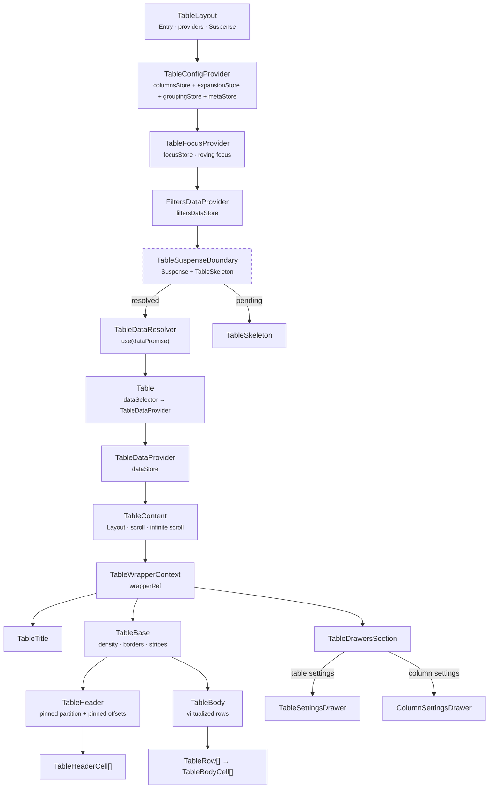
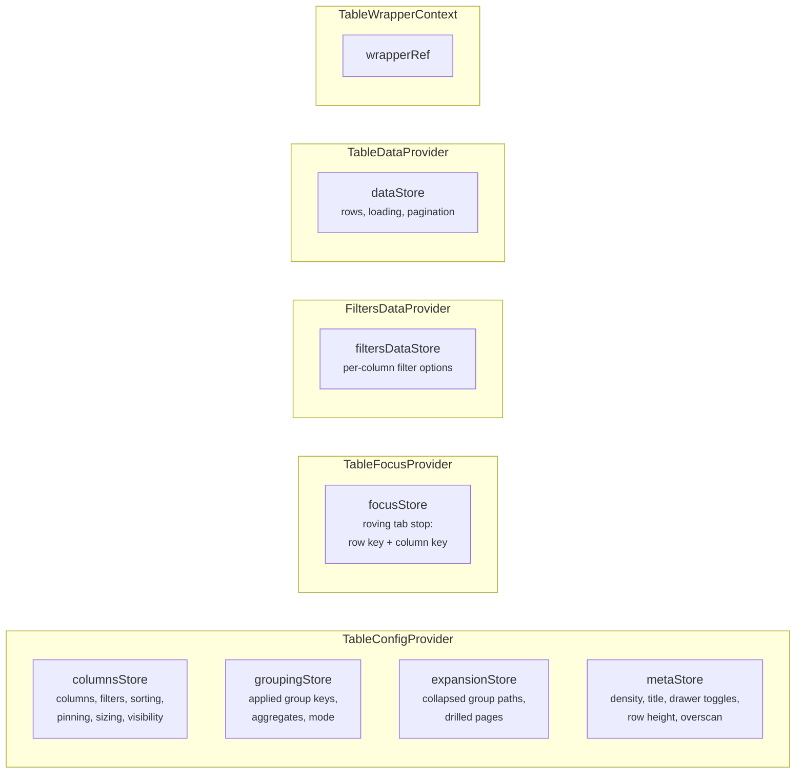
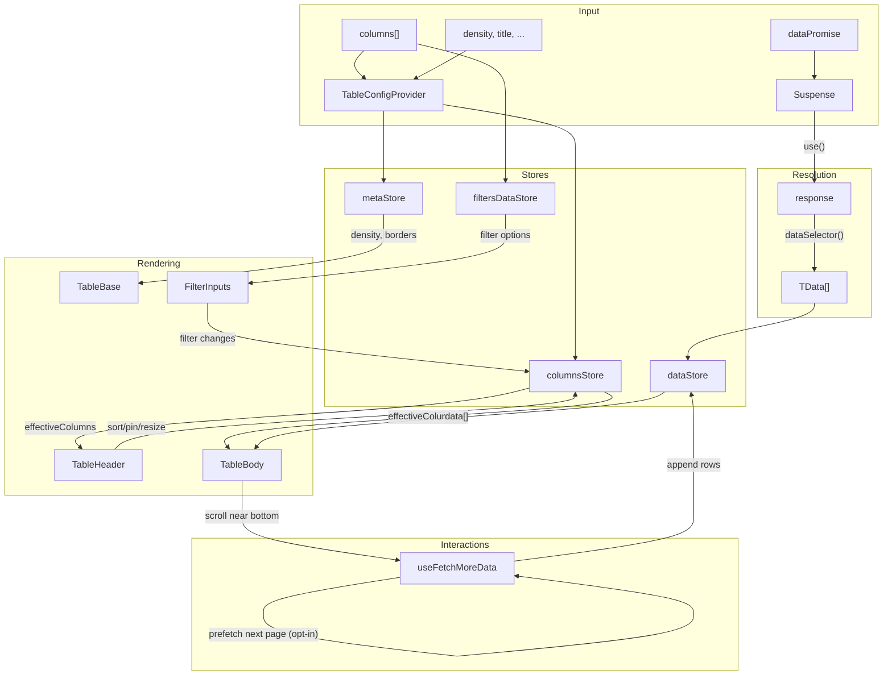
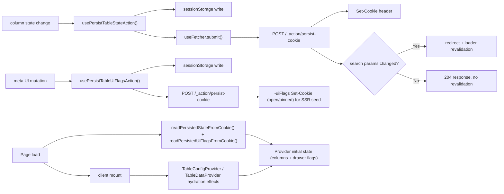

# Table Component Architecture

Feature-rich data table with virtualized rendering, column pinning, sorting,
filtering, infinite scroll, settings drawers, and cookie-based persistence.

## Entry Points

| Component     | Use Case                                                          |
| ------------- | ----------------------------------------------------------------- |
| `TableLayout` | Route-level: receives `dataPromise`, sets up providers + Suspense |
| `Table`       | Inner: receives resolved `response`, creates `TableDataProvider`  |

## Component Hierarchy



## File Structure Overview

```
Table/
├── Table.component.tsx            → Inner entry: data → TableDataProvider → TableContent
├── Table.test.tsx                 → Unit tests for response mapping and wrapper behavior
├── Table.types.ts                 → 25+ exported types (columns, state, props)
├── Table.constants.ts             → Defaults (row height, page size, thresholds)
├── Table.stylex.ts                → Flex wrapper styles
├── index.ts                       → Public barrel: Table, types
│
├── TableLayout/                   → Route-level entry with provider stack
├── TableContent/                  → Layout: title + scroll area + drawers
├── TableBase/                     → <table> with density/border/stripe styles
├── TableHeader/                   → <thead> → TableRow → TableHeaderCell[]
├── TableHeaderCell/               → Interactive <th>: sort, pin, resize, settings
├── TableBody/                     → Virtualised <tbody>: row windowing
├── TableBodyCell/                 → Auto-formatted <td> with type detection
├── TableRow/                      → Styled <tr> with stripe/header variants
├── SpacerRow/                     → Vertical virtual-scroll spacer <tr>
├── SpacerCell/                    → Horizontal virtual-scroll spacer <td>/<th>
├── TableTitle/                    → Title bar with icon + actions slot
├── TableCheckDisplay/             → Boolean checkbox display
├── TableSkeleton/                 → Loading placeholder (reuses Table)
├── TableSuspenseBoundary/         → Suspense wrapper + skeleton fallback
├── TableDataResolver/             → use(dataPromise) → children(response)
├── TableDrawersSection/           → Conditional drawer rendering
│
├── contexts/                      → Context providers (config, focus, data, filters, wrapper)
├── ColumnSettingsDrawer/          → Per-column settings panel
├── TableSettingsDrawer/           → Table-wide settings panel (filters, sort, columns)
├── filters/                       → Filter input components (boolean, text, number, date, select)
├── hooks/                         → useColumnResize, useColumnDragSession, useInfiniteScroll, useScrollResetAfterLoad
├── utils/                         → Column processing + persistence utilities
└── docs/                          → Supplementary architecture docs
```

## State Management

Context providers over external stores, one graph per provider:



All stores use `useSyncExternalStore` for granular subscriptions.
See [contexts/ARCHITECTURE.md](contexts/ARCHITECTURE.md) for details.

**Grouping is split across two of them, and the split is the loader boundary.**
`groupingStore` holds the applied keys, aggregates and mode — the _configuration_,
which is URL state and travels through the loader
([ADR-061](../../../../../docs/decisions/ADR-061-grouping-config-in-url-expansion-in-store.md)).
`expansionStore` holds which paths are collapsed and which groups have drilled,
which are _client_ state and do not: `TableGroupingState` is also the URL codec's
and the loader's type, and a `Set` does not survive that boundary (ADR-009).
Collapse is stored as the **collapsed** set rather than the expanded one, so a
newly-arrived group is open by default and a refetch cannot silently fold rows
([ADR-067](../../../../../docs/decisions/ADR-067-expansion-is-the-collapsed-set-and-a-group-row-is-a-tree-node.md)).

## Data Flow



## Accessibility

The Table is a **grid**, and its roles are declared rather than inherited: the
`display` overrides that make virtualization work take every structural element
out of the table formatting context, and a browser drops an element's implicit
table role along with its table `display`
([ADR-062](../../../../../docs/decisions/ADR-062-grid-semantics-roving-focus-and-row-identity.md)).

The `<table>` is the exception and keeps `display: table`, so `role='grid'` there
upgrades an implicit role rather than replacing a missing one. `<thead>` and the
empty-state `<tbody>` set no overriding `display` either, so neither declares a
role — where the implicit one survives, none is added.

| Element                  | Carries                                                                                                           |
| ------------------------ | ----------------------------------------------------------------------------------------------------------------- |
| `TableBase` `<table>`    | `role='grid'` / `'treegrid'`, `aria-rowcount`, the roving tab stop                                                |
| `TableBody` `<tbody>`    | `role='rowgroup'` — on the populated branch only                                                                  |
| `TableRow` `<tr>`        | `role='row'`, `aria-rowindex`, and under a tree `aria-level` / `aria-posinset` / `aria-setsize` / `aria-expanded` |
| `TableHeaderCell` `<th>` | `role='columnheader'`, `scope='col'`, `aria-sort`                                                                 |
| `TableBodyCell` `<td>`   | `role='gridcell'`, `tabIndex` 0 on exactly one cell                                                               |
| `SpacerRow` `<tr>`       | `aria-hidden='true'`, and no role at all                                                                          |

Exactly one element carries `tabIndex={0}` at any time — the focused cell while
the grid holds focus and that row is rendered, the grid container otherwise.
Arrow, `Home`, `End`, `PageUp` and `PageDown` move it; the focus target is held
in the store as a data-derived row key so it survives the row being unmounted by
a scroll. The model is
[contexts/TableFocus/ARCHITECTURE.md](contexts/TableFocus/ARCHITECTURE.md); the
end-to-end behaviour is pinned by `Table.gridFocus.test.tsx`.

Under grouping the grid upgrades to `role='treegrid'`, every row states its
level, position and set size, `ArrowRight`/`ArrowLeft` expand and collapse a
group row, and everything the grid counts — the virtualization window,
`aria-rowcount`, the row indices, the focus store's `rowIndex` — counts the rows
a collapse leaves standing rather than every loaded row
([ADR-067](../../../../../docs/decisions/ADR-067-expansion-is-the-collapsed-set-and-a-group-row-is-a-tree-node.md)),
pinned by `Table.treeExpansion.test.tsx` and `Table.groupedGridSemantics.test.tsx`.

**A group row is one row of that grid, with cells of its own.** It is not a
banner beside the data: it carries the same `aria-rowindex` sequence, the same
one cell per rendered column, and therefore the same roving tab stop
([ADR-065](../../../../../docs/decisions/ADR-065-grouped-rows-render-a-hierarchy-column.md)).
`Table.groupedGridSemantics.test.tsx` is where the two models meet.

**Asking a row what it is has two different questions in it, and the render path
needs both.** `getTableGroupRowSummary` answers whether a marker is well-formed
enough to render from; `hasTableStructuralMarker` answers whether the row
carries one at all. The first returns `undefined` for a data row and for an
unreadable marker alike, so on its own the grid cannot tell those apart — and it
read the second as the first, handing a group row to the
detail-row path where the actions column asked it for a primary key it was never
going to have. A row that claims to be chrome is now blanked rather than
reclassified, which is what lets the validators stay strict: one member that does
not narrow must still refuse the whole summary, because a group described by some
of its keys is not the group the row holds.

**Nothing on the render path may throw, and sharing a derivation is not sharing a
failure mode.** ADR-062 settled this for row identity: `resolveRowKey` degrades
to the row's index rather than reusing `resolveCrudRowId`, because a throw on the
render path empties the table. The row-actions menu was equally on the render
path and kept the throwing call until #887, so `resolveCrudRowId` no longer
throws at all — it answers `undefined` and the menu renders nothing. The rule generalises past these two: a derivation may be shared by a link
builder and a renderer, and each owns what it does when the derivation fails.

**A per-row field forwarded by name is a field that can be dropped by name.**
`renderTableBodyPinnedGroup` receives one spread object and destructures the
fields it passes on, so a field missing from its signature vanishes without a
type error — excess properties survive a spread. `drillRow` was built per row and
lost exactly this way, which is what made every drill chrome row a data row.
Adding a per-row field means adding it to that signature too, and
`Table.groupedCrud.test.tsx` is what notices when it is not.

## Grouped rows

### Grouping requires a SQL-backed paginated endpoint

**A `Table` handed an array cannot be grouped, and this is a precondition rather
than an unfinished feature.** Every grouped row the grid renders is produced by
the server: the grouping sets, the `GROUPING()` mask that separates a subtotal
from a real NULL, the aggregates and the guard rails all come from
`@lcabrera/server`'s `group-query-builder`
([ADR-059](../../../../../docs/decisions/ADR-059-aggregation-is-builder-generated.md)).
The grid renders a grouped result; it does not compute one.

A route qualifies by serving a paginated read the grouping request can be sent
to, and declares it with a **capability on the loader meta**
([ADR-063](../../../../../docs/decisions/ADR-063-request-shaping-capabilities-on-the-loader-meta.md)).
Without that declaration the grouping drawer is not offered, so an array-backed
table never presents a control it could not honour.

**Why no client-side path is offered.** Grouping an array in the browser would
have to re-implement the parts that are not the `GROUP BY`: `rollup` and `cube`
set expansion, subtotal disambiguation, the aggregate legality rules that come
from the pg catalogue rather than from a column's TypeScript type
([ADR-058](../../../../../docs/decisions/ADR-058-grouping-legality-by-analytical-role.md),
and #550 settled that `TableColumnDataType` cannot answer it), and the
cardinality guard rails. That is a second implementation of the same semantics
with no way to hold the two in step — and it would still be wrong for the case
the feature exists for, where the rows being summarised are the ones the client
does **not** have. A consumer who genuinely needs to summarise an in-memory array
should aggregate it before handing it to the `Table`, and render the result as
ordinary rows.

### Which guard rails this side can break by construction

`@lcabrera/server`'s `group-query-builder.constants.ts` carries a family of guard
rails ([ADR-066](../../../../../docs/decisions/ADR-066-grouping-guard-rails-and-per-query-timeout.md)),
and they do not all stand in the same relation to the UI. Some are a property of
the **request** — a configuration alone decides whether they hold, so a surface
offering past one builds a state the read then refuses. Others are a property of
the **data**, refused on an estimate at read time, and no configuration can
predict them. The table below is that enumeration (#842), and the second group is
named rather than left out: "not enforced here" and "not knowable here" are
different facts, and only the first is a gap.

| Rail (server)                                         | Predictable from a configuration?     | What holds it on this side                                                                                                                                                                                                                                                         |
| ----------------------------------------------------- | ------------------------------------- | ---------------------------------------------------------------------------------------------------------------------------------------------------------------------------------------------------------------------------------------------------------------------------------- |
| `MAX_GROUP_KEYS` — group-key depth                    | Yes                                   | `MAX_TABLE_GROUP_KEYS` (a pinned duplicate), `areGroupKeysLegal`, `sanitizeGroupingByColumns`, and both add-key surfaces                                                                                                                                                           |
| `MAX_KEYS_BY_GROUPING` — depth per mode               | Yes, and unreached today              | Its lower bound is `cube`'s, and `TABLE_GROUPING_MODES` ships no `cube`. **Nothing gates that**: `groupingContract.test.ts` asserts only that every mode the UI sends is one the builder expands, which a UI-side `cube` would satisfy. Adding one means duplicating this rail too |
| `MAX_COUNT_DISTINCT_AGGREGATES` — per **read**        | Yes                                   | `MAX_TABLE_COUNT_DISTINCT_AGGREGATES` (pinned the same way), through `utils/isWithinCountDistinctBudget.util.ts` and `utils/hasCountDistinctBudgetLeft.util.ts` — #842                                                                                                             |
| A repeated group key                                  | Yes                                   | `areGroupKeysLegal` and the sanitizer, both refusing whole                                                                                                                                                                                                                         |
| A repeated `(columnKey, fn)` → `assertGroupAliases`   | Yes                                   | `areGroupAggregatesLegal` and the sanitizer (#831)                                                                                                                                                                                                                                 |
| A granularity naming a column that is not a key       | Yes                                   | The sanitizer, refusing whole (#786)                                                                                                                                                                                                                                               |
| Group-key and aggregate legality by type              | Only because the verdict is shipped   | The catalogue's per-column answer on the loader meta (ADR-058/063), read through `resolveGroupKeyAvailability` and `resolveOfferableAggregates`. No threshold is duplicated here                                                                                                   |
| `MAX_GROUP_KEY_DISTINCT`, `UNIQUE_ISH_DISTINCT_RATIO` | The verdict, never the number         | Arrive pre-answered as `canGroup: false` plus a refusal reason; this side never evaluates the ratio                                                                                                                                                                                |
| `MAX_IDENTIFIER_LENGTH` — alias length and collision  | In principle, deliberately not        | The alias is derived server-side from the function and the column name, and the way past it is an explicit `alias` the `grouping` param has no slot for (#569). Duplicating a name-building rule is not the trade that duplicating a number is                                     |
| `MAX_GROUP_ROWS_REFUSE` / `MAX_GROUP_ROWS_WARN`       | **No**                                | An estimate over the data, which ADR-066 lets answer `unknown` on an unanalysed table. Rendered as a refusal instead (ADR-068)                                                                                                                                                     |
| The per-query statement timeout                       | **No**                                | Refuses on elapsed cost. Same treatment                                                                                                                                                                                                                                            |
| "A grouped query needs at least one aggregate"        | Not reachable through the read helper | `toGroupAggregates` prepends `count(*)` to every grouped read, so a grouping carrying no measures still asks for one — a property of that helper rather than of this package                                                                                                       |

The first group follows
[ADR-039](../../../../../docs/decisions/ADR-039-duplicate-over-undeclared-edges.md)'s
pattern, without exception: this package is client-safe and cannot import the
Node-only builder, so a rail it must respect is **duplicated** and then pinned to
the server's value by a contract test in a consumer of both packages — the only
place that comparison can be made. Two constants and one assertion each, never a
copy left to drift.

### Layout

While grouping is applied, three derivations reshape the column list, in an
order that matters. `withAggregateColumns` runs first and replaces each
**measured** column with one column per aggregate applied to it —
the primary key included, since a row id is resolved from the declared columns
and never from the painted list. `withGroupedColumnScope` then drops every
column the grouping neither keys nor measures, so the grid holds the group keys,
the measures and the row-actions column and nothing else
([ADR-096](../../../../../docs/decisions/ADR-096-the-grouping-decides-which-columns-the-grid-shows.md)).
`withGroupedColumnLayout` runs last and hoists each group key to the head of the
order and of the left pin, in key order, forcing it visible
([ADR-080](../../../../../docs/decisions/ADR-080-a-group-key-renders-in-its-own-column.md)).
All three are derivations and never state, so none reaches the cookie the column
layout persists through nor the list the drawer offers — which is what makes
ungrouping free, and what means a deselected aggregate needs no pruning: the
next derivation simply does not produce its column.

**The row-actions column is the one thing the scope keeps that the grouping does
not name**, because it is not a data column: its cell is the grid's own
affordance rather than a field of the row, so a grouped grid keeps its row
menus.

**The settings drawer's Columns tab reads that same derivation, over its own
draft** — `resolveRenderedColumnKeys` runs `getPinnedDerivedColumnsState` and
maps each painted key back through `toDeclaredColumnKey`, so a measure ticks its
source column's row. `Show`, the order the rows are listed in, and the count in
the section header all come from that one answer, and the grid and the tab agree
exactly when the drawer's draft is the applied state. Nothing is removed from
the list: a column the grouping does not name is listed unticked, and ticking it
opens the prompt below. **No row is draggable while grouping is applied** — the
order shown is derived for its whole length, so a drag would write a derivation
into the persisted order.

**Turning a column on while grouped is a request to join the grouping, and the
prompt asks how.** The toggle branches on whether the grouping **names** the
column (`isColumnNamedByGrouping`) rather than on whether it is painted: hiding
a measured column hides its measures with it, so a named column can be unpainted
and ticking it must simply un-hide it. For an unnamed one,
`resolveColumnGroupingChoices` offers what the column supports — as a group key,
or with one of its offerable aggregates — from `resolveGroupKeyAvailability` and
`resolveAddableAggregates`, the same pair the Grouping tab's pickers read, and
returns a `refusal` naming the cause when it can offer nothing. Accepting a
choice writes the grouping draft and takes the column off the drawer's hidden
set; it writes no derived key into `columnVisibility`, which is the write path
the warning below is about.

**Keeping that true takes work at the two edges where a user acts on a measure
column.** Pinning one resolves to the column it measures (`toDeclaredColumnKey`),
so `columnOrder` and `columnPinning` stay declared-only and a whole band travels
together rather than half of it; without that the derived key entered the
declared order, where `syncColumnOrderWithPinning`'s removal filter could not
find it, and the next derivation produced the same column from both entries —
two identical headers with duplicate React keys. And the expansion
**deduplicates**, because these lists are restored from a cookie that outlives
any invariant this code holds today.

**Hiding is mapped the same way, and it has to be**, because the layout is
_persisted_ and the settings drawer builds its rows from the **declared**
columns. A derived key written into `columnVisibility` therefore reaches the
cookie with nothing in the per-column UI able to take it out again: the drawer
lists `Total Amount`, never `Average`, so toggling it writes the declared key
and leaves the derived one hidden. Only the drawer's blanket "Clear Visibility &
Pinning" clears it, along with every other preference. So hiding `Average` hides
`Total Amount`, and the derivation expands that back into both measures — which
is also what makes the drawer's own toggle work, since a key `gridColumns` no
longer holds would otherwise filter nothing while the drawer drew the column as
hidden. The mapping and the expansion are the two halves of one rule; either
alone leaves the two write paths disagreeing about the same column.

The cost is that a band hides whole. Hiding one measure and keeping its
siblings would need the drawer to offer the derived columns as rows of their
own — a real feature, tracked separately, not something to be had by writing an
unreachable key into a cookie.

**A column's locks carry onto its measures, and the guard runs after the
mapping.** Both follow from the same fact: every layout action on a measure
acts on the column it measures. So a measure must not resolve
`isStatic: false` while its source is locked — `withAggregateColumns` copies
`isStatic` and `isResizable` across, which is what stops the header menu
offering Pin/Hide and the header cell drawing a resize handle on a column the
consumer froze. And a permission check must test the **declared** key, because
`staticKeys` is built from the consumer's own column list and can never contain
`total_amount:avg`: a guard placed before `toDeclaredColumnKey` tests a key no
permission set was ever built for, passes, and then writes the source key
anyway. `useSetColumnPinning` cannot get this wrong — `resolveColumnPinningUpdate`
receives the mapped key and guards inside — while `useSetColumnVisibility` orders
the two by hand. The drawer's own `useToggleColumnVisibility` reads `staticKeys`
for the same reason it must: `normalizedColumns` no longer holds a column the
grouping scoped out, so a lock read from there would silently stop answering.

**The drawer decides "grouped" the way the grid does, from the declared keys.**
`ColumnOrderSectionBody` resolves `resolveDeclaredGroupingKeys` once and hands
the result to `hoistRenderedColumns` and `createDraggableItems`, and
`useToggleColumnVisibility` resolves it for its own gate — so an applied
grouping that names no declared column leaves the tab ordered, draggable and
directly toggleable, which is what the grid is doing beside it. Only the
key-cap count in `resolveColumnGroupingChoices` reads the raw applied list,
because a cap is about the grouping that would be written.

**The Filters tab reads the declared columns for the same reason, through
`useGetDeclaredColumn`.** `FilterItem`, `FilterItemHeader`, `FilterInputs`,
`SelectFilterInput` and `useAddFilterSection` all answer a question about the
column the consumer declared, not about the one the grid paints, so a filter on
a column the grouping neither keys nor measures stays listed and removable and
the picker's offer stays honourable — a filter restates the read rather than the
layout, so it applies while the grouping is on.

Sorting is the third edge and it is handled server-side, because a measure sort
is legitimate on the grouped read — `toGroupSort` maps it onto the aggregate's
alias — and meaningless on any ungrouped one. `toDrillRead` drops measure terms
alongside the group-key terms it already dropped; `pruneSortingToColumns` covers
the other direction, when the grouping clears while such a sort is applied.

**A detail row arriving in a grouped grid renders blank, and that is a known
limitation rather than an oversight.** Every row renders over the same
partition (ADR-065), and a grouped grid paints the group keys and the measures
alone (ADR-096) — so such a row has nothing to show: its key cells blank because
the group row above states the value, and the measure columns are fields it does
not carry. Keeping the unmeasured columns would fix it and cost more than it
saves: they can carry no aggregate, so each would draw the em dash on every
group row of every grouped view, to serve rows a grouped read does not return.
ADR-087 opens a group's own rows in a route that applies no grouping — where the
declared columns are all present and the question does not arise.
`Table.aggregateColumns.test.tsx` pins the current behaviour so it stays a
decision on record.

The scope and the measures cannot conflict, because an aggregate naming a group
key is dropped — that column already carries its key's value. The em dash
ADR-065 defined survives only for a measure column whose value the payload did
not carry, which is what `TableGroupAggregate` renders when a group row states
no aggregate for it.

A measure column's key is the aggregate's token — `total_amount:avg` — which
`DataKey` admits for the same reason it admits `'actions'`: a column identity
that names no field of the row. Its header draws the function alone, with the
source column's name stated once above it by a decorative band row
(`TableHeaderBand`). The band is `aria-hidden`, so the name reaches the
accessibility tree through each measure header's own `aria-label` instead — one
announcement per column rather than a second header row in the sequence
`aria-rowindex` counts through.

**The store's derived column fields are only valid derived together.**
`normalizedColumns`, `effectiveColumns`, `pinnedColumnPartition` and
`pinnedColumnOffsets` all come out of one `deriveColumnViewState` call, and an
action writing a subset of them writes a state no derivation would have
produced. That was survivable while every derivation added no column: the
consumer's declared list and the painted list held the same keys, so rebuilding
one field from the wrong list happened to agree. `withAggregateColumns` ends
that, because it paints columns the declared list has never heard of.
`useSetColumnSorting` was the one action still writing a subset, and once
measures existed a sort click rebuilt `normalizedColumns` without them while
`pinnedColumnPartition` still asked for them to be rendered — so
`TableHeaderCell` destructured `undefined` (#872). Every column-mutating action
now re-derives the whole view state, and `aggregates`/`groupingKeys` are
**required** arguments so a new derivation site fails to compile rather than
silently deriving from the declared list. That requirement is also what this
site evaded: it reached past `deriveColumnViewState` to the `getNormalizedColumns`
primitive underneath, and so had nothing to fail on.

A group row renders **each key's value in that key's own column** and one measure
per measure column — the only columns it holds, so the dash above is the only one
it can draw. **Depth is read from which key columns are filled**,
not from a pixel offset: a rollup fills a prefix, a cube fills an arbitrary
subset, and neither needs the other's reading. A key column renders **blank** on
its detail rows: the value is stated once, by the group row directly above them,
in the same column.

An ancestor that repeats the row above is carried rather than restated — blank on
screen, still announced — and refills at the top of the rendered window, where
there is no row above to have stated it.

**`path` holds only the keys a row's grouping set grouped by**, so under
`rollup` a subtotal carries one entry fewer than the rows it totals, and **the
grand total carries none at all** — anything deriving ancestry from `path` has
to treat the empty path as the root rather than as a malformed summary.
`resolveGroupTreeNodes` reads it as the **root**: the grand total is a sibling
of the top-level groups, not their parent — making it their ancestor would put
the whole grid inside one collapsible subtree.

**`path.length` is not a depth, and the rendering never treats it as one.** It
coincides with depth only while every grouping set is a **prefix** of the key
list, which is true of `flat` and `rollup` and false of `cube`, whose sets are
arbitrary subsets: a row carrying the second key and not the first is the child
of nothing. The tree derivation may rely on the prefix property, because a tree
is what it builds and only the prefix modes produce one. The **cell** rendering
may not, which is why it reads a level from which key column is filled — the one
reading that serves a tree and a lattice alike (ADR-080).

## Persistence

Table state uses two write paths with a shared hydration model:

- Cookies + URL for SSR/shareable column state (filters, sorting, pinning, sizing, visibility)
- sessionStorage (tab-scoped) for per-tab working copies (drawer UI + data rows)
- Meta UI state is written by the mutation action itself, not by a subscription effect
- The drawer **open/pinned flags** are additionally mirrored to a `-uiFlags` cookie
  so the loader can SSR-seed the drawer in its persisted open/pinned state and
  avoid a hydration layout shift (tab/expanded-filter state stays sessionStorage-only)
- All persisted keys are optionally scoped by an **`appId`** (`table-state-{appId}-{persistenceKey}`)
  so tables in different apps that share a `persistenceKey` never collide
- Query revalidation is conditional: only effective filter/sort URL changes trigger
  redirect and loader rerun.



**A route can declare its column layout transient.**
`isColumnLayoutTransient` on the loader `meta` takes `columnOrder`,
`columnPinning`, `columnSizing` and `columnVisibility` out of the cookie read
**and** out of the write, so the grid opens at its declared columns in declared
order on every request and stores nothing to open at next time. Filters and
sorting are untouched — they travel in the URL. Like every other route-declared
meta field it is re-asserted unconditionally in `createTableRouteLoader`, beside
`lockedFilters`, because `metaUiFlags` comes out of a client-controlled cookie.

Why both halves rather than one, and what it costs, are
[ADR-094](../../../../../docs/decisions/ADR-094-a-scoped-table-states-its-restriction-and-opens-declared.md).

See [hooks/ARCHITECTURE.md](hooks/ARCHITECTURE.md) and
[utils/ARCHITECTURE.md](utils/ARCHITECTURE.md) for details.

## Detailed Architecture

Leaf folders have no architecture file ([ADR-088](../../../../../docs/decisions/ADR-088-keep-living-architecture-docs-on-systems-not-on-every-folder.md)). The inventory names them.

| Area                 | Details                                                                      |
| -------------------- | ---------------------------------------------------------------------------- |
| Contexts             | [contexts/ARCHITECTURE.md](contexts/ARCHITECTURE.md)                         |
| TableFocus context   | [contexts/TableFocus/ARCHITECTURE.md](contexts/TableFocus/ARCHITECTURE.md)   |
| TableLayout          | [TableLayout/ARCHITECTURE.md](TableLayout/ARCHITECTURE.md)                   |
| TableHeaderCell      | [TableHeaderCell/ARCHITECTURE.md](TableHeaderCell/ARCHITECTURE.md)           |
| TableBody            | [TableBody/ARCHITECTURE.md](TableBody/ARCHITECTURE.md)                       |
| TableBodyRows        | [TableBodyRows/ARCHITECTURE.md](TableBodyRows/ARCHITECTURE.md)               |
| TableRow             | [TableRow/ARCHITECTURE.md](TableRow/ARCHITECTURE.md)                         |
| TableEmptyState      | [TableEmptyState/ARCHITECTURE.md](TableEmptyState/ARCHITECTURE.md)           |
| TableGroupAggregate  | [TableGroupAggregate/ARCHITECTURE.md](TableGroupAggregate/ARCHITECTURE.md)   |
| TableGroupKeyCell    | [TableGroupKeyCell/ARCHITECTURE.md](TableGroupKeyCell/ARCHITECTURE.md)       |
| TableGroupDisclosure | [TableGroupDisclosure/ARCHITECTURE.md](TableGroupDisclosure/ARCHITECTURE.md) |
| Filters              | [filters/ARCHITECTURE.md](filters/ARCHITECTURE.md)                           |
| Hooks                | [hooks/ARCHITECTURE.md](hooks/ARCHITECTURE.md)                               |
| Utils                | [utils/ARCHITECTURE.md](utils/ARCHITECTURE.md)                               |
| Commands             | [commands/ARCHITECTURE.md](commands/ARCHITECTURE.md)                         |
| TableSettingsDrawer  | [TableSettingsDrawer/ARCHITECTURE.md](TableSettingsDrawer/ARCHITECTURE.md)   |
| ColumnSettingsDrawer | [ColumnSettingsDrawer/ARCHITECTURE.md](ColumnSettingsDrawer/ARCHITECTURE.md) |
