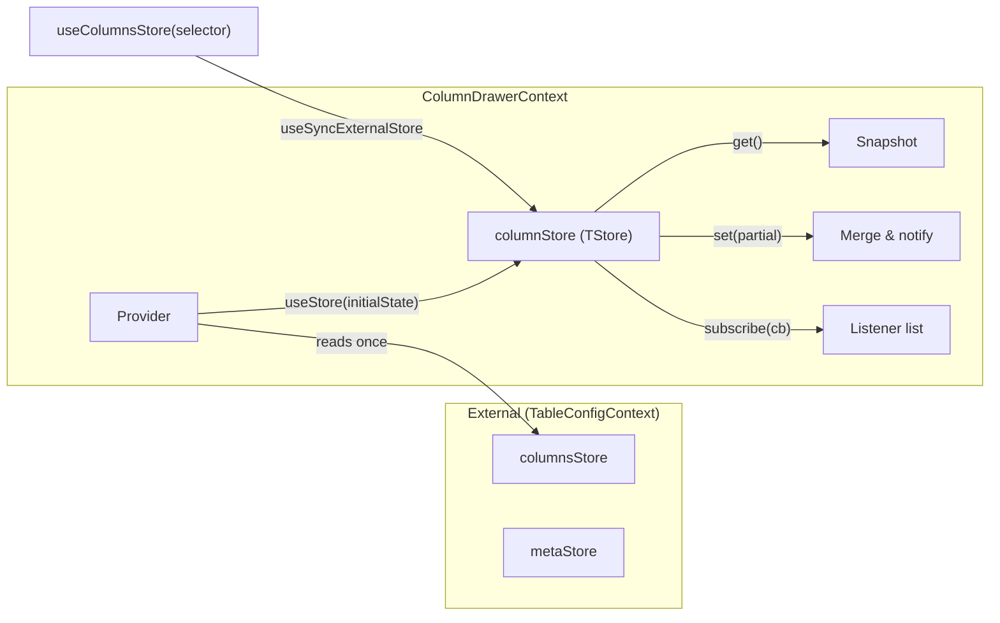
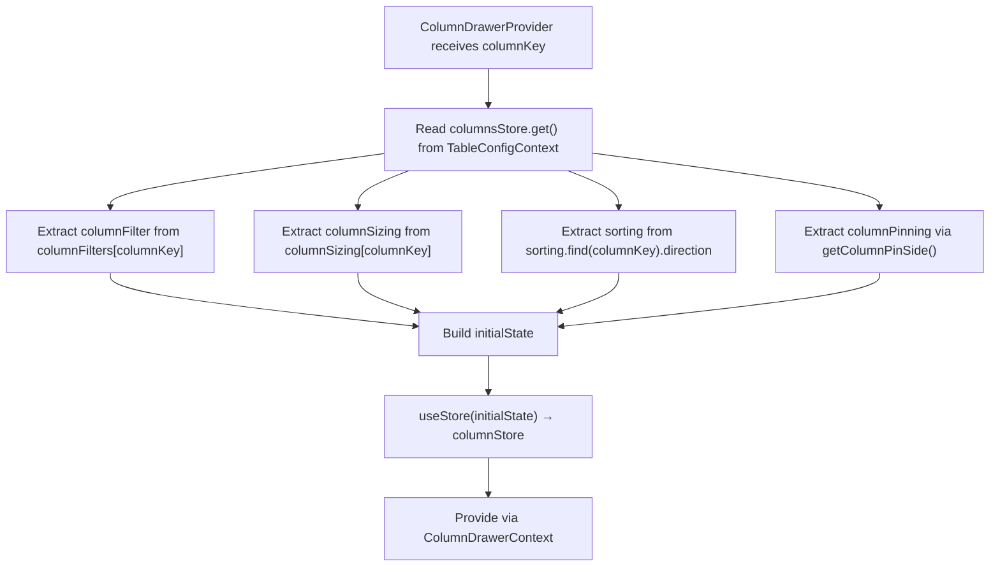

# ColumnDrawerContext Architecture

Store-based context that manages local column settings state within the drawer.
Changes are held locally until the user explicitly accepts or cancels.

## File Structure

```
ColumnDrawerContext/
├── ColumnDrawerContext.context.ts         → createContext with empty initial store
├── ColumnDrawerContext.provider.tsx        → Provider: reads table state → creates store
├── ColumnDrawerContext.types.ts            → ColumnDrawerState, ProviderProps, ContextValue
├── useColumnDrawerContextValue.hook.ts    → use(ColumnDrawerContext)
├── useColumnsStore.hook.ts                → useSyncExternalStore + selector
│
├── actions/                               → 9 hooks that write to the store
│   ├── useBatchSetColumnDrawerSettings    → Push all drawer state to table
│   ├── useClearAllColumnDrawerSettings    → Clear all fields (optionally close drawer)
│   ├── useResetAllColumnDrawerSettings    → Reset all from table (optionally close drawer)
│   ├── useResetColumnFilter               → Reset filter from table
│   ├── useResetColumnPinning              → Reset pinning from table
│   ├── useResetColumnSorting              → Reset sorting from table
│   ├── useSetColumnFilter                 → Set filter value
│   ├── useSetColumnPinning                → Set pinning side
│   ├── useSetColumnSizing                 → Set width
│   └── useSetColumnSorting                → Set sort direction
│
├── selectors/                             → 3 hooks that read from the store
│   ├── useGetColumnFilter
│   ├── useGetColumnPinning
│   └── useGetColumnSorting
│
└── utils/
  ├── closeColumnSettingsDrawer.service.ts → Close drawer + restore table settings, persist UI state (effectful service: store writes + persistence)
  ├── getInitialColumnsState.util.ts     → Build initial state shape
  └── getTableColumnDrawerState.util.ts  → Map table snapshot to drawer state for one column
```

## Store Pattern



The `useStore` hook (from `@/hooks`) creates a store with `get`, `set`, `subscribe`, and
`getServerSnapshot`. The store holds a flat object; `set()` does a shallow merge
(`{ ...prev, ...partial }`), then notifies all subscribers.

## State Shape

```typescript
ColumnDrawerState<TData> = {
  columnKey:     DataKey<TData>          // always present
  columnFilter?: ColumnFilter            // operator + value(s)
  columnSizing?: number                  // width in px
  sorting?:      SortDirection           // 'asc' | 'desc' | undefined
  columnPinning?: 'left' | 'right'      // pin side
}
```

## Provider Initialization



## Actions

Actions are hooks that return a callback. Each callback reads the store, validates
`columnKey`, and calls `columnStore.set(partial)`.

| Hook                              | Reads From             | Writes To     | Side Effect                                                                     |
| --------------------------------- | ---------------------- | ------------- | ------------------------------------------------------------------------------- |
| `useSetColumnFilter`              | —                      | `columnStore` | —                                                                               |
| `useSetColumnSizing`              | —                      | `columnStore` | —                                                                               |
| `useSetColumnSorting`             | —                      | `columnStore` | —                                                                               |
| `useSetColumnPinning`             | —                      | `columnStore` | —                                                                               |
| `useClearAllColumnDrawerSettings` | `columnStore`          | `columnStore` | Sets all to `undefined`; closes drawer if `shouldCloseDrawer`                   |
| `useResetColumnFilter`            | `columnsStore` (table) | `columnStore` | —                                                                               |
| `useResetColumnPinning`           | `columnsStore` (table) | `columnStore` | —                                                                               |
| `useResetColumnSorting`           | `columnsStore` (table) | `columnStore` | —                                                                               |
| `useResetAllColumnDrawerSettings` | `columnsStore` (table) | `columnStore` | Resets all fields; closes drawer if `shouldCloseDrawer`                         |
| `useBatchSetColumnDrawerSettings` | `columnStore`          | —             | Pushes the current drawer snapshot to the table via `useBatchSetColumnSettings` |

### Action Categories

```mermaid
graph TD
  subgraph "Set (write value directly)"
    S1["useSetColumnFilter(filter)"]
    S2["useSetColumnSizing(width)"]
    S3["useSetColumnSorting(dir)"]
    S4["useSetColumnPinning(side)"]
  end

  subgraph "Clear (set to undefined)"
    C1["useClearAllColumnDrawerSettings(shouldCloseDrawer?)"]
  end

  subgraph "Reset (read table → write store)"
    R1["useResetColumnFilter"]
    R2["useResetColumnPinning"]
    R3["useResetColumnSorting"]
    R4["useResetAllColumnDrawerSettings(shouldCloseDrawer?)"]
  end

  subgraph "Commit"
    B1["useBatchSetColumnDrawerSettings"]
  end

  S1 & S2 & S3 & S4 -->|"columnStore.set()"| DS["Drawer Store"]
  C1 -->|"columnStore.set(all undefined)"| DS
  R1 & R2 & R3 & R4 -->|"read table → columnStore.set()"| DS
  B1 -->|"read store → batchSetColumnSettings()"| TS["Table Store"]

  C1 -->|"if shouldCloseDrawer"| Meta["metaStore"]
  R4 -->|"if shouldCloseDrawer"| Meta
```



## Selectors

Selectors use `useColumnsStore(selector)` which wraps `useSyncExternalStore`.
Components only re-render when their selected slice changes.

| Hook                  | Returns                          |
| --------------------- | -------------------------------- |
| `useGetColumnFilter`  | `ColumnFilter \| undefined`      |
| `useGetColumnPinning` | `'left' \| 'right' \| undefined` |
| `useGetColumnSorting` | `SortDirection`                  |

## Consumers

| Consumer               | Uses Actions                                                     | Uses Selectors   |
| ---------------------- | ---------------------------------------------------------------- | ---------------- |
| `GeneralSection`       | setColumnSizing, clearAll, resetAll                              | —                |
| `FilterSection`        | setColumnFilter                                                  | getColumnFilter  |
| `SortingSection`       | setColumnSorting                                                 | getColumnSorting |
| `PinningSection`       | setColumnPinning                                                 | getColumnPinning |
| `FilterToolbar`        | setColumnFilter, resetColumnFilter                               | getColumnFilter  |
| `SortingToolbar`       | setColumnSorting, resetColumnSorting                             | getColumnSorting |
| `PinningToolbar`       | setColumnPinning, resetColumnPinning                             | getColumnPinning |
| `ColumnSettingsDrawer` | batchSetColumnDrawerSettings, resetAllColumnDrawerSettings(true) | —                |
