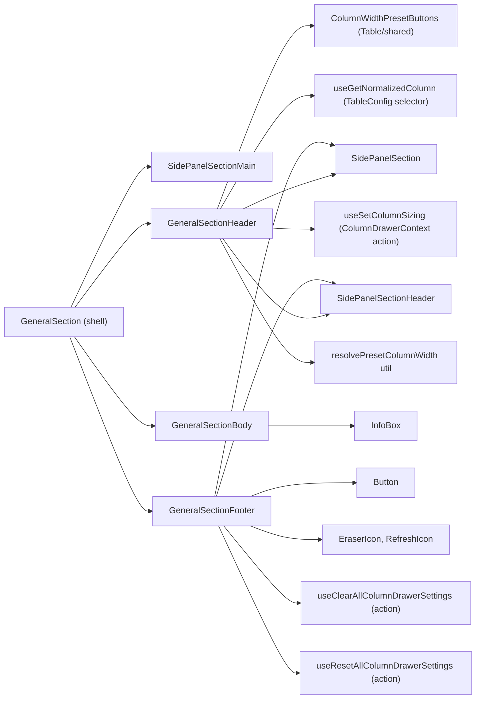
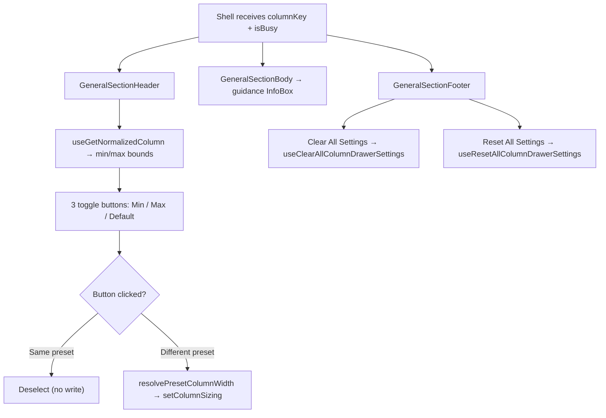

# GeneralSection Architecture

"General" tab of the column settings drawer: per-column width presets and
cross-section clear/reset controls. A thin shell (mirroring the
`TableSettingsDrawer` header/body/footer pattern) composing private delegates
that own their store wiring.

## State Ownership Rule

No store state is prop-drilled through the section shell. Each delegate reads
the selectors and dispatches the actions it needs itself; the shell only
forwards the presentation props (`columnKey`, `isBusy`).

| Delegate               | Reads (selectors)              | Dispatches (actions)                                       |
| ---------------------- | ------------------------------ | ---------------------------------------------------------- |
| `GeneralSection`       | — (pure composition)           | —                                                          |
| `GeneralSectionHeader` | normalizedColumn (TableConfig) | setColumnSizing                                            |
| `GeneralSectionBody`   | — (static guidance)            | —                                                          |
| `GeneralSectionFooter` | —                              | clearAllColumnDrawerSettings, resetAllColumnDrawerSettings |

`columnKey` is an identity prop (which column the drawer edits), not store
state — it flows from `ColumnSettingsDrawer` into the delegates that need it.

## File Structure

```
GeneralSection/
├── index.ts                              → Barrel export
├── GeneralSection.component.tsx           → Thin shell: Header + Body + Footer
├── GeneralSection.types.ts                → Section props (columnKey, isBusy?, div pass-through)
│
├── GeneralSectionHeader/                 → Width preset toggles (private delegate)
│   ├── GeneralSectionHeader.component.tsx
│   ├── GeneralSectionHeader.types.ts        → { columnKey, isBusy? }
│   ├── GeneralSectionHeader.stylex.ts
│   └── GeneralSectionHeader.test.tsx
│
├── GeneralSectionBody/                   → Preset guidance InfoBox (private delegate, no props)
│   └── GeneralSectionBody.component.tsx
│
├── GeneralSectionFooter/                 → Clear/reset-all actions (private delegate)
│   ├── GeneralSectionFooter.component.tsx
│   ├── GeneralSectionFooter.types.ts        → { isBusy? }
│   ├── GeneralSectionFooter.stylex.ts
│   └── GeneralSectionFooter.test.tsx
│
└── utils/
    ├── resolvePresetColumnWidth.util.ts   → Preset → sizing value written to the store
    └── resolvePresetColumnWidth.util.test.ts
```

The Header/Body/Footer delegates are private delegates (ADR-007): imported
via direct file paths, no `index.ts`, and no Props re-exports.

## Dependencies



## Render Flow



## Props

| Prop        | Type             | Description                                |
| ----------- | ---------------- | ------------------------------------------ |
| `columnKey` | `DataKey<TData>` | Column identifier (forwarded to Header)    |
| `isBusy`    | `boolean?`       | Disables controls while the drawer is busy |

## Local State

| Owner                  | State            | Type                                                       | Purpose                                              |
| ---------------------- | ---------------- | ---------------------------------------------------------- | ---------------------------------------------------- |
| `GeneralSectionHeader` | `selectedPreset` | `WidthPreset` (`'min' \| 'max' \| 'default' \| undefined`) | Track which width button is active (toggle behavior) |
