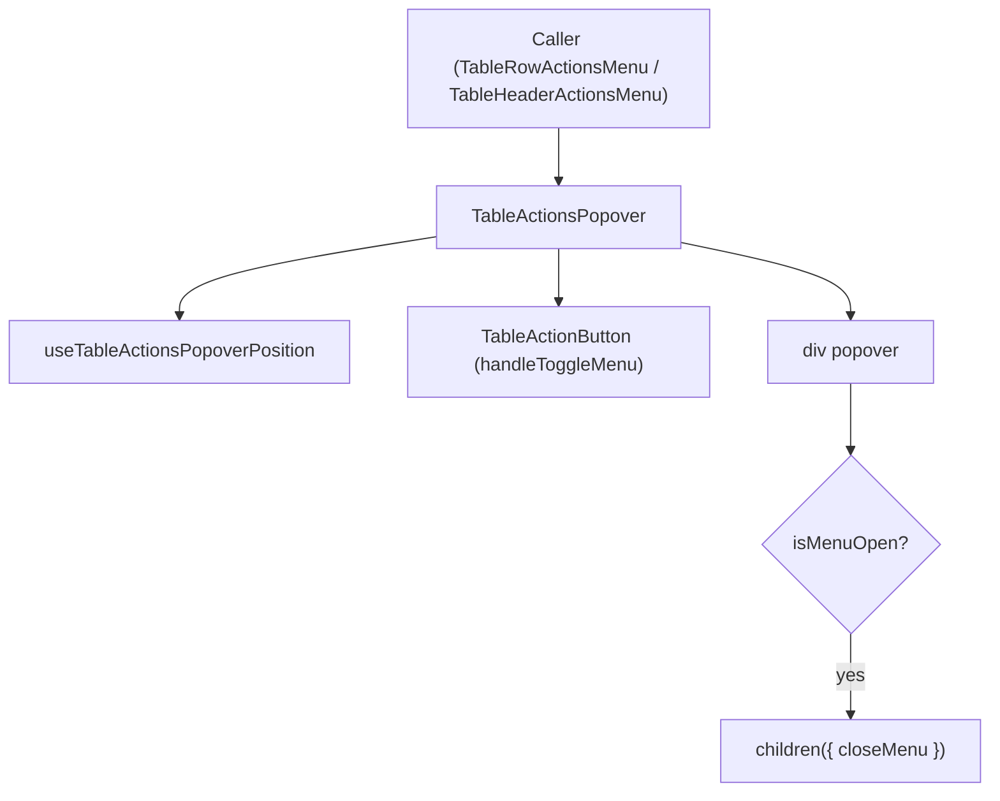

# TableActionsPopover Architecture

Shared trigger + popover shell for table "quick actions" menus. Extracted from
`TableRowActionsMenu` so both row-level actions and column-header actions
(`TableHeaderActionsMenu`) reuse the same positioning/trigger/popover-panel
mechanics instead of duplicating them.

## Responsibility

- Render the `TableActionButton` trigger (`MoreVerticalIcon`) with a
  caller-provided `ariaLabel`/`label`.
- Own popover open state and viewport-aware coordinates via the colocated
  `useTableActionsPopoverPosition` hook (RAF-stabilized after opening,
  ResizeObserver/IntersectionObserver-driven while open).
- Render `children` — a render-prop `({ closeMenu }) => ReactNode` — only
  while the popover is open, so callers can close the menu after firing an
  action (e.g. after a row delete or a header sort/pin/hide action).
- Stay content-agnostic: it knows nothing about CRUD, sorting, or pinning —
  callers compose their own menu-item list as `children`.
- The trigger wrapper defaults to `width: 100%` (fills a dedicated actions-column
  cell, as `TableRowActionsMenu` needs). Callers that render the trigger
  alongside sibling content in a flex row — like `TableHeaderActionsMenu` next
  to the column label — must pass `customStylex` to opt out of the stretch
  (e.g. `width: 'auto'`, `flexShrink: 0`, `marginLeft: 'auto'` to pin it to the
  end of the row instead of overlapping/squeezing the label).

## File Structure

```text
TableActionsPopover/
├── TableActionsPopover.component.tsx      → Trigger + popover panel + render-prop children
├── TableActionsPopover.types.ts           → Props, BoundsRect, MenuPosition, render-prop context type
├── TableActionsPopover.constants.ts       → MENU_* layout constants (gap, nudge, frames, padding)
├── TableActionsPopover.stylex.ts          → trigger/menu/menuItem/menuIcon/menuActions/menuSectionDivider styles (shared)
├── useTableActionsPopoverPosition.hook.ts → State + observers + environment reads (trigger lookup,
│                                            viewport size) injected into the handler-core utils
├── utils/
│   ├── applyRepositionOutcome.util.ts               → Applies a resolveOpenMenuReposition outcome to
│   │                                                  injected close/setPosition callbacks; returns
│   │                                                  whether the menu repositioned (still open)
│   ├── computeMenuPosition.util.ts                  → Measures trigger/cell/menu, delegates to
│   │                                                  getTableActionsPopoverPosition (argument reads only)
│   ├── createViewportRect.util.ts                   → Pure: window dimensions → whole-viewport BoundsRect
│   │                                                  (fallback container bounds, built at reposition time)
│   ├── getIsPopoverOpen.util.ts                     → `:popover-open` check, single-sources the selector
│   ├── getTableActionsPopoverPosition.util.ts       → Pure coordinate computation (no side effects)
│   ├── handlePopoverToggle.util.ts                  → Popover `toggle` event core: syncs open state with
│   │                                                  the Popover API, clears coordinates on close
│   ├── handleToggleMenu.util.ts                     → Trigger-click core: close-if-open, else open via
│   │                                                  Popover API + RAF stabilization loop (environment
│   │                                                  reads injected by the hook)
│   ├── resolveOpenMenuReposition.util.ts            → keep/close/reposition decision core shared by the
│   │                                                  observer and RAF-stabilization paths (argument reads
│   │                                                  only; container rect read lazily on reposition)
│   └── *.util.test.ts                               → Unit coverage per util
├── ARCHITECTURE.md                        → This file
└── index.ts                               → Barrel export
```

## Consumers

- `TableRowActionsMenu` — CRUD view/edit/delete menu for a table row, composes
  `TableActionMenu` as `children`.
- `TableHeaderCell/TableHeaderActionsMenu` — sort/pin/hide/manage menu for a
  column header.

## Render Flow


