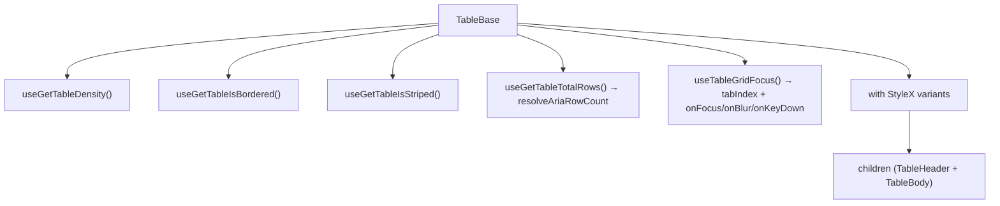

# TableBase Architecture

The grid element. A wrapper around the native `<table>` that applies density,
border and stripe styles from `TableConfigContext` meta state, declares the
grid's ARIA semantics, and carries the grid's keyboard surface.

## Grid semantics are declared, not inherited

`role="grid"` here is an **upgrade**, and it is the one element in the grid for
which that is true: `TableBase.stylex.ts` keeps `display: table`, so the
`<table>` retains its implicit `table` role and the attribute refines it to the
interactive subclass. Everything below it is a different case — `TableBody`,
`TableRow`, `TableHeaderCell` and `TableBodyCell` each set a `display` override
in their **own** stylesheet that _removes_ the implicit role, so their
attributes are its only source
([ADR-062](../../../../../../docs/decisions/ADR-062-grid-semantics-roving-focus-and-row-identity.md)).
Those four are independent of one another: restoring a native `display` value in
one of those stylesheets discharges only that element's role, never a
neighbour's — and whichever one it is, the role must go in the same change, or
the grid ends up with duplicated semantics.

`aria-rowcount` is the whole dataset plus its header row (`resolveAriaRowCount`),
never `totalLoadedRows`: a count taken from what has been fetched grows with
every page and describes the fetch rather than the data. It shares one base with
every row's `aria-rowindex`, so the last body row's index equals this count —
the invariant `resolveGridRowIndexing.util.test.ts` pins.

## Keyboard surface

`useTableGridFocus` supplies the container's `tabIndex` plus its focus, blur and
keydown handlers. The container carries `tabIndex={0}` whenever no rendered cell
does, which is what keeps the grid exactly one stop in the page's tab order even
while the focused row sits outside the virtualization window. See
[contexts/TableFocus/ARCHITECTURE.md](../contexts/TableFocus/ARCHITECTURE.md).

## File Structure

```
TableBase/
├── TableBase.component.tsx   → <table> with density/border/stripe StyleX
├── TableBase.test.tsx        → Unit tests for selector-driven attributes and native props
├── TableBase.types.ts        → TableBaseProps extends <table> + customStylex
├── TableBase.stylex.ts       → Base, density (compact/comfortable), borderless
└── index.ts                  → Barrel export
```

Its ARIA row-index arithmetic is shared with `TableHeader` and `TableBodyRows`,
so it lives in `Table/utils/resolveGridRowIndexing.util.ts` rather than here —
the count and the indices are only meaningful against one another.

## Context Dependencies

Reads from `TableConfigContext` meta selectors:

| Selector                | Controls                         |
| ----------------------- | -------------------------------- |
| `useGetTableDensity`    | Compact vs comfortable spacing   |
| `useGetTableIsBordered` | Show/hide cell borders           |
| `useGetTableIsStriped`  | `data-striped` attribute         |
| `useGetTableTotalRows`  | `aria-rowcount` over the dataset |

## Render


