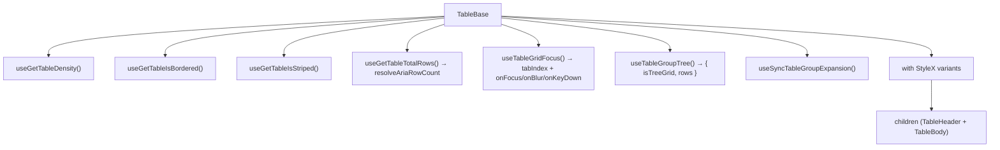

# TableBase Architecture

The grid element. A wrapper around the native `<table>` that applies density,
border and stripe styles from `TableConfigContext` meta state, declares the
grid's ARIA semantics, and carries the grid's keyboard surface.

## Grid semantics are declared, not inherited

`role="grid"` here is an **upgrade**, and it is the one element in the grid for
which that is true: `TableBase.stylex.ts` keeps `display: table`, so the
`<table>` retains its implicit `table` role and the attribute refines it to the
interactive subclass. Everything below it is a different case — `TableBody`,
`TableRow`, `TableHeaderCell` and `TableBodyCell` each set a `display` override
in their **own** stylesheet that _removes_ the implicit role, so their
attributes are its only source
([ADR-062](../../../../../../docs/decisions/ADR-062-grid-semantics-roving-focus-and-row-identity.md)).
Those four are independent of one another: restoring a native `display` value in
one of those stylesheets discharges only that element's role, never a
neighbour's — and whichever one it is, the role must go in the same change, or
the grid ends up with duplicated semantics.

`aria-rowcount` is the whole dataset plus its header row (`resolveAriaRowCount`),
never `totalLoadedRows`: a count taken from what has been fetched grows with
every page and describes the fetch rather than the data. It shares one base with
every row's `aria-rowindex`, so the last body row's index equals this count —
the invariant `resolveGridRowIndexing.util.test.ts` pins.

## A tree changes both the role and what a row is

The element declares `role="treegrid"` when the loaded rows contain a group row
and `role="grid"` otherwise — asked of the **rows**, the same question
`TableBodyRows` asks to decide which component a row gets, so a grouped read that
returned no groups is not announced as a tree with nothing in it
([ADR-067](../../../../../../docs/decisions/ADR-067-expansion-is-the-collapsed-set-and-a-group-row-is-a-tree-node.md)).

The row count moves with the role. Under a tree the dataset **is** the rows a
collapse leaves standing — a hidden row is not a row of the grid — so
`aria-rowcount` counts those, and the invariant above still holds because the
body's indices come off the same array. Counting the dataset instead would
advertise a total no `aria-rowindex` could ever reach.

`useSyncTableGroupExpansion` is mounted here too: the grid is where the tree's
state belongs, and it is the one element rendered in every table.

**Zero rows is a count, not a missing one.** `-1` — ARIA's "unknown" — is
reported only while `isLoading`, because that is the state in which the total
genuinely is not known yet. A filter matching nothing is an ordinary outcome
with a known answer: one row, the header. Reporting it as unknown would tell a
screen-reader user the table's size is unknowable at the moment it is most
definitely known.

Both attributes are applied **after** `{...rest}`, so a caller cannot replace
them; `TableBase.test.tsx` asserts that a conflicting `role`/`aria-rowcount`
loses.

## Keyboard surface

`useTableGridFocus` supplies the container's `tabIndex` plus its focus, blur and
keydown handlers. The container carries `tabIndex={0}` whenever no rendered cell
does, which is what keeps the grid exactly one stop in the page's tab order even
while the focused row sits outside the virtualization window. See
[contexts/TableFocus/ARCHITECTURE.md](../contexts/TableFocus/ARCHITECTURE.md).

## File Structure

```
TableBase/
├── TableBase.component.tsx   → <table> with density/border/stripe StyleX
├── TableBase.test.tsx        → Unit tests for selector-driven attributes and native props
├── TableBase.types.ts        → TableBaseProps extends <table> + customStylex
├── TableBase.stylex.ts       → Base, density (compact/comfortable), borderless
└── index.ts                  → Barrel export
```

Its ARIA row-index arithmetic is shared with `TableHeader` and `TableBodyRows`,
so it lives in `Table/utils/resolveGridRowIndexing.util.ts` rather than here —
the count and the indices are only meaningful against one another.

## Context Dependencies

Reads from `TableConfigContext` meta selectors:

| Selector                | Controls                                                       |
| ----------------------- | -------------------------------------------------------------- |
| `useGetTableDensity`    | Compact vs comfortable spacing                                 |
| `useGetTableIsBordered` | Show/hide cell borders                                         |
| `useGetTableIsStriped`  | `data-striped` attribute                                       |
| `useGetTableTotalRows`  | `aria-rowcount` over the dataset (outside a tree)              |
| `useTableGroupTree`     | `role`, and `aria-rowcount` over the visible rows under a tree |

## Render


