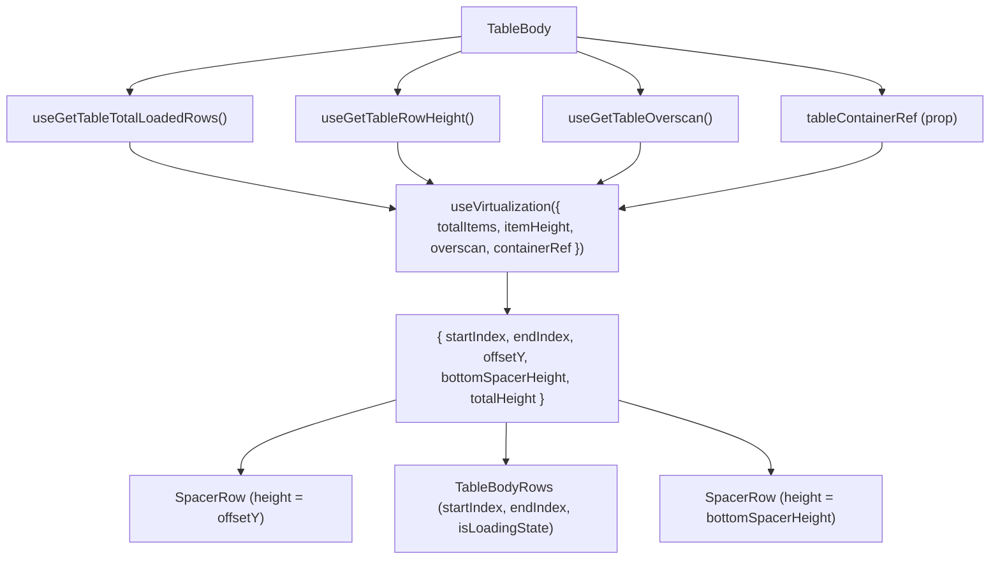

# TableBody Architecture

Virtualised `<tbody>` that renders only the visible row window using
`useVirtualization`. The body uses **SpacerRow** components above and below
the visible rows to maintain correct scroll height in normal document flow.
Row rendering is delegated to `TableBodyRows`, which owns the
`visibleRows.map()` loop and cell creation.

## Design Decision — SpacerRow vs Absolute Positioning

An earlier implementation used `position: absolute` + `transform: translateY()`
per row in a grid-layout `<tbody>`. This caused **visible black gaps during
fast scrolling** because row position updates lagged behind scroll events.

The current SpacerRow approach places rows in normal document flow with
invisible spacer `<tr>` elements above (for `offsetY`) and below (for
`bottomSpacerHeight`). The browser layout engine keeps content contiguous,
eliminating visual gaps regardless of scroll speed.

## Design Decision — Delegation to TableBodyRows

`TableBody` previously subscribed to the full `data` array via
`useGetTableData()` to pass `data.length` to `useVirtualization` and to
slice visible rows. This caused `TableBody` to re-render on every data
change (fetch, load-more).

Now `TableBody` reads only a **count** for virtualisation and delegates row
rendering to `TableBodyRows` via props `{ startIndex, endIndex, isLoadingState }`.
Data-dependent re-renders are scoped to `TableBodyRows`.

The count is the rows a collapse leaves standing (`useTableGroupTree().rows.length`),
not `totalLoadedRows`: `<tbody>`'s declared height and both spacers are derived
from it, so counting rows hidden under a collapsed ancestor would leave the body
taller than its contents by exactly that subtree
([ADR-067](../../../../../../docs/decisions/ADR-067-expansion-is-the-collapsed-set-and-a-group-row-is-a-tree-node.md)).
`useGetTableTotalLoadedRows` still decides the **empty** branch — a fully
collapsed tree is not an empty table, it is a table showing only its group
rows.

## The populated body declares role="rowgroup"; the empty one does not

`styles.body` sets `display: grid`, and a browser drops an element's implicit
table role along with its table `display` — so the populated `<tbody>` loses its
`rowgroup` role and has to declare one. A grid's rows must be owned by a
rowgroup; without it the accessibility tree reads `grid > generic > row`
([ADR-062](../../../../../../docs/decisions/ADR-062-grid-semantics-roving-focus-and-row-identity.md)).

`styles.bodyEmpty` keeps `display: table-row-group`, so the empty branch's
implicit role survives and declaring one there would be the redundancy the
populated branch only resembles. The asymmetry is deliberate and both halves are
pinned in `TableBody.test.tsx`.

Those tests assert the `role` **attribute**, never `getByRole('rowgroup')`.
Testing Library resolves implicit roles, so a role query returns the same
element with the attribute deleted and could not fail for the reason it reports;
the implicit role it is resolving is precisely the one the `display` override
destroys in a real browser.

### Rejected: `role="presentation"` on the body

ARIA would accept it. A grid's required owned elements are `row`, **or** `row`
via `rowgroup` — so making the `<tbody>` transparent re-parents the rows onto the
grid and satisfies row ownership by a second, equally valid route. It also
happens to trip neither of the linters that object to `rowgroup`.

It is rejected because it is not true. A `<tbody>` in a data grid _is_ a row
group, and `<thead>` still has its implicit one — `TableHeader.stylex.ts` sets no
`display`, so nothing took it away. Declaring only the body presentational would
describe this table as one group of header rows plus a set of unowned body rows:
a worse account of the structure than either consistent choice, adopted for no
reason but linter silence. The role stays `rowgroup`, and the linters are
answered where linters are answered.

## Design Decision — Empty State

When `totalLoadedRows === 0` **and** the table is not loading
(`!isLoading && !isLoadingMore`), `TableBody` renders a single
`TableEmptyState` row inside a non-grid `tbody` (`styles.bodyEmpty` uses
`display: table-row-group` so the empty cell can size naturally and its sticky
content can center). During loading with zero rows the skeleton path still
renders — the empty state never flashes before data resolves. `TableBody`
passes the empty state no props: `TableEmptyState` reads its own title from
`useGetTableTitleSingular` and holds a fixed default message.

## File Structure

```
TableBody/
├── TableBody.component.tsx   → <tbody> with SpacerRow-based row virtualisation (+ empty-state branch)
├── TableBody.test.tsx        → Unit tests for virtualisation window, cell rendering, spacers, empty state
├── TableBody.types.ts        → TableBodyProps (tableContainerRef)
├── TableBody.stylex.ts       → body(height) grid style + bodyEmpty (table-row-group) for the empty state
├── index.ts                  → Barrel export
│
└── utils/
  ├── ARCHITECTURE.md                 → TableBody utility architecture
  ├── buildTableBodyCellDescriptor.util.tsx → Derives pure cell descriptor data (with isLoadingState)
  ├── createRenderTableBodyCell.util.ts    → Creates stable cell renderer bound to sizing/offsets/loading
  ├── generatePlaceholderData.util.ts → Creates skeleton row objects
  ├── renderTableBodyPinnedGroup.util.ts → Maps one pinning partition to rendered cells
  └── index.ts                        → Utility barrel exports
```

## Context Dependencies

| Selector                     | Purpose                                   |
| ---------------------------- | ----------------------------------------- |
| `useGetTableRowHeight`       | Row height for row virtualisation         |
| `useGetTableOverscan`        | Extra rows above/below viewport           |
| `useGetTableTotalLoadedRows` | Row count for virtualisation `totalItems` |
| `useGetTableIsLoading`       | Initial loading state                     |
| `useGetTableIsLoadingMore`   | Pagination loading state                  |

## Row Virtualisation Flow



## Render Structure

```
<tbody>
  ├── SpacerRow (offsetY > 0)          ← top padding
  ├── <TableBodyRows>                  ← row rendering delegate
  │   ├── TableRow[startIndex]         ← normal document flow
  │   ├── TableRow[startIndex + 1]
  │   ├── ...
  │   └── TableRow[endIndex - 1]
  └── SpacerRow (bottomSpacerHeight > 0) ← bottom padding
</tbody>
```

## Column Rendering Flow

Column rendering is now owned by `TableBodyRows`. See
`TableBodyRows/ARCHITECTURE.md` for the column rendering flow diagram.

The pinned column partition and pinned offsets are derived state stored in `columnsStore`.
They are recomputed by store actions whenever `effectiveColumns`,
`columnPinning`, or `columnSizing` change, so `TableBodyRows` reads them
directly without any per-render calculation.

## Per-Row Cell Order

```
[leftPinnedCells] | [centerCells] | [rightPinnedCells]
```

## Cell Rendering

Cell rendering is delegated to `TableBodyRows` using the
`createRenderTableBodyCell` and `renderTableBodyPinnedGroup` utilities:

- **Custom render**: If `column.render` is defined, passes children to `<TableBodyCell>`
- **Default render**: Passes `value`, `dataType`, `format`, `label` as props
- **CRUD actions render**: For the `actions` column with `crud` enabled,
  wraps row actions in `TableRowActionsMenu` and appends any custom action
  content from `column.render` after built-in CRUD menu items
- Each cell receives `pinInfo` from the store's `pinnedColumnOffsets` slice
- Width is resolved from `columnSizing[col.key]` or `col.minWidth`
- `isLoadingState` is forwarded through the cell descriptor to each `<TableBodyCell>`
- **SpacerRow** computes its own `colSpan` from `useGetPinnedColumnPartition()`

## `dataType` travels on both descriptor branches, and it is not the discriminator

`kind` tells the two branches apart. `dataType` is on both, answering a different
question on each: on `default` it says how to **format** the value, and on
`custom` the content is already rendered, so it says only how the cell
**aligns**.

That second job used to be inferred from `children !== undefined`, and the
inference was wrong for half the cases. Every group-row cell comes back from
`resolveStructuralCellChildren` — an aggregate, a group key, an em dash, a
detail row's blanked key column — so every one of them took the branch written
for a consumer's own `render()` output and skipped alignment outright. A currency
total sat at the left edge of a column whose detail rows were all flush right
(#1018).

So the flag `TableBodyCell` acts on is now `isAlignedByDataType`, and the
descriptor decides it by **stating the column's type or withholding it**:

| Branch                                    | `dataType`     | Cell aligns by |
| ----------------------------------------- | -------------- | -------------- |
| Grid-supplied structural content          | `col.dataType` | the column     |
| The `actions` column                      | `undefined`    | nothing        |
| A consumer's `render()` output            | `undefined`    | nothing        |
| An ordinary data cell (`kind: 'default'`) | `col.dataType` | the column     |

`TableBodyCellCustomFields` declares `dataType` **required** for the same reason
`hasStructuralMarker` is required: an optional field lets a new branch forget it
and inherit the wrong default silently, which is the shape of the defect above.

A cell's alignment class reaches a **flex child that fills it** only if that
child asks — `TableGroupAggregate` and `TableGroupKeyCell` are `width: 100%`, so
both set `justifyContent: 'inherit'` rather than a value of their own. Hardcoding
`flex-end` in either would move the type decision into a component that does not
own the column, and would align the measures while leaving the em dash and the
blanked cells behind.
