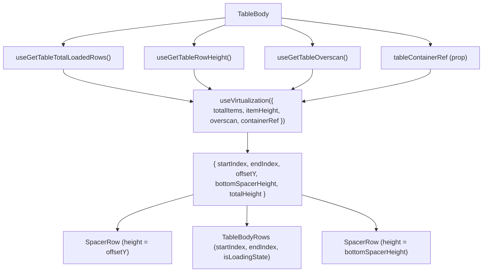

# TableBody Architecture

Virtualised `<tbody>` that renders only the visible row window using
`useVirtualization`. The body uses **SpacerRow** components above and below
the visible rows to maintain correct scroll height in normal document flow.
Row rendering is delegated to `TableBodyRows`, which owns the
`visibleRows.map()` loop and cell creation.

## Design Decision — SpacerRow vs Absolute Positioning

An earlier implementation used `position: absolute` + `transform: translateY()`
per row in a grid-layout `<tbody>`. This caused **visible black gaps during
fast scrolling** because row position updates lagged behind scroll events.

The current SpacerRow approach places rows in normal document flow with
invisible spacer `<tr>` elements above (for `offsetY`) and below (for
`bottomSpacerHeight`). The browser layout engine keeps content contiguous,
eliminating visual gaps regardless of scroll speed.

## Design Decision — Delegation to TableBodyRows

`TableBody` previously subscribed to the full `data` array via
`useGetTableData()` to pass `data.length` to `useVirtualization` and to
slice visible rows. This caused `TableBody` to re-render on every data
change (fetch, load-more).

Now `TableBody` subscribes only to `useGetTableTotalLoadedRows()` (a number)
for virtualisation, and delegates row rendering to `TableBodyRows` via props
`{ startIndex, endIndex, isLoadingState }`. Data-dependent re-renders are
scoped to `TableBodyRows`.

## Design Decision — Empty State

When `totalLoadedRows === 0` **and** the table is not loading
(`!isLoading && !isLoadingMore`), `TableBody` renders a single
`TableEmptyState` row inside a non-grid `tbody` (`styles.bodyEmpty` uses
`display: table-row-group` so the empty cell can size naturally and its sticky
content can center). During loading with zero rows the skeleton path still
renders — the empty state never flashes before data resolves. `TableBody`
passes the empty state no props: `TableEmptyState` reads its own title from
`useGetTableTitleSingular` and holds a fixed default message.

## File Structure

```
TableBody/
├── TableBody.component.tsx   → <tbody> with SpacerRow-based row virtualisation (+ empty-state branch)
├── TableBody.test.tsx        → Unit tests for virtualisation window, cell rendering, spacers, empty state
├── TableBody.types.ts        → TableBodyProps (tableContainerRef)
├── TableBody.stylex.ts       → body(height) grid style + bodyEmpty (table-row-group) for the empty state
├── index.ts                  → Barrel export
│
└── utils/
  ├── ARCHITECTURE.md                 → TableBody utility architecture
  ├── buildTableBodyCellDescriptor.util.tsx → Derives pure cell descriptor data (with isLoadingState)
  ├── createRenderTableBodyCell.util.ts    → Creates stable cell renderer bound to sizing/offsets/loading
  ├── generatePlaceholderData.util.ts → Creates skeleton row objects
  ├── renderTableBodyPinnedGroup.util.ts → Maps one pinning partition to rendered cells
  └── index.ts                        → Utility barrel exports
```

## Context Dependencies

| Selector                     | Purpose                                   |
| ---------------------------- | ----------------------------------------- |
| `useGetTableRowHeight`       | Row height for row virtualisation         |
| `useGetTableOverscan`        | Extra rows above/below viewport           |
| `useGetTableTotalLoadedRows` | Row count for virtualisation `totalItems` |
| `useGetTableIsLoading`       | Initial loading state                     |
| `useGetTableIsLoadingMore`   | Pagination loading state                  |

## Row Virtualisation Flow



## Render Structure

```
<tbody>
  ├── SpacerRow (offsetY > 0)          ← top padding
  ├── <TableBodyRows>                  ← row rendering delegate
  │   ├── TableRow[startIndex]         ← normal document flow
  │   ├── TableRow[startIndex + 1]
  │   ├── ...
  │   └── TableRow[endIndex - 1]
  └── SpacerRow (bottomSpacerHeight > 0) ← bottom padding
</tbody>
```

## Column Rendering Flow

Column rendering is now owned by `TableBodyRows`. See
`TableBodyRows/ARCHITECTURE.md` for the column rendering flow diagram.

The pinned column partition and pinned offsets are derived state stored in `columnsStore`.
They are recomputed by store actions whenever `effectiveColumns`,
`columnPinning`, or `columnSizing` change, so `TableBodyRows` reads them
directly without any per-render calculation.

## Per-Row Cell Order

```
[leftPinnedCells] | [centerCells] | [rightPinnedCells]
```

## Cell Rendering

Cell rendering is delegated to `TableBodyRows` using the
`createRenderTableBodyCell` and `renderTableBodyPinnedGroup` utilities:

- **Custom render**: If `column.render` is defined, passes children to `<TableBodyCell>`
- **Default render**: Passes `value`, `dataType`, `format`, `label` as props
- **CRUD actions render**: For the `actions` column with `crud` enabled,
  wraps row actions in `TableRowActionsMenu` and appends any custom action
  content from `column.render` after built-in CRUD menu items
- Each cell receives `pinInfo` from the store's `pinnedColumnOffsets` slice
- Width is resolved from `columnSizing[col.key]` or `col.minWidth`
- `isLoadingState` is forwarded through the cell descriptor to each `<TableBodyCell>`
- **SpacerRow** computes its own `colSpan` from `useGetPinnedColumnPartition()`
