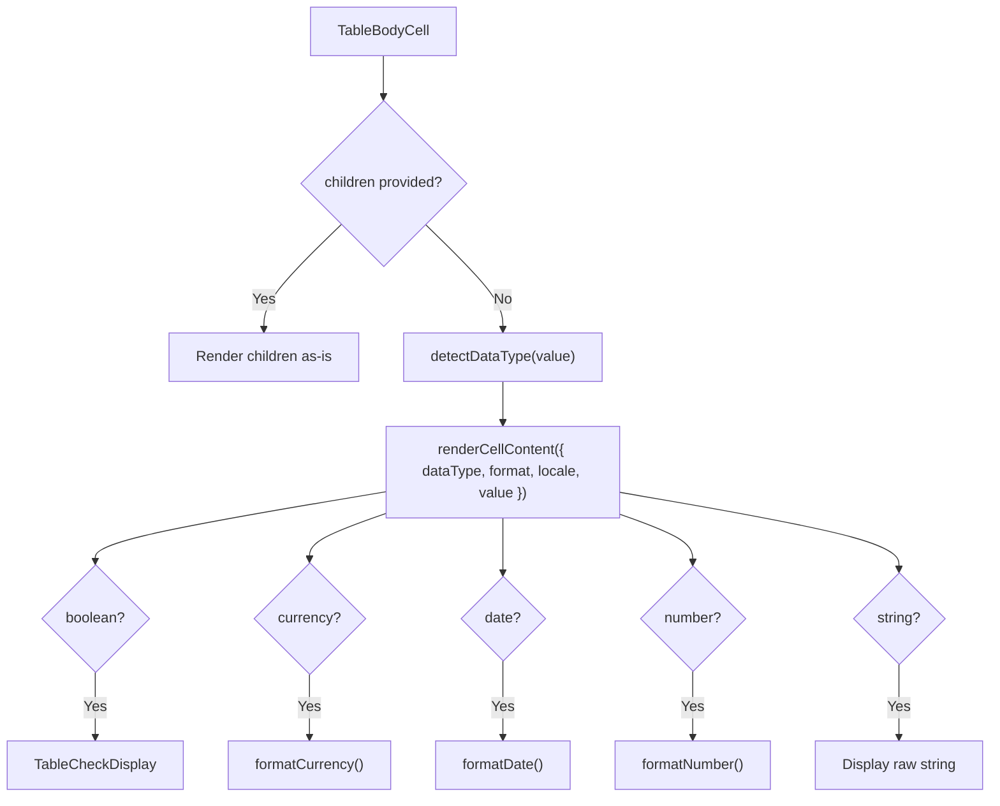

# TableBodyCell Architecture

One `gridcell`: a `<td>` that auto-detects the data type and renders formatted
content, with support for pinning, loading overlays and custom render functions,
and that carries the grid's roving tab stop when it is the focus target.

## Grid semantics and focus

`role='gridcell'` is declared, not inherited — `getCellStyleProps` gives every
cell `display: flex`, and a browser drops an element's implicit table role along
with its table `display`
([ADR-062](../../../../../../docs/decisions/ADR-062-grid-semantics-roving-focus-and-row-identity.md)).

`useTableCellFocus` supplies the cell's `tabIndex`, its `onFocus` and the ref the
grid focuses through. `tabIndex` is `0` on exactly one cell and `-1` on every
other. The ref matters because a focus request outlives the node it names: a
focused row that scrolls out of the virtualization window is unmounted, and the
request is applied on whichever render first has a node for it — including the
cell's very first one, which is how focus survives a trip out of the window and
back.

`columnKey`, `rowIndex` and `rowKey` are the cell's address in that model and
are required for the same reason: a cell that could not name its own position
could not be the target of one. They arrive through the descriptor pipeline
(`buildTableBodyCellDescriptor` → `renderFromDescriptor`), so a gap in the
wiring is a type error rather than a silently unfocusable column.

## File Structure

```
TableBodyCell/
├── TableBodyCell.component.tsx   → <td> with auto-format + pinning + shimmer
├── TableBodyCell.types.ts        → TableBodyCellProps (value, pinInfo, format, ...)
├── TableBodyCell.stylex.ts       → Alignment, pinning offsets, shimmer overlay
├── index.ts                      → Barrel export
│
└── utils/
    ├── detectDataType.util.ts     → Infer type from value (boolean/number/currency/date/string)
    ├── renderCellContent.util.tsx  → Format + render based on data type
    └── index.ts
```

## Props

| Prop        | Type                   | Description                               |
| ----------- | ---------------------- | ----------------------------------------- |
| `columnKey` | `string`               | The cell's column — half its grid address |
| `rowIndex`  | `number`               | Absolute index of the row in the dataset  |
| `rowKey`    | `string`               | Data-derived identity of the row          |
| `value`     | `unknown`              | Cell data value                           |
| `dataType`  | `TableColumnDataType?` | Override auto-detected type               |
| `format`    | `TableColumnFormat?`   | Formatting options (currency/date/number) |
| `label`     | `string?`              | Column label for accessibility            |
| `pinInfo`   | `PinnedColumnInfo?`    | Pin side, offset, shadow flags            |
| `minWidth`  | `number?`              | Minimum cell width                        |
| `width`     | `number?`              | Current cell width, in pixels             |
| `children`  | `ReactNode?`           | Custom content (overrides default)        |
| `locale`    | `string?`              | Locale for formatting                     |

## Rendering Pipeline



## Auto-Detection Rules (`detectDataType`)

| Value Pattern        | Detected Type |
| -------------------- | ------------- |
| `typeof boolean`     | `boolean`     |
| `typeof number`      | `number`      |
| Starts with `$€£¥₹`  | `currency`    |
| Matches `YYYY-MM-DD` | `date`        |
| Everything else      | `string`      |

## Blank Values

A blank value renders as an empty cell for **every** data type — `number` and `currency` included. `renderCellContent` treats an empty/whitespace-only string as absent rather than parsing it, because `Number('')` is `0` (not `NaN`) and would otherwise format as `0` / `$ 0.00`. This keeps the skeleton loading state consistent, since `generatePlaceholderData` fills every column with `''` regardless of type. A real `0` still formats normally.

## Alignment

- **Right-aligned**: number, currency
- **Centered**: boolean, date
- **Left-aligned** (default): string, custom content

## Loading State

Body cells receive `isLoadingState` from `TableBody` and render their local
shimmer overlay without subscribing to loading state individually.
