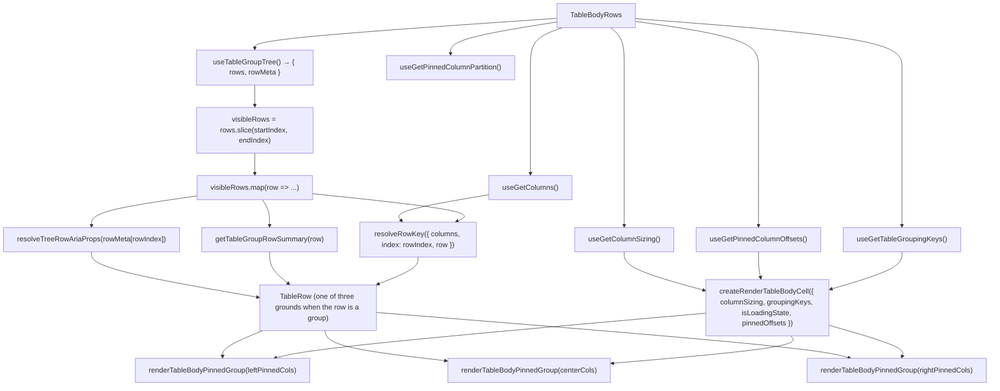

# TableBodyRows Architecture

Row-rendering delegate for `TableBody`. Owns the `visibleRows.map()` loop
and cell creation, isolating data-dependent re-renders from the
virtualisation layout in `TableBody`.

The rows it loops over are the ones a collapse leaves standing, and `rowIndex`
counts those — the same index space the focus store, `aria-rowindex` and the
`<tbody>` height all use, because all four come off the one array
`useTableGroupTree` returns (ADR-067).

**One rendering path, whatever a row is**
([ADR-065](../../../../../../docs/decisions/ADR-065-grouped-rows-render-a-hierarchy-column.md)).
A row carrying a group summary and a detail row produce the same `TableRow` over
the same columns in the same order; only what each cell holds differs, and that
is `buildTableBodyCellDescriptor`'s decision. The spanning banner a group row
used to be, and the branch that chose it, are both gone.

What a row _is_ is still asked of the **row**, not of the grouping
configuration, so a group row and a detail row can arrive in the same result.
The configuration is consulted for one thing only: which data columns a _detail_
row blanks, because its group row already states them.

## File Structure

```
TableBodyRows/
├── TableBodyRows.component.tsx   → Visible-row loop: one TableRow per row, cells per pinning partition
├── TableBodyRows.stylex.ts       → The three group-row grounds (group, subtotal, grand total)
├── TableBodyRows.types.ts        → TableBodyRowsProps (startIndex, endIndex, isLoadingState)
├── utils/
│   ├── resolveGroupRowStyle.util.ts → Which of the three grounds a row paints on, or none for a detail row
│   ├── resolveRowKey.util.ts     → Row identity key from a group summary, else from the primary-key column(s)
│   └── resolveTreeRowAriaProps.util.ts → One row's aria-level / posinset / setsize / expanded, or nothing outside a tree
├── ARCHITECTURE.md               → This file
└── index.ts                      → Barrel export
```

## Props

| Prop             | Type      | Description                                     |
| ---------------- | --------- | ----------------------------------------------- |
| `endIndex`       | `number`  | Exclusive end index of the visible row window   |
| `isLoadingState` | `boolean` | Whether data is loading (initial or load-more)  |
| `startIndex`     | `number`  | Inclusive start index of the visible row window |

## Context Dependencies

| Selector                      | Purpose                                                                                               |
| ----------------------------- | ----------------------------------------------------------------------------------------------------- |
| `useTableGroupTree`           | The rows a collapse leaves standing, plus each one's place in the tree — sliced to the visible window |
| `useGetColumns`               | Declared columns — the primary-key source for keys                                                    |
| `useGetPinnedColumnPartition` | Pre-split left/center/right pinning partition                                                         |
| `useGetColumnSizing`          | Column widths for cell rendering                                                                      |
| `useGetPinnedColumnOffsets`   | Pre-computed sticky offsets for pinned columns                                                        |
| `useGetTableGroupingKeys`     | Which data columns a detail row blanks (ADR-065)                                                      |

`useGetColumns` is read instead of re-assembling the pinning partition: the
partition carries only the visible columns in display order, so a hidden or
reordered primary key would silently change a row's identity.

## Render Flow



## Grouped Rows

A grouped read returns one row per group, each carrying a `TableGroupRowSummary`
under `TABLE_GROUP_ROW_FIELD` ([ADR-061](../../../../../../docs/decisions/ADR-061-grouping-config-in-url-expansion-in-store.md)).
`getTableGroupRowSummary` validates the whole summary or answers `undefined`, so
a half-written one renders as a data row rather than putting `undefined` on
screen.

**One visible row still produces exactly one `<tr>`.** `TableBody` sizes
`<tbody>` from a visible-row count times `rowHeight` and derives both spacers
from that same number — which count is `TableBody`'s to state, not this file's —
so emitting a header _plus_ a detail row per entry would desynchronize the body
from its contents. Every row goes through `TableRow`, which is where `rowHeight`
is read, so a group row paints at the same height as every other row by
construction rather than by a matching literal — and the hierarchy label stays
on **one line** for the same reason: `TableRow` clamps `minHeight`/`maxHeight`
alongside `height`, so a wrapped label is not a taller row, it is a clipped one.

**A group row's cells are ordinary cells**, built by the same descriptor
pipeline: a group-key column holds `TableGroupKeyCell`, the actions column holds
nothing, and every other column holds `TableGroupAggregate` — that group's
selected aggregate, or an em dash saying none was selected. Because they are
real `TableBodyCell`s they carry `role="gridcell"` and the roving tab stop, so
the keypress a one-cell banner used to swallow now lands (#651, ADR-062).

**A detail row blanks the columns it is grouped by**, and its own hierarchy cell
is empty: the value is stated once by the group row above it, and a detail row's
values are already in their own columns.

## ARIA Row Indexing

Each rendered row carries `aria-rowindex` — its **absolute** position in the
dataset, `resolveBodyAriaRowIndex({ rowIndex })`, never its offset in the
rendered window. Deriving it from the window is the cheaper implementation and
is wrong: a screen reader would announce "row 3 of 50" for a row far down a
large dataset, because the window index is an implementation detail of scrolling
with no meaning to a user
([ADR-062](../../../../../../docs/decisions/ADR-062-grid-semantics-roving-focus-and-row-identity.md)).

The rule shares a module with `aria-rowcount`
(`Table/utils/resolveGridRowIndexing.util.ts`) because the two are only
meaningful against one another: the last body row's index must equal the count
the grid advertises, and if they are computed from different bases one of them
is wrong.

Group rows take the same attribute — a group is one row of the sequence, not an
annotation beside it — which follows from every row going through `TableRow`.

Under a tree the sequence counts the rows a collapse leaves standing, and so
does `aria-rowcount`: a collapsed row is not a row of the grid, so counting it
would advertise a total no index can ever reach
([ADR-067](../../../../../../docs/decisions/ADR-067-expansion-is-the-collapsed-set-and-a-group-row-is-a-tree-node.md)).
Both numbers come off the one array `useTableGroupTree` returns, which is what
keeps them from being derived from different bases.

## Tree Semantics

`resolveTreeRowAriaProps` writes `aria-level`, `aria-posinset` and
`aria-setsize` on **every** row of a tree, group and detail alike — two rows
exposing different structures is what makes a tree unreadable rather than merely
under-annotated. `aria-expanded` is written only where there is something to
expand: on a leaf it would announce a control the user cannot operate. Outside a
tree the util returns nothing at all, so an ungrouped grid's markup is what it
was before tree semantics existed.

A row's level comes from the group's **path**, never from its position among the
rows: prefixes are what a grouping mode emits (ADR-065), so ancestry read that
way does not depend on emission order.

## Cell Addressing

`rowIndex` and `rowKey` travel with the row into every cell, through
`renderTableBodyPinnedGroup` → `createRenderTableBodyCell` →
`buildTableBodyCellDescriptor`. Sizing and pinning bind once for the whole
window; these two change per row, and together with the column key they are what
addresses a cell in the grid's focus model. Threading them through the existing
descriptor pipeline makes a gap a type error rather than a silently unfocusable
column.

## Row Identity

Rows are keyed by data, not by position ([ADR-062](../../../../../../docs/decisions/ADR-062-grid-semantics-roving-focus-and-row-identity.md)).
`resolveRowKey` derives the key from the `isPrimaryKey` column(s) — the same
derivation `resolveCrudRowId` uses for a CRUD id, via the shared
`resolvePrimaryKeyColumnKeys`. A group row's key is `resolveGroupPathKey`'s
encoding of its path, called rather than repeated: expansion is stored under
that same key, so a collapse could not be re-applied after a refetch if the two
drifted (ADR-067).

The two helpers share which columns they read and nothing else — not the
encoding, and not what they answer when the read fails. `resolveCrudRowId`
returns `undefined` when no column is marked `isPrimaryKey`, or when a
primary-key value is neither string nor number, and its caller renders no menu;
`resolveRowKey` degrades to the row's index, because a key is needed for every
row on every render.

**Neither throws, and that is a correction rather than a coincidence.**
`resolveCrudRowId` did throw, which ADR-062 defended as right for a CRUD link
where a bad id must not reach a route — and then rejected for row keys, since
the same throw on the render path empties the table. Both callers turned out to
be on the render path, so in #887 the throw did exactly that. Nothing reaches a
route either way: a menu that does not render builds no link.

| Case                                                                 | Key shape                        |
| -------------------------------------------------------------------- | -------------------------------- |
| Group row (checked first)                                            | `grp:["order_status","Shipped"]` |
| Single primary key                                                   | `pk:[123]`                       |
| Composite primary key, declaration order                             | `pk:[123,"ORD 9"]`               |
| No `isPrimaryKey` column, a non-scalar value, or a non-finite number | `idx:<absolute row index>`       |

A group row is identified **first**, and from its own values. A grouped read
projects the group key and its aggregates only, so the primary-key branch would
find nothing there and drop every group in the result to its index — giving the
whole grouped view the identity of position, which is what ADR-062 exists to
retire.

**The value part is `JSON.stringify` over the resolved tuple, and each of its
three properties is load-bearing.** A delimiter-joined `encodeURIComponent`
form — the shape `resolveCrudRowId` uses, and the obvious thing to copy — fails
all three:

- **It is well-formed by spec (ES2019), so it cannot throw on string input.**
  `encodeURIComponent` raises `URIError: URI malformed` on an unpaired surrogate,
  which is an ordinary `string` and passes any `typeof` guard. That value reaches
  a row from `JSON.parse('{"id":"\ud800"}')` or from any string sliced through a
  surrogate pair — so the delimiter-joined form is not total, and "never throws"
  would be false.
- **It is unambiguous across element boundaries.** `PRIMARY_KEY_ID_DELIMITER` is
  `_`, which is unreserved and therefore survives `encodeURIComponent` untouched,
  so `['a_b','c']` and `['a','b_c']` both join to `a_b_c` — two rows, one key.
  A JSON array delimits its elements structurally and escapes its own `"`, so no
  value can forge a boundary.
- **It distinguishes `7` from `'7'`.** `String` is not injective over the scalar
  domain. An id column that arrives as numbers on one page and strings on another
  would otherwise give two rows one key.

**A non-finite number is not an id.** `NaN` is not equal to itself, and `NaN`,
`Infinity` and `-Infinity` all serialize to `null` — so accepting them would hand
three different rows the key `pk:[null]`. They route to the index fallback
instead, which is what that fallback is for: a non-finite id is a failed parse.
(`0` and `-0` do share a key. They are `===`-equal, so treating them as one value
is the language's own answer.)

**The prefixes keep the three namespaces disjoint.** Under the tuple encoding they
are belt-and-braces — a value key always starts `[` and an index key is always
decimal digits, so no cross-namespace collision is constructible today even
without them. They are kept because ADR-062 requires the separation to hold
whatever the value part encodes: the moment someone "simplifies" a single-column
key to `pk:7`, the prefix is the only thing standing between it and the row at
index 7. `resolveRowKey.util.test.ts` pins the prefixes by literal shape, not by
the bare inequality, which the tuple encoding alone would now satisfy.

The index-derived fallback is exactly as unstable as keying by array index — the
behaviour it replaces. A consumer whose columns declare no primary key therefore
gets no stronger guarantee than before, which is the deliberate floor ADR-062
records.

## Relationship to TableBody

`TableBody` owns virtualisation (spacers, total height, scroll window) and
delegates row rendering to `TableBodyRows`. This separation means:

- **`TableBody`** reads only the visible row **count** for its window, not the
  rows themselves, avoiding re-renders when row content changes.
- **`TableBodyRows`** subscribes to the rows and the collapsed paths (through
  `useTableGroupTree`), the declared columns, the pinned column partition,
  sizing, and pinned offsets — re-renders when any of those change.

## Utility Reuse

Uses existing utilities from `TableBody/utils/`:

- `createRenderTableBodyCell` — factory that binds sizing + pinned offsets into a cell renderer
- `renderTableBodyPinnedGroup` — maps one pinning partition through the bound renderer

Owns two private delegates in `utils/`, imported by direct file path (ADR-007 rule 3 — no deep `utils/` barrel):

- `resolveRowKey` — row identity key; see [Row Identity](#row-identity)
- `resolveTreeRowAriaProps` — one row's tree attributes; see [Tree Semantics](#tree-semantics)

## Three grounds, and why ground rather than weight

A rollup body is scanned, not read line by line, and a subtotal used to be
separable from an ordinary group row only by a heavier font and the word `total`
appended to its label. That fails at a glance among hundreds of rows, and fails
outright for a group whose key value legitimately ends in that word. Ground is
the one difference that survives both.

`resolveGroupRowStyle` answers with the row's ground, and the order it asks in is
not interchangeable: **the grand total is tested first because it is also a
subtotal.** It rolls up every key, so `isSubtotal` is true on it too, and asking
that question first would paint the end of the table as one more level total.
The empty `path` is what separates them.

A detail row gets no ground and keeps `TableRow`'s striping — the one row kind
whose alternation carries no false meaning.

**Colour and weight only.** `TableRow` pins `height`/`minHeight`/`maxHeight` to
the store's `rowHeight` and `TableBody` derives `<tbody>`'s height from that same
number, so a variant that changed box metrics would desynchronize the body from
its contents. The grand total's rule is a `border-top` under
`box-sizing: border-box`, which paints inside the pinned height rather than
adding to it — the one property that makes an accounting rule affordable here.
`TableBody.grouping.test.tsx` holds every kind to the same declared height;
what it cannot hold is a variant that paints taller, because jsdom runs no
layout. That one is held by this rule and by review of the StyleX file.

## The tree meta travels to the cell

`useTableGroupTree` answers `hasChildren` / `isExpanded` / `pathKey` per visible
row, and the hierarchy cell needs the first two to draw its disclosure. That
answer travels down the same path the group summary does, rather than being
re-derived at the cell: deriving it there would resolve the whole tree once per
hierarchy cell, and deriving it from adjacency would be wrong under rollup,
where a subtotal sits below the rows it totals. The disclosure lives in
`TableGroupDisclosure/`.
