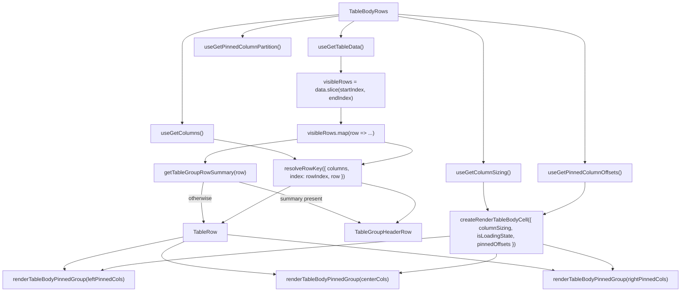

# TableBodyRows Architecture

Row-rendering delegate for `TableBody`. Owns the `visibleRows.map()` loop
and cell creation, isolating data-dependent re-renders from the
virtualisation layout in `TableBody`.

Which component a row gets is asked of the **row**: one carrying a group summary
renders as a `TableGroupHeaderRow`, everything else renders its cells. The
grouping configuration is never consulted here, so a group row and a detail row
can arrive in the same result.

## File Structure

```
TableBodyRows/
├── TableBodyRows.component.tsx   → Visible-row loop: group header or column-group cell rendering, per row
├── TableBodyRows.types.ts        → TableBodyRowsProps (startIndex, endIndex, isLoadingState)
├── utils/
│   └── resolveRowKey.util.ts     → Row identity key from a group summary, else from the primary-key column(s)
├── ARCHITECTURE.md               → This file
└── index.ts                      → Barrel export
```

## Props

| Prop             | Type      | Description                                     |
| ---------------- | --------- | ----------------------------------------------- |
| `endIndex`       | `number`  | Exclusive end index of the visible row window   |
| `isLoadingState` | `boolean` | Whether data is loading (initial or load-more)  |
| `startIndex`     | `number`  | Inclusive start index of the visible row window |

## Context Dependencies

| Selector                      | Purpose                                            |
| ----------------------------- | -------------------------------------------------- |
| `useGetTableData`             | Full data array — sliced to visible window         |
| `useGetColumns`               | Declared columns — the primary-key source for keys |
| `useGetPinnedColumnPartition` | Pre-split left/center/right pinning partition      |
| `useGetColumnSizing`          | Column widths for cell rendering                   |
| `useGetPinnedColumnOffsets`   | Pre-computed sticky offsets for pinned columns     |

`useGetColumns` is read instead of re-assembling the pinning partition: the
partition carries only the visible columns in display order, so a hidden or
reordered primary key would silently change a row's identity.

## Render Flow



## Grouped Rows

A grouped read returns one row per group, each carrying a `TableGroupRowSummary`
under `TABLE_GROUP_ROW_FIELD` ([ADR-061](../../../../../../docs/decisions/ADR-061-grouping-config-in-url-expansion-in-store.md)).
`getTableGroupRowSummary` validates the whole summary or answers `undefined`, so
a half-written one renders as a data row rather than putting `undefined` on
screen.

**One data row still produces exactly one `<tr>`.** `TableBody` sizes `<tbody>`
as `totalLoadedRows × rowHeight` and derives both spacers from the same number,
so emitting a header _plus_ a detail row per entry would desynchronize the body
from its contents. `TableGroupHeaderRow` composes `TableRow`, which is where
`rowHeight` is read, so the group row paints at the same height as every other
row by construction rather than by a matching literal.

## ARIA Row Indexing

Each rendered row carries `aria-rowindex` — its **absolute** position in the
dataset, `resolveBodyAriaRowIndex({ rowIndex })`, never its offset in the
rendered window. Deriving it from the window is the cheaper implementation and
is wrong: a screen reader would announce "row 3 of 50" for a row far down a
large dataset, because the window index is an implementation detail of scrolling
with no meaning to a user
([ADR-062](../../../../../../docs/decisions/ADR-062-grid-semantics-roving-focus-and-row-identity.md)).

The rule shares a module with `aria-rowcount`
(`Table/utils/resolveGridRowIndexing.util.ts`) because the two are only
meaningful against one another: the last body row's index must equal the count
the grid advertises, and if they are computed from different bases one of them
is wrong.

Group rows take the same attribute — a group is one row of the sequence, not an
annotation beside it — which is why `TableGroupHeaderRow` forwards native `<tr>`
attributes.

## Cell Addressing

`rowIndex` and `rowKey` travel with the row into every cell, through
`renderTableBodyPinnedGroup` → `createRenderTableBodyCell` →
`buildTableBodyCellDescriptor`. Sizing and pinning bind once for the whole
window; these two change per row, and together with the column key they are what
addresses a cell in the grid's focus model. Threading them through the existing
descriptor pipeline makes a gap a type error rather than a silently unfocusable
column.

## Row Identity

Rows are keyed by data, not by position ([ADR-062](../../../../../../docs/decisions/ADR-062-grid-semantics-roving-focus-and-row-identity.md)).
`resolveRowKey` derives the key from the `isPrimaryKey` column(s) — the same
derivation `resolveCrudRowId` uses for a CRUD id, via the shared
`resolvePrimaryKeyColumnKeys`.

The two helpers share which columns they read and nothing else — not the
encoding, and not the failure handling. `resolveCrudRowId` throws a `TypeError`
when no column is marked `isPrimaryKey`, and again when a primary-key value is
neither string nor number; that is correct for a CRUD link, where a bad id must
not reach a route. `resolveRowKey` **never throws**, because a key is needed for
every row on every render and a throw here would take the whole table to an error
boundary.

| Case                                                                 | Key shape                        |
| -------------------------------------------------------------------- | -------------------------------- |
| Group row (checked first)                                            | `grp:["order_status","Shipped"]` |
| Single primary key                                                   | `pk:[123]`                       |
| Composite primary key, declaration order                             | `pk:[123,"ORD 9"]`               |
| No `isPrimaryKey` column, a non-scalar value, or a non-finite number | `idx:<absolute row index>`       |

A group row is identified **first**, and from its own values. A grouped read
projects the group key and its aggregates only, so the primary-key branch would
find nothing there and drop every group in the result to its index — giving the
whole grouped view the identity of position, which is what ADR-062 exists to
retire.

**The value part is `JSON.stringify` over the resolved tuple, and each of its
three properties is load-bearing.** A delimiter-joined `encodeURIComponent`
form — the shape `resolveCrudRowId` uses, and the obvious thing to copy — fails
all three:

- **It is well-formed by spec (ES2019), so it cannot throw on string input.**
  `encodeURIComponent` raises `URIError: URI malformed` on an unpaired surrogate,
  which is an ordinary `string` and passes any `typeof` guard. That value reaches
  a row from `JSON.parse('{"id":"\ud800"}')` or from any string sliced through a
  surrogate pair — so the delimiter-joined form is not total, and "never throws"
  would be false.
- **It is unambiguous across element boundaries.** `PRIMARY_KEY_ID_DELIMITER` is
  `_`, which is unreserved and therefore survives `encodeURIComponent` untouched,
  so `['a_b','c']` and `['a','b_c']` both join to `a_b_c` — two rows, one key.
  A JSON array delimits its elements structurally and escapes its own `"`, so no
  value can forge a boundary.
- **It distinguishes `7` from `'7'`.** `String` is not injective over the scalar
  domain. An id column that arrives as numbers on one page and strings on another
  would otherwise give two rows one key.

**A non-finite number is not an id.** `NaN` is not equal to itself, and `NaN`,
`Infinity` and `-Infinity` all serialize to `null` — so accepting them would hand
three different rows the key `pk:[null]`. They route to the index fallback
instead, which is what that fallback is for: a non-finite id is a failed parse.
(`0` and `-0` do share a key. They are `===`-equal, so treating them as one value
is the language's own answer.)

**The prefixes keep the three namespaces disjoint.** Under the tuple encoding they
are belt-and-braces — a value key always starts `[` and an index key is always
decimal digits, so no cross-namespace collision is constructible today even
without them. They are kept because ADR-062 requires the separation to hold
whatever the value part encodes: the moment someone "simplifies" a single-column
key to `pk:7`, the prefix is the only thing standing between it and the row at
index 7. `resolveRowKey.util.test.ts` pins the prefixes by literal shape, not by
the bare inequality, which the tuple encoding alone would now satisfy.

The index-derived fallback is exactly as unstable as keying by array index — the
behaviour it replaces. A consumer whose columns declare no primary key therefore
gets no stronger guarantee than before, which is the deliberate floor ADR-062
records.

## Relationship to TableBody

`TableBody` owns virtualisation (spacers, total height, scroll window) and
delegates row rendering to `TableBodyRows`. This separation means:

- **`TableBody`** subscribes to `totalLoadedRows` (a number) instead of the
  full `data` array, avoiding re-renders when row content changes.
- **`TableBodyRows`** subscribes to `data`, the declared columns, the pinned column
  partition, sizing, and pinned offsets — re-renders when any of those change.

## Utility Reuse

Uses existing utilities from `TableBody/utils/`:

- `createRenderTableBodyCell` — factory that binds sizing + pinned offsets into a cell renderer
- `renderTableBodyPinnedGroup` — maps one pinning partition through the bound renderer

Owns one private delegate in `utils/`, imported by direct file path (ADR-007 rule 3 — no deep `utils/` barrel):

- `resolveRowKey` — row identity key; see [Row Identity](#row-identity)
