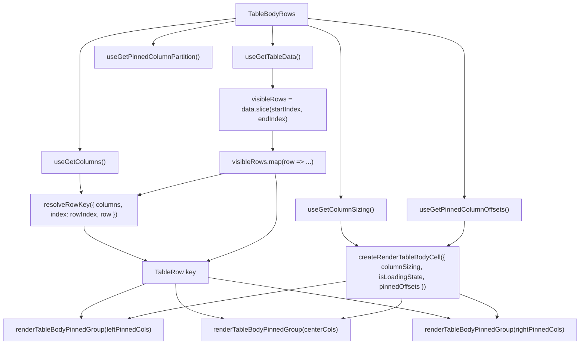

# TableBodyRows Architecture

Row-rendering delegate for `TableBody`. Owns the `visibleRows.map()` loop
and cell creation, isolating data-dependent re-renders from the
virtualisation layout in `TableBody`.

## File Structure

```
TableBodyRows/
├── TableBodyRows.component.tsx   → Visible-row loop with column-group cell rendering
├── TableBodyRows.types.ts        → TableBodyRowsProps (startIndex, endIndex, isLoadingState)
├── utils/
│   └── resolveRowKey.util.ts     → Row identity key from the primary-key column(s)
├── ARCHITECTURE.md               → This file
└── index.ts                      → Barrel export
```

## Props

| Prop             | Type      | Description                                     |
| ---------------- | --------- | ----------------------------------------------- |
| `endIndex`       | `number`  | Exclusive end index of the visible row window   |
| `isLoadingState` | `boolean` | Whether data is loading (initial or load-more)  |
| `startIndex`     | `number`  | Inclusive start index of the visible row window |

## Context Dependencies

| Selector                      | Purpose                                            |
| ----------------------------- | -------------------------------------------------- |
| `useGetTableData`             | Full data array — sliced to visible window         |
| `useGetColumns`               | Declared columns — the primary-key source for keys |
| `useGetPinnedColumnPartition` | Pre-split left/center/right pinning partition      |
| `useGetColumnSizing`          | Column widths for cell rendering                   |
| `useGetPinnedColumnOffsets`   | Pre-computed sticky offsets for pinned columns     |

`useGetColumns` is read instead of re-assembling the pinning partition: the
partition carries only the visible columns in display order, so a hidden or
reordered primary key would silently change a row's identity.

## Render Flow



## Row Identity

Rows are keyed by data, not by position ([ADR-062](../../../../../../docs/decisions/ADR-062-grid-semantics-roving-focus-and-row-identity.md)).
`resolveRowKey` derives the key from the `isPrimaryKey` column(s) — the same
derivation `resolveCrudRowId` uses for a CRUD id, via the shared
`resolvePrimaryKeyColumnKeys`.

The two helpers deliberately differ in their failure handling. `resolveCrudRowId`
throws a `TypeError` when no column is marked `isPrimaryKey`, and again when a
primary-key value is neither string nor number — correct for a CRUD link, where a
bad id must not reach a route. `resolveRowKey` is **total**: a key is needed for
every row on every render, so the same conditions yield an index-derived key
instead of a throw that would take the whole table to an error boundary.

| Case                                            | Key shape                  |
| ----------------------------------------------- | -------------------------- |
| Single primary key                              | `pk:<encoded value>`       |
| Composite primary key, declaration order        | `pk:<v1>_<v2>`             |
| No `isPrimaryKey` column, or a non-scalar value | `idx:<absolute row index>` |

**The prefixes are load-bearing.** Value-derived and index-derived keys occupy
disjoint namespaces, so a row whose primary key is literally the text of some
row's index stays distinguishable from that row. Removing either prefix
reintroduces that collision, and `resolveRowKey.util.test.ts` asserts the
inequality directly.

The index-derived fallback is exactly as unstable as keying by array index — the
behaviour it replaces. A consumer whose columns declare no primary key therefore
gets no stronger guarantee than before, which is the deliberate floor ADR-062
records.

## Relationship to TableBody

`TableBody` owns virtualisation (spacers, total height, scroll window) and
delegates row rendering to `TableBodyRows`. This separation means:

- **`TableBody`** subscribes to `totalLoadedRows` (a number) instead of the
  full `data` array, avoiding re-renders when row content changes.
- **`TableBodyRows`** subscribes to `data`, the declared columns, the pinned column
  partition, sizing, and pinned offsets — re-renders when any of those change.

## Utility Reuse

Uses existing utilities from `TableBody/utils/`:

- `createRenderTableBodyCell` — factory that binds sizing + pinned offsets into a cell renderer
- `renderTableBodyPinnedGroup` — maps one pinning partition through the bound renderer

Owns one private delegate in `utils/`, imported by direct file path (ADR-007 rule 3 — no deep `utils/` barrel):

- `resolveRowKey` — row identity key; see [Row Identity](#row-identity)
