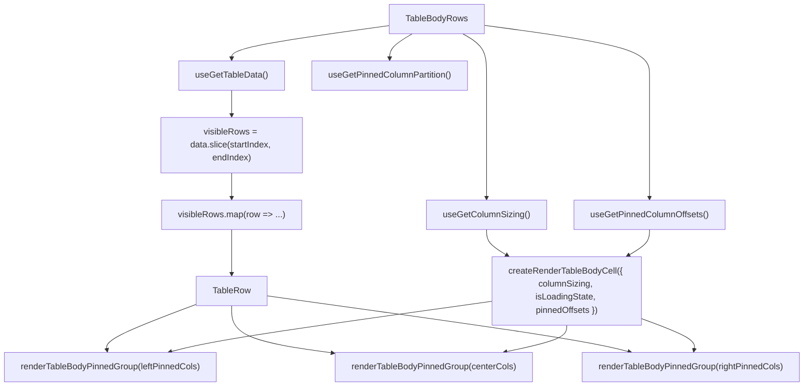

# TableBodyRows Architecture

Row-rendering delegate for `TableBody`. Owns the `visibleRows.map()` loop
and cell creation, isolating data-dependent re-renders from the
virtualisation layout in `TableBody`.

## File Structure

```
TableBodyRows/
├── TableBodyRows.component.tsx   → Visible-row loop with column-group cell rendering
├── TableBodyRows.types.ts        → TableBodyRowsProps (startIndex, endIndex, isLoadingState)
├── ARCHITECTURE.md               → This file
└── index.ts                      → Barrel export
```

## Props

| Prop             | Type      | Description                                     |
| ---------------- | --------- | ----------------------------------------------- |
| `endIndex`       | `number`  | Exclusive end index of the visible row window   |
| `isLoadingState` | `boolean` | Whether data is loading (initial or load-more)  |
| `startIndex`     | `number`  | Inclusive start index of the visible row window |

## Context Dependencies

| Selector                      | Purpose                                        |
| ----------------------------- | ---------------------------------------------- |
| `useGetTableData`             | Full data array — sliced to visible window     |
| `useGetPinnedColumnPartition` | Pre-split left/center/right pinning partition  |
| `useGetColumnSizing`          | Column widths for cell rendering               |
| `useGetPinnedColumnOffsets`   | Pre-computed sticky offsets for pinned columns |

## Render Flow



## Relationship to TableBody

`TableBody` owns virtualisation (spacers, total height, scroll window) and
delegates row rendering to `TableBodyRows`. This separation means:

- **`TableBody`** subscribes to `totalLoadedRows` (a number) instead of the
  full `data` array, avoiding re-renders when row content changes.
- **`TableBodyRows`** subscribes to `data`, the pinned column partition, sizing, and pinned
  offsets — re-renders when any of those change.

## Utility Reuse

Uses existing utilities from `TableBody/utils/`:

- `createRenderTableBodyCell` — factory that binds sizing + pinned offsets into a cell renderer
- `renderTableBodyPinnedGroup` — maps one pinning partition through the bound renderer
