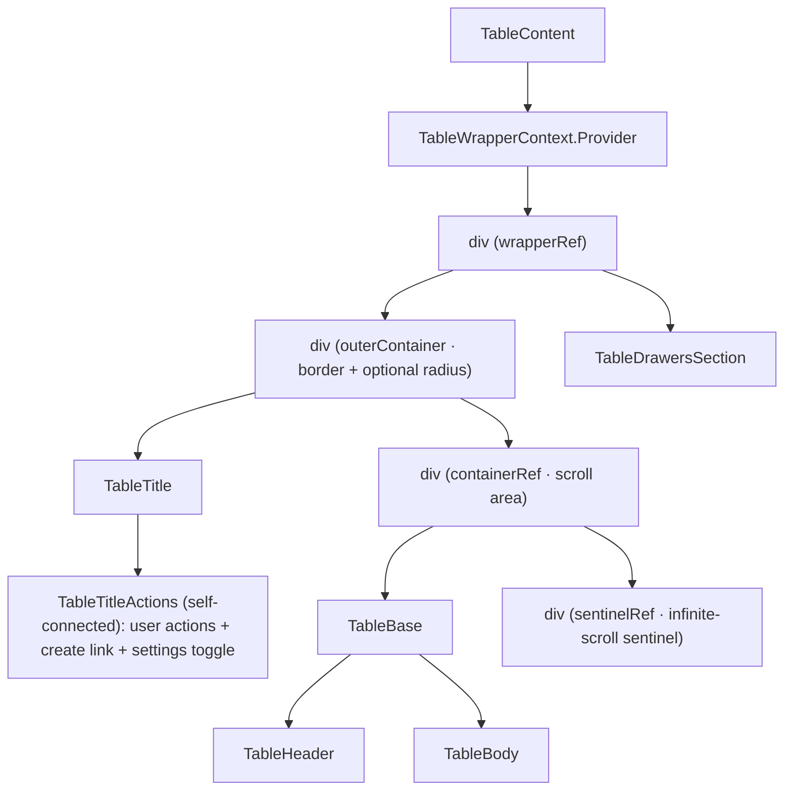
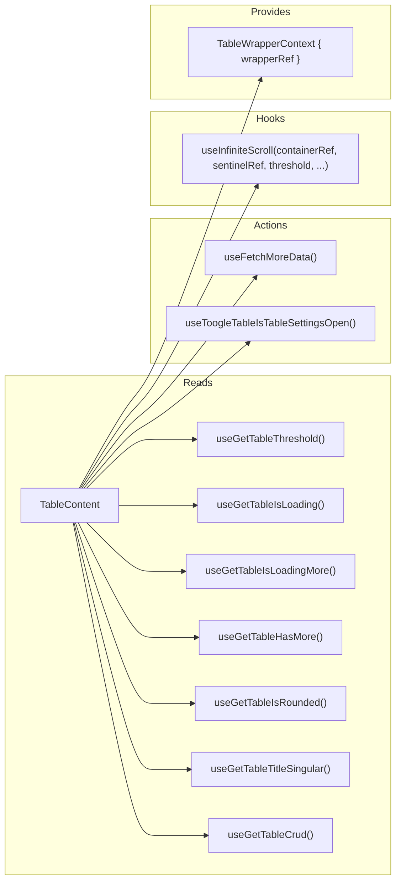

# TableContent Architecture

Main layout component that assembles the table UI: title bar, scrollable
table container with header/body, optional CRUD header action, infinite
scroll, and settings drawers.
Also provides the `TableWrapperContext` with a ref to the wrapper element.
The scroll container can be scroll-locked during the initial loading state,
while header/body cells keep rendering the per-cell shimmer overlay.

## File Structure

```
TableContent/
├── TableContent.component.tsx   → Layout shell: Title + scroll container + drawers
├── TableTitleActions/           → Self-connected title actions (create link + settings toggle)
├── TableContent.types.ts        → TableContentProps (picks from TableProps)
├── TableContent.stylex.ts       → Wrapper, outer container, scroll container
└── index.ts                     → Barrel export
```

## Render Structure



> The sentinel uses `position: sticky; left: 0` so it stays inside the
> horizontal viewport at every `scrollLeft`. `IntersectionObserver` requires
> overlap on both axes — a normal block sentinel is only viewport-wide and
> anchored left, so scrolling the wide table fully right would move it out of
> view and silently stop fetch-more. Sticky-pinning keeps vertical
> bottom-detection working regardless of horizontal scroll.

## Context & Hooks



## CRUD Header Integration

The CRUD config is read from the meta store via `useGetTableCrud()` (no longer
prop-drilled). When `crud.create` is enabled, `TableContent` renders
`TableCreateLink` in the title actions cluster between caller-provided `actions`
and the settings button. The link label uses `meta.title.singular` (falling
back to `Record`).

The row-level `actions` column itself (view/edit/delete menu) is a separate
concern handled by `getInitialColumnsState` / `resolveTableActionsColumn`
(`@lcabrera/ui/components/Table/utils`), which synthesizes it whenever
`crud.read`/`update`/`delete` is enabled — `crud.create` alone never adds it,
since the create action has no row id.

## Refs

| Ref            | Element        | Purpose                                    |
| -------------- | -------------- | ------------------------------------------ |
| `containerRef` | Scroll `<div>` | Infinite scroll detection + virtualization |
| `wrapperRef`   | Outer `<div>`  | Provided via `TableWrapperContext`         |

## Infinite Scroll

The `useInfiniteScroll` hook monitors `containerRef` scroll position.
When the user scrolls within `threshold` pixels of the bottom and
`hasMore` is true, it calls `fetchMoreData()` which appends the next
page to `dataStore`.

## Rounded Corners

The table card renders **square by default**. `metaState.isRounded` opts into
`borderRadius.lg`, composed onto `outerContainer` — the element that owns the
border, the shadow and the `overflow: hidden` that clips the scroll area to the
corner curve. Putting the radius on the inner scroll `div` instead looks
equivalent in the style file and is not: the visible card edge is the outer
border, so the corners would stay square while the radius only clipped content
nobody sees. The rendered flag is mirrored as `data-rounded` so it is
assertable without depending on generated StyleX class names.

## Scroll Lock

`TableContent` disables scrolling only during the initial `isLoading` state so
the user keeps the previous data + skeleton presentation without being able to
scroll through an empty loading surface.

When a query transition completes (`isLoading` goes from `true` to `false`),
the scroll container is reset to top. This is intentionally different from
infinite-scroll load-more transitions (`isLoadingMore`), which preserve the
current scroll position.
