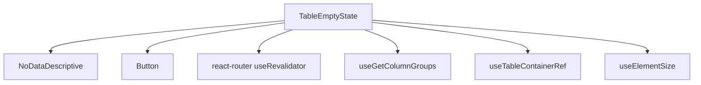

# TableEmptyState Architecture

The no-data row rendered inside the table `<tbody>` when there are zero rows and
the table is not loading. Mirrors the visual language of `RouteErrorBoundary`
(illustration + title + message + action) but lives entirely inside a
`<tr><td>` so it participates in normal table layout.

## Responsibilities

- Render a theme-adaptive, animated `NoDataDescriptive` illustration
  (`currentColor` + `prefers-reduced-motion` aware).
- Show a configurable `title` (default `"No data found"`) and `message`
  (default standard copy), both overridable via `TableProps.emptyState`.
- Offer a single **Retry** button that re-runs the route loader through React
  Router 7's `useRevalidator()` — because filters and sorting live in the URL,
  revalidation re-fetches with the current query state.

## Design Decision — Centering Across Horizontal Overflow

The table body can be wider than the scroll container (columns overflow → the
container scrolls horizontally). A naive centered cell would center against the
**body width**, drifting off-screen. Instead:

- The `<td>` spans every visible column via `colSpan` (from `useGetColumnGroups`).
- Its inner box is `position: sticky; top: 0; left: 0` so it pins to the
  scroll container's visible top-left corner.
- The box is sized to the scroll container's measured client box
  (`useElementSize` on the `useTableContainerRef()` element), **minus the sticky
  `<thead>` height**. The header stays in the container's normal flow above the
  body, so sizing the box to the full container height would overflow by exactly
  the header height and show a vertical scrollbar. The header height is measured
  reactively (ResizeObserver on the `thead` resolved from the container) so it
  tracks density changes. Sizing the box to the remaining body area and
  centering content inside it keeps the empty state centered in the **visible
  body viewport**, both axes, with no scrollbar, regardless of scroll position
  or body width. Until measured (SSR/first paint) it falls back to
  `width: 100%` / `height: auto`.

## File Structure

```
TableEmptyState/
├── TableEmptyState.component.tsx → <tr><td colSpan><sticky sized box> illustration + title + message + Retry
├── TableEmptyState.stylex.ts     → viewport(height,width) sticky/centered box + content/title/message styles
├── TableEmptyState.test.tsx      → Unit tests (defaults, overrides, colSpan, retry → revalidate)
└── index.ts                      → Barrel export
```

## Dependencies


