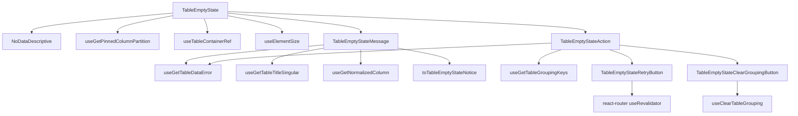

# TableEmptyState Architecture

The no-data row rendered inside the table `<tbody>` when there are zero rows and
the table is not loading. Mirrors the visual language of `RouteErrorBoundary`
(illustration + title + message + action) but lives entirely inside a
`<tr><td>` so it participates in normal table layout.

**There are two reasons a table body is empty and they are not the same
answer.** The filters matched nothing, or the endpoint declined to run the query
— a grouping it refused (ADR-058/ADR-066), a statement it cut off. Before #642
the body said "No records match the current view" either way, which is a claim
about the filters and simply false in the second case. The read's outcome now
reaches the data store as `error` (ADR-068), and both the sentence and the
recovery follow from it.

## Responsibilities

- Render a theme-adaptive, animated `NoDataDescriptive` illustration
  (`currentColor` + `prefers-reduced-motion` aware).
- Size and pin the content to the scroll container's visible body area (below).
- Compose the heading and sentence from the read's outcome — delegated to
  `TableEmptyStateMessage`.
- Offer exactly one recovery, chosen by that outcome — delegated to
  `TableEmptyStateAction`.

Nothing here is a prop: there is no `TableProps.emptyState` override, so the
title is store-driven and both branches read what they need for themselves.

## State Ownership Rule

| Delegate                             | Selectors read                                                               | Actions dispatched      |
| ------------------------------------ | ---------------------------------------------------------------------------- | ----------------------- |
| `TableEmptyState` (shell)            | `useGetPinnedColumnPartition`, `useTableContainerRef`                        | —                       |
| `TableEmptyStateMessage`             | `useGetTableDataError`, `useGetTableTitleSingular`, `useGetNormalizedColumn` | —                       |
| `TableEmptyStateAction` (shell)      | `useGetTableDataError`, `useGetTableGroupingKeys`                            | —                       |
| `TableEmptyStateRetryButton`         | —                                                                            | `useRevalidator()`      |
| `TableEmptyStateClearGroupingButton` | —                                                                            | `useClearTableGrouping` |

## Design Decision — What the body says, and who writes it

`toTableEmptyStateNotice` maps the read's outcome to `{ message, title }`:

| Outcome                                     | Heading                            | Sentence           |
| ------------------------------------------- | ---------------------------------- | ------------------ |
| no error                                    | the table's singular title         | the filters nudge  |
| `grouping-refused` + `column-not-groupable` | `Grouping by <column> was refused` | the endpoint's own |
| `grouping-refused` + any other reason       | `This grouping was refused`        | the endpoint's own |
| `db-canceled`                               | `This query took too long`         | the endpoint's own |
| `db-failed` / `unexpected`                  | `This table could not be loaded`   | the endpoint's own |

**The heading is the table's, the sentence is the endpoint's**, and neither can
be written by the other. Only the endpoint knows why it refused — the catalogue
rule, the estimate, the threshold — and it has already vetted that text for
anything a client may not see (ADR-050). Only the table knows what the user
calls the column: the refusal names `total_amount`, the header said "Total
Amount". `<column>` is that label, falling back to the raw key when this table
declares no column by that name.

**Only `column-not-groupable` may name the column**, because it is the one
refusal whose column _is_ the group key that was refused. Every other reason
names a column in a different role, and "Grouping by X was refused" would be a
false sentence about each:

- `estimate-too-large` names the **widest** key — the one worth dropping, which
  is usually _not_ the one just picked. A user who adds a third column would
  otherwise be told the first was refused, about a column that was already
  applied and is legal on its own.
- `aggregate-not-legal` names an _aggregated_ column, which need not be a group
  key at all.
- `unknown-column` is raised for a group key and for an aggregated column alike,
  so the payload cannot tell the two apart.
- `too-many-keys`, `duplicate-keys`, `no-keys` and `row-limit-reached` name no
  column in the first place.

Those keep the neutral heading and let the endpoint's sentence carry the column
in the role it actually plays — which each of those messages already does.

## Design Decision — Which recovery is offered

**Retry** for an empty result: it can turn into rows the moment the data does,
and revalidation re-runs the loader with the filters and sorting already in the
URL. **Clear grouping** for a grouping refusal: the refusal is a property of the
request, so revalidating sends the same keys and is refused again. That write
goes through `useClearTableGrouping`, taking the persist-then-navigate path every
grouping change takes (ADR-061) rather than resetting a store the next loader
would overwrite.

The choice is made by rendering **one of two delegates**, not by branching inside
one, and that is load-bearing: the grouping write path reaches
`usePersistTableStateAction`, which requires a `NotificationProvider`. A single
component calling it unconditionally would make every empty table require one.

The offer is also guarded on the applied keys — a refusal with nothing grouped
has nothing to clear, so it keeps Retry.

## Design Decision — Centering Across Horizontal Overflow

The table body can be wider than the scroll container (columns overflow → the
container scrolls horizontally). A naive centered cell would center against the
**body width**, drifting off-screen. Instead:

- The `<td>` spans every visible column via `colSpan` (from `useGetPinnedColumnPartition`).
- Its inner box is `position: sticky; top: 0; left: 0` so it pins to the
  scroll container's visible top-left corner.
- The box is sized to the scroll container's measured client box
  (`useElementSize` on the `useTableContainerRef()` element), **minus the sticky
  `<thead>` height**. The header stays in the container's normal flow above the
  body, so sizing the box to the full container height would overflow by exactly
  the header height and show a vertical scrollbar. The header height is measured
  reactively (ResizeObserver on the `thead` resolved from the container) so it
  tracks density changes. Sizing the box to the remaining body area and
  centering content inside it keeps the empty state centered in the **visible
  body viewport**, both axes, with no scrollbar, regardless of scroll position
  or body width. Until measured (SSR/first paint) it falls back to
  `width: 100%` / `height: auto`.

## File Structure

```
TableEmptyState/
├── TableEmptyState.component.tsx → <tr><td colSpan><sticky sized box> illustration + the two delegates
├── TableEmptyState.stylex.ts     → viewport(height,width) sticky/centered box + row/cell/content/illustration
├── TableEmptyState.test.tsx      → Shell + both delegates, empty and refused
├── TableEmptyStateAction/
│   ├── TableEmptyStateAction.component.tsx                → picks the one recovery
│   ├── TableEmptyStateClearGroupingButton/…               → useClearTableGrouping
│   └── TableEmptyStateRetryButton/…                       → useRevalidator
├── TableEmptyStateMessage/
│   ├── TableEmptyStateMessage.component.tsx → heading + sentence, self-connected
│   └── TableEmptyStateMessage.stylex.ts     → title/message typography
├── utils/
│   └── toTableEmptyStateNotice.util.ts → the pure outcome → { message, title } map
└── index.ts                            → Barrel export
```

No `index.ts` in the delegate folders: they are private to this module and
imported by direct path (ADR-007 rule 3).

## Dependencies



## Related

- [ADR-068](../../../../../../docs/decisions/ADR-068-a-refused-read-is-rendered-data-not-an-exception.md) — a refused read is data the table renders
- [ADR-066](../../../../../../docs/decisions/ADR-066-grouping-guard-rails-and-per-query-timeout.md) — what can refuse a grouped read, and the union it arrives as
- [ADR-061](../../../../../../docs/decisions/ADR-061-grouping-config-in-url-expansion-in-store.md) — why clearing goes through the URL
