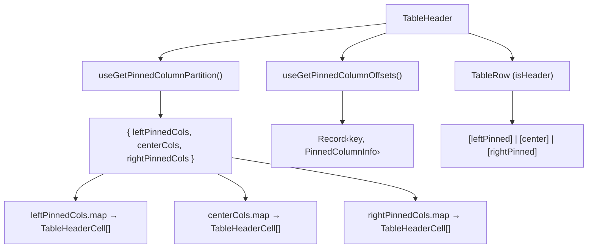

# TableHeader Architecture

Renders `<thead>` with a single header row. Uses the pre-computed pinned column partition
and pinned-column offsets from the columns store via dedicated selectors.

## File Structure

```
TableHeader/
├── TableHeader.component.tsx   → <thead> → TableRow → TableHeaderCell[]
├── TableHeader.types.ts        → TableHeaderProps extends <thead>
├── TableHeader.stylex.ts       → Sticky header positioning
└── index.ts                    → Barrel export
```

## Context Dependencies

| Selector                      | Purpose                                        |
| ----------------------------- | ---------------------------------------------- |
| `useGetPinnedColumnPartition` | Pre-split left/center/right pinning partition  |
| `useGetPinnedColumnOffsets`   | Pre-computed sticky offsets for pinned columns |

## Render Flow



The pinned column partition and pinned offsets are derived state stored in `columnsStore`.
They are recomputed by store actions whenever `effectiveColumns`,
`columnPinning`, or `columnSizing` change, so the component reads them
directly without any per-render calculation.

Each `TableHeaderCell` receives `columnKey`, `hasSettings`, and `pinInfo`.
