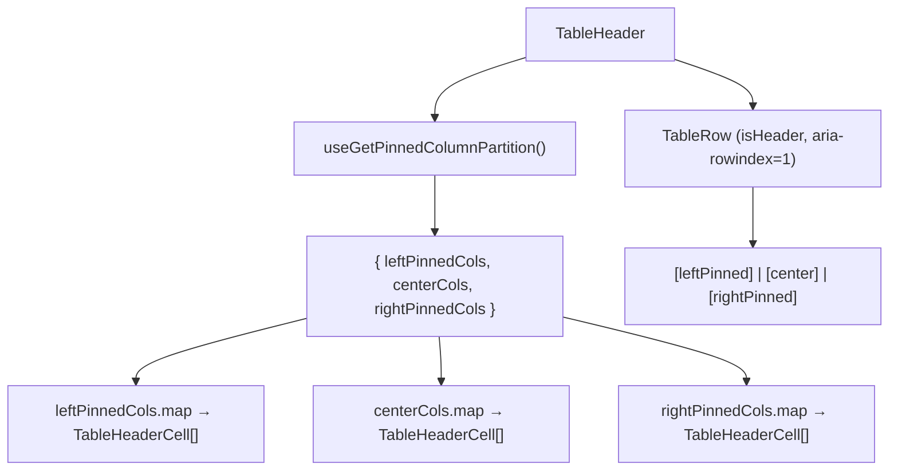

# TableHeader Architecture

Renders `<thead>` with a single header row. Uses the pre-computed pinned column partition
and pinned-column offsets from the columns store via dedicated selectors.

## File Structure

```
TableHeader/
├── TableHeader.component.tsx   → <thead> → TableRow → TableHeaderCell[]
├── TableHeader.types.ts        → TableHeaderProps extends <thead>
├── TableHeader.stylex.ts       → Sticky header positioning
└── index.ts                    → Barrel export
```

## Context Dependencies

| Selector                      | Purpose                                       |
| ----------------------------- | --------------------------------------------- |
| `useGetPinnedColumnPartition` | Pre-split left/center/right pinning partition |

## Render Flow



## The header is row 1 of the grid

ARIA row indices are 1-based and continuous across the whole grid, and
`aria-rowcount` counts the header — so the header row carries
`HEADER_ARIA_ROW_INDEX` and body rows start at 2
([ADR-062](../../../../../../docs/decisions/ADR-062-grid-semantics-roving-focus-and-row-identity.md)).
The constant is shared with the count and the body indices in
`Table/utils/resolveGridRowIndexing.util.ts`; if the header's index and the
count are ever computed from different bases, one of them is wrong.

The pinned column partition is derived state stored in `columnsStore`,
recomputed by store actions whenever `effectiveColumns`, `columnPinning`, or
`columnSizing` change, so the component reads it directly without any per-render
calculation.

`TableHeader` no longer subscribes to `pinnedColumnOffsets` — that map got a
fresh reference on every width write, so reading it here re-rendered the whole
header (and re-created every cell element) on every drag frame. Each
`TableHeaderCell` now self-connects its own `columnKey` slice
(`useGetColumnWidth`, `useGetPinnedColumnInfo`), so `TableHeader` only passes
`columnKey` + `hasSettings` and re-renders solely when the partition itself
changes — not during a resize.
