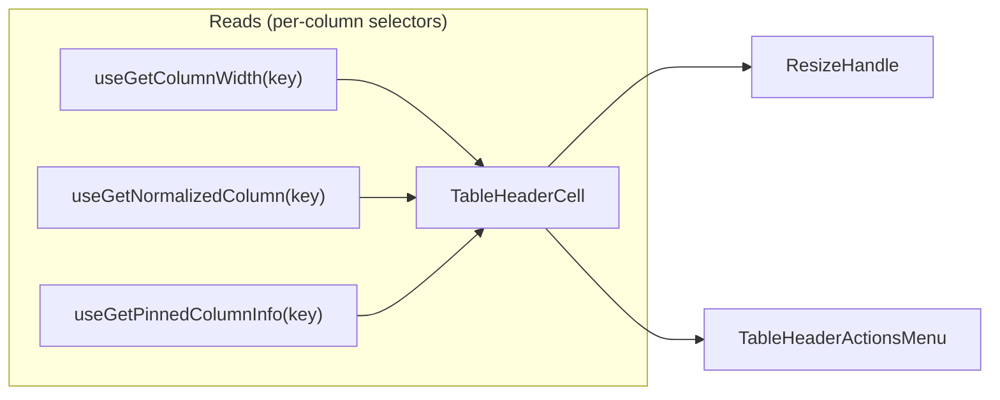

# TableHeaderCell Architecture

Interactive column header cell with sorting, pinning, resizing, visibility,
and per-column settings — all consolidated behind a single actions-menu
trigger so narrow columns still show their label instead of being crowded out
by inline icon buttons.

## File Structure

```text
TableHeaderCell/
├── TableHeaderCell.component.tsx        → <th> rendering label + ResizeHandle + TableHeaderActionsMenu
├── TableHeaderCell.types.ts             → TableHeaderCellProps (columnKey, hasSettings)
├── TableHeaderCell.stylex.ts            → Pinned positioning, base cell layout, shimmer
├── TableHeaderCell.test.tsx             → Unit coverage for label/resize/menu wiring
├── index.ts                             → Barrel export
│
├── ResizeHandle/
│   ├── ResizeHandle.component.tsx       → Resize splitter; spreads useColumnResize's handlers, owns no actions
│   ├── ResizeHandle.types.ts            → ResizeHandleProps<TData>
│   ├── ResizeHandle.stylex.ts           → Grab zone, ::before line, hover/focus/active states
│   └── index.ts
│
├── TableHeaderActionsMenu/
│   ├── TableHeaderActionsMenu.component.tsx → Popover menu shell: gates sections, renders the separators between them, forwards closeMenu
│   ├── TableHeaderActionsMenu.types.ts      → Props (isSortable, isStatic, hasSettings, pinSide, sortDirection)
│   ├── SortActions/                         → Thin shell composing the sort delegates (forwards columnKey/onClose/sortDirection)
│   │   ├── SortActions.component.tsx
│   │   ├── SortAscendingButton/             → Toggles asc + highlights when applied; owns useSetColumnSorting
│   │   ├── SortDescendingButton/            → Toggles desc + highlights when applied; owns useSetColumnSorting
│   │   └── ClearSortingButton/             → Always shown, disabled until sorted; owns useSetColumnSorting
│   ├── PinAndHideActions/                   → Thin shell composing the pin/hide delegates (forwards columnKey/onClose/pinSide)
│   │   ├── PinAndHideActions.component.tsx
│   │   ├── PinLeftButton/                   → Toggles left pin + highlights; owns useSetColumnPinning
│   │   ├── PinRightButton/                  → Toggles right pin + highlights; owns useSetColumnPinning
│   │   ├── ClearPinningButton/             → Always shown, disabled until pinned; owns useSetColumnPinning
│   │   └── HideColumnButton/                → Hides the column, below a separator; owns useSetColumnVisibility
│   ├── ManageColumnAction/                  → Manage Column item (single self-connected button); owns the drawer-open meta actions
│   └── index.ts
│
└── utils/
    ├── getPinnedStyle.util.ts           → Returns left/right pinned StyleX
    └── getShadowStyle.util.ts           → Returns shadow separator StyleX
```

## Props

| Prop           | Type             | Description                      |
| -------------- | ---------------- | -------------------------------- |
| `columnKey`    | `DataKey<TData>` | Column identifier                |
| `hasSettings`  | `boolean`        | Enables the "Manage Column" item |
| `customStylex` | `StyleXStyles?`  | Override styles                  |

## Context Dependencies



Every subscription here is **per-column** (a number, one normalized column, one
pinned-offset entry), so a width change to one column re-renders only that
column's cell — not the whole header row. `ResizeHandle` self-connects the same
way, so `TableHeaderCell` drills nothing into it (see below).

## Column Capabilities

`TableHeaderCell` resolves the column's capabilities once through
`resolveColumnCapabilities` (`Table/utils/`) and renders from the result: the
`ResizeHandle` appears when `isResizable` — which already accounts for `isStatic`
locking a column against resizing — and `isSortable`/`isStatic` are forwarded to
`TableHeaderActionsMenu` to gate its sections.

Each menu delegate then resolves the same capability for itself and passes it to
`deriveToggleCommandState` as the command's availability. In production that
value never disagrees with the gate above it: `TableHeaderActionsMenu` renders
`SortActions` only for a sortable column and `PinAndHideActions` only for a
movable one, so a command the column does not offer is **un-rendered**, and the
disabled branch is not reached from the header. What the delegate's own
resolution buys is that a button somehow mounted outside that gate disables
itself rather than offering an edit the table would refuse.

## Actions Menu

A single `MoreVerticalIcon` trigger (`TableActionsPopover`, shared with
`TableRowActionsMenu` — see `components/Table/TableActionsPopover/ARCHITECTURE.md`)
opens a popover built by `TableHeaderActionsMenu`, replacing the previous
inline pin/sort/settings buttons:

- **Sort** (`SortActions`, when `isSortable`): "Ascending"/"Descending" toggle
  the direction on/off exactly like `ColumnSettingsDrawer/SortingSection`
  (`direction === current ? undefined : direction`) and highlight the applied
  one via the `primary` variant + `aria-pressed`; "Clear Sorting" is always
  shown but `isDisabled` until a direction is applied.
- **Pin** (`PinAndHideActions`, when `!isStatic`): "Pin Left"/"Pin Right"
  toggle via `useSetColumnPinning` directly — no side-selection or conflict
  modal, same silent behavior as `ColumnSettingsDrawer/PinningSection` — and
  highlight the applied side (`primary` variant + `aria-pressed`). "Clear
  Pinning" (`useSetColumnPinning({ columnKey, side: undefined })`) is always
  shown but `isDisabled` until a side is pinned.
- **Hide Column** (`PinAndHideActions`, when `!isStatic`):
  `useSetColumnVisibility({ columnKey, isVisible: false })` — a single-column,
  table-level visibility action (see `contexts/TableConfig/ARCHITECTURE.md`),
  distinct from the settings-drawer's draft-scoped `useToggleColumnVisibility`.
- **Manage Column** (`ManageColumnAction`, when `hasSettings`): opens the
  per-column `ColumnSettingsDrawer` — identical wiring to the previous
  "Settings for {label}" button (`setTableColumnSelectedKey` +
  `setTableDrawersOpenState({ isColumnSettingsOpen: true,
isTableSettingsOpen: false })`).

**Stable layout & section dividers.** Every option always renders (the "Clear"
items disable rather than disappear) so the menu never changes height as state
changes. Section boundaries are `TableActionsPopoverSeparator` elements rendered
between the groups — a flex child of `menuActions`, so the container's `gap`
gives the rule equal space on both sides. Whoever knows a boundary exists renders
it: the shell puts one before `PinAndHideActions` and before `ManageColumnAction`
whenever a section precedes them, and `PinAndHideActions` puts one before "Hide
Column", which is not a pinning choice.

This replaced a `border-top` composed onto the first item of each following
section. That form could not be made symmetric — the rule sat on the item's box
edge, leaving 8px above it and nothing below, and adding `paddingTop` to
compensate would have let the ghost-button hover background paint up to the rule.
A `border-bottom` on each section's _last_ item is worse still: its identity
shifts as options toggle. A separate element sidesteps both, and it also let the
`hasSectionAbove` prop that threaded the old conditional through `PinLeftButton`,
`ManageColumnAction` and the `PinAndHideActions` shell disappear entirely.

The tree is two levels of private delegates (direct file imports, no barrels —
ADR-007). `SortActions` and `PinAndHideActions` are **thin shells** that only
forward props; each individual item ("Ascending", "Pin Left", …) is its own
`*Button` delegate that owns its store-action hook (`useSetColumnSorting` /
`useSetColumnPinning` / `useSetColumnVisibility`) and click handler, keeping
every file short and independently testable. `ManageColumnAction` is already a
single self-connected button, so it stays a leaf without a shell.
`TableHeaderActionsMenu` itself only gates which sections render and forwards
the popover's render-prop `closeMenu` down to each button's `onClose`, so every
item closes the popover after firing its action. The menu renders nothing (no
trigger) when the column has no sortable/pinnable/settings affordance at all.

### Resize

**`useColumnResize` is the single owner of resize interaction and store wiring.**
`ResizeHandle` calls it once and spreads what it returns (`onMouseDown`,
`onKeyDown`, `onDoubleClick`, plus the `width`/`bounds` the splitter announces)
onto the host element. The component triggers **no actions of its own** — if you
find yourself reaching for a sizing action inside it, the behaviour belongs in
the hook instead. It is **self-connected**: `TableHeaderCell` passes only
`columnKey` + `columnLabel`, and `ResizeHandle` reads its own bounds
(`useGetNormalizedColumn`) and width (`useGetColumnWidth`) from the store. This
is what keeps the width subscription at the leaf — drilling `currentWidth` down
would force the parent cell to subscribe to width coarsely and re-render the
whole header row on every drag frame.

Internally `useColumnResize` delegates the pointer gesture to the private
`useColumnDragSession` (RAF-throttled drag, document listeners, body cursor) and
keeps the discrete interactions itself. The split is about size, not ownership:
one hook still fronts the whole domain.

The handle is an ARIA **window splitter** (`role="separator"`, `tabIndex=0`,
`aria-orientation="vertical"`, `aria-valuenow`/`valuemin`/`valuemax`), not a
button: it adjusts a value rather than invoking a command, and a `<button>` put
one dead tab stop per column in the keyboard path. `resolveKeyboardResizeAction`
owns the key map — arrows step by `COLUMN_RESIZE_KEYBOARD_STEP` (shift for the
coarse step), Home/End jump to the bounds, Enter resets — and returns `ignore`
for anything else so unrelated keys keep bubbling.

Both bounds come from `resolveColumnWidthBounds`, which every resize path shares
(pointer drag via `createResizeStartData`, keyboard stepping, and the announced
`aria-valuemin`/`aria-valuemax`) so they cannot drift apart.

**Persistence belongs to the action.** `useSetColumnSizing` writes _and_
persists, the same way `useSetColumnPinning` and `useSetColumnSorting` own
theirs, so a keypress or a double-click is a single call and there is no second
step to forget. (Reset used to forget it, silently leaving the old width in the
cookie for the next load.)

The one exception is a pointer drag: it emits a width every animation frame and
would re-serialize and rewrite the cookie ~60 times per gesture, so
`useColumnDragSession` previews frames through `useSetColumnSizingWithoutSync`
and persists once on mouse up. If you add a new way to resize a column, it wants
`useSetColumnSizing`; `useSetColumnSizingWithoutSync` is not in the actions
barrel and is only for a continuous gesture that commits at the end.

Visually the 8px grab zone straddles the cell's right border (`right: -4`),
overhanging into the neighbouring cell. Both halves land in the 6px
`paddingInline` of the cell they cover, so the handle never steals clicks from a
label or an actions menu — keep that in mind if the header cell's padding ever
shrinks. The visible 2px line is a `::before` fed by the
`--resize-handle-line-color` custom property, which is what lets a hover (or
focus) anywhere in the grab zone light the line. One caveat: every `<th>` is its
own stacking context, and pinned cells sit at `sticky + 2` versus a plain cell's
`sticky`, so the overhang of the column immediately left of a **right-pinned**
column is painted under it and grabs on 4px rather than 8px.

## Loading State

Header cells receive `isLoadingState` from `TableHeader` and render their local
shimmer overlay without subscribing to loading state individually.
