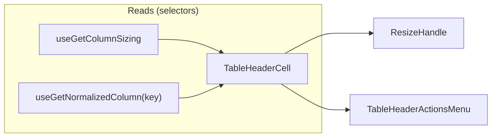

# TableHeaderCell Architecture

Interactive column header cell with sorting, pinning, resizing, visibility,
and per-column settings — all consolidated behind a single actions-menu
trigger so narrow columns still show their label instead of being crowded out
by inline icon buttons.

## File Structure

```text
TableHeaderCell/
├── TableHeaderCell.component.tsx        → <th> rendering label + ResizeHandle + TableHeaderActionsMenu
├── TableHeaderCell.types.ts             → TableHeaderCellProps (columnKey, pinInfo)
├── TableHeaderCell.stylex.ts            → Pinned positioning, base cell layout, shimmer
├── TableHeaderCell.test.tsx             → Unit coverage for label/resize/menu wiring
├── index.ts                             → Barrel export
│
├── ResizeHandle/
│   ├── ResizeHandle.component.tsx       → Drag-resize handle; owns useColumnResize + double-click reset
│   ├── ResizeHandle.types.ts            → ResizeHandleProps<TData>
│   ├── ResizeHandle.stylex.ts           → Resize handle line/hover/active styles
│   └── index.ts
│
├── TableHeaderActionsMenu/
│   ├── TableHeaderActionsMenu.component.tsx → Popover menu: sort/pin/hide/manage column
│   ├── TableHeaderActionsMenu.types.ts      → Props (isSortable, isStatic, hasSettings, pinSide, sortDirection)
│   └── index.ts
│
└── utils/
    ├── getPinnedStyle.util.ts           → Returns left/right pinned StyleX
    └── getShadowStyle.util.ts           → Returns shadow separator StyleX
```

## Props

| Prop           | Type                | Description                      |
| -------------- | ------------------- | -------------------------------- |
| `columnKey`    | `DataKey<TData>`    | Column identifier                |
| `hasSettings`  | `boolean`           | Enables the "Manage Column" item |
| `pinInfo`      | `PinnedColumnInfo?` | Pin side, offset, shadow flags   |
| `customStylex` | `StyleXStyles?`     | Override styles                  |

## Context Dependencies



## Actions Menu

A single `MoreVerticalIcon` trigger (`TableActionsPopover`, shared with
`TableRowActionsMenu` — see `components/Table/TableActionsPopover/ARCHITECTURE.md`)
opens a popover built by `TableHeaderActionsMenu`, replacing the previous
inline pin/sort/settings buttons:

- **Sort** (when `isSortable`): "Ascending"/"Descending" toggle the direction
  on/off exactly like `ColumnSettingsDrawer/SortingSection`
  (`direction === current ? undefined : direction`); "Clear Sorting" appears
  only when a direction is currently applied.
- **Pin** (when `!isStatic`): "Pin Left"/"Pin Right" toggle via
  `useSetColumnPinning` directly — no side-selection or conflict modal, same
  silent behavior as `ColumnSettingsDrawer/PinningSection`.
- **Hide Column** (when `!isStatic`): `useSetColumnVisibility({ columnKey,
isVisible: false })` — a single-column, table-level visibility action (see
  `contexts/TableConfig/ARCHITECTURE.md`), distinct from the settings-drawer's
  draft-scoped `useToggleColumnVisibility`.
- **Manage Column** (when `hasSettings`): opens the per-column
  `ColumnSettingsDrawer` — identical wiring to the previous "Settings for
  {label}" button (`setTableColumnSelectedKey` + `setTableDrawersOpenState({
isColumnSettingsOpen: true, isTableSettingsOpen: false })`).

Every item closes the popover via the render-prop `closeMenu` after firing its
action. The menu renders nothing (no trigger) when the column has no
sortable/pinnable/settings affordance at all.

### Resize

`ResizeHandle` fully owns `useColumnResize` (RAF-throttled drag resize) and
the double-click-to-reset-width handler; `TableHeaderCell` only passes
`columnKey`, `columnLabel`, `currentWidth`, `maxWidth`, `minWidth`.

## Loading State

Header cells receive `isLoadingState` from `TableHeader` and render their local
shimmer overlay without subscribing to loading state individually.
